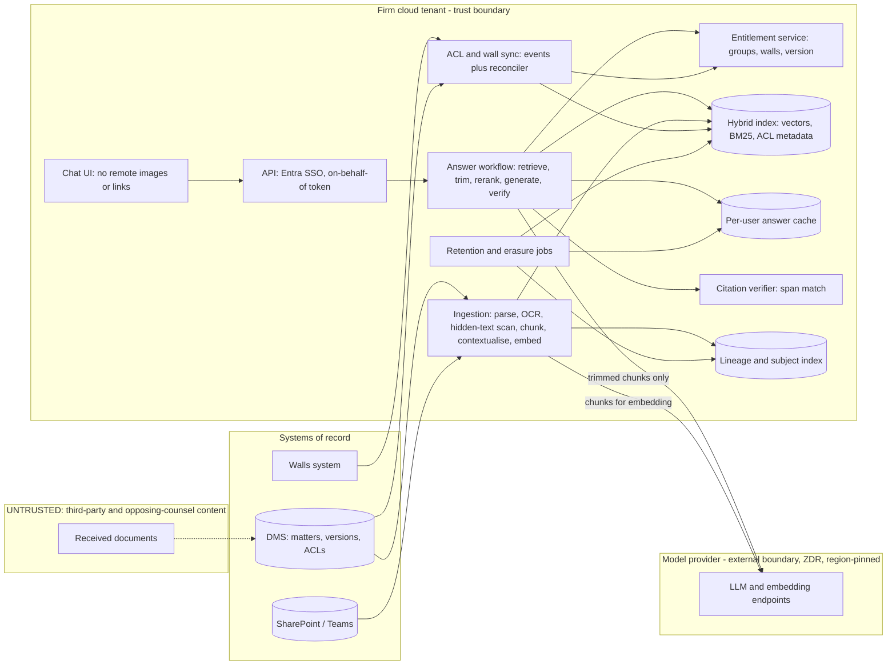

# P01 · Permission-Aware Knowledge Assistant for a Law Firm

> A research assistant over the firm's matter files. It answers with paragraph-level citations and never shows anyone a document they could not open themselves, including documents behind an ethical wall.
> **Customer:** Meridian & Rao LLP (fictional) · **Industry:** Legal services (disputes, M&A, regulatory) · **Geography:** London, Mumbai, Bengaluru; clients in the UK, EU and India · **Real engagement:** 16 weeks; 2 FDEs and a security engineer at 50%, plus the firm's KM lead, a DMS administrator and 2 lawyer SMEs (4 h/week each) · **Course build:** 6 weeks, team of 3–4 · **Difficulty:** ★★☆

## 1. Scenario — the customer and the ask

Meridian & Rao has about 1,200 staff, around 550 of them fee earners. Its iManage/NetDocuments-style DMS holds about 9 million documents and emails across about 60,000 matters, and newer work lives in SharePoint and Teams. The Managing Partner asked for **"ChatGPT for our documents"**. Associates are already pasting clauses into consumer chatbots, which the CISO keeps blocking.

**What they actually need** is a research assistant that:

1. Finds precedents and prior advice, but only in matters the user may see.
2. Cites every claim to a document, a version and a paragraph (for scanned material, a page and region).
3. Enforces matter ACLs and **ethical walls** at least as strictly as the DMS does, with a measured time for changes to take effect.
4. Treats documents from opposing parties as hostile input.
5. Can prove deletion when a matter's retention period ends or an erasure request is upheld.

The conversation that decides the project is with the General Counsel. A single leak across a wall can get the firm removed from a matter, and it breaches the SRA Code's requirement for "effective measures … which result in there being no real risk of disclosure" ([SRA Code 6.5](https://www.sra.org.uk/solicitors/standards-regulations/code-conduct-solicitors/), as of Sept 2026).

| Stakeholder | Cares about | Can block |
|---|---|---|
| Managing Partner (sponsor) | A visible win | Funding |
| General Counsel / Head of Risk | Walls, conflicts, privilege, client consent | Go-live (a veto) |
| CISO | Data egress, provider terms, logging, pen test | Security sign-off |
| DPO (UK) and Grievance Officer (India) | Lawful basis, transfers, erasure, DPIA | DPIA approval |
| Head of Knowledge (KM partner) | Precedent quality, adoption | Content scope, SME time |
| Litigation practice head | "Zero hallucinated citations" | Her group's participation |
| IT applications lead | DMS load, Microsoft relationship | API access |
| Records manager | Retention schedules, legal holds | Deletion design |
| Associates and paralegals | Speed, trust, not being blamed | Adoption |

## 2. Constraints

- **Data.**
  - About 30% of disclosure bundles are scanned, with handwriting, stamps and rotated pages.
  - Emails are filed with their attachments; documents exist in up to 12 versions.
  - A few Indian court orders are in Hindi or Marathi.
  - Walls live in a wall-management system (Intapp Walls or similar; Intapp says it pushes walls to AI tools such as Harvey and Copilot, [Intapp](https://www.intapp.com/walls/)). The time for a wall to take effect in the DMS is **unknown until measured**.
- **Legal and regulatory** (as of Sept 2026; the firm's counsel owns every conclusion):
  - **UK GDPR / DPA 2018**, as amended by the Data (Use and Access) Act 2025. Most DUAA data-protection changes commenced on 5 Feb 2026, including the automated decision-making reform (s.80, new Arts 22A–22D), which this tool does not engage: it decides nothing about individuals. The complaints duty (s.103: a written procedure, acknowledgement within 30 days) applies to complaints received from 19 Jun 2026 ([SI 2026/82](https://www.legislation.gov.uk/uksi/2026/82/made)).
  - **Erasure exemptions.** Erasure does not apply where processing is needed "for the establishment, exercise or defence of legal claims" ([Art. 17(3)(e)](https://www.legislation.gov.uk/eur/2016/679/article/17)), and the DPA 2018 has a privilege exemption ([Sch. 2 para 19](https://www.legislation.gov.uk/ukpga/2018/12/schedule/2/paragraph/19)). These cover the matter file, not automatically the derived copies in caches, logs or eval sets.
  - **UK → India transfers** need an IDTA or the Addendum, plus a transfer risk assessment ([ICO](https://ico.org.uk/for-organisations/uk-gdpr-guidance-and-resources/international-transfers/international-transfers-a-guide/)).
  - **EU GDPR** applies only where Art. 3 is triggered (the DPO confirms). EU→UK flows rely on the UK adequacy decisions renewed on 19 Dec 2025 ([European Commission](https://commission.europa.eu/law/law-topic/data-protection/international-dimension-data-protection/adequacy-decisions_en)).
  - **India's DPDP Act 2023 and DPDP Rules 2025** (notified 13 Nov 2025). The Board provisions applied immediately; consent managers from 13 Nov 2026; most obligations from **13 May 2027** (12 and 18 months from notification). Until then, IT Act s.43A and the SPDI Rules apply ([DLA Piper summary](https://www.dlapiperdataprotection.com/?t=law&c=IN)).
  - **DPDP exemptions.** Section 17(1)(a) (legal claims) and s.17(1)(d) (Indian processing, under contract, of data about people outside India) remove most duties, but the s.8(5) security duty still applies ([Act text](https://prsindia.org/files/bills_acts/acts_parliament/2023/Digital_Personal_Data_Protection_Act,_2023.pdf)).
  - **CERT-In Directions (28 Apr 2022)** for the Indian entity: report incidents within 6 hours; keep logs for 180 days in India ([CERT-In](https://www.cert-in.org.in/PDF/CERT-In_Directions_70B_28.04.2022.pdf)).
  - **Professional duties.**
    - SRA Code 6.3 (confidentiality) and 6.5 (walls).
    - *Ayinde v Haringey* [2025] EWHC 1383 (Admin) (6 June 2025): lawyers using AI for research have "a professional duty … to check the accuracy of such research by reference to authoritative sources" ([judgment](https://www.judiciary.uk/judgments/ayinde-v-london-borough-of-haringey-and-al-haroun-v-qatar-national-bank/)).
    - India: professional-communication privilege under s.132 of the Bharatiya Sakshya Adhiniyam 2023 (formerly Evidence Act s.126), in force since 1 July 2024 ([text](https://indiankanoon.org/doc/142112571/)).
  - **EU AI Act.** Probably out of scope for a non-EU firm's internal tool (check Art. 2(1)(c) for outputs used in the EU), and not high-risk: Annex III point 8 covers tools for judicial authorities, not law firms ([Regulation 2024/1689](https://eur-lex.europa.eu/eli/reg/2024/1689/oj)). Record the screen anyway.
  - **Contracts.** About 15% of clients' outside-counsel guidelines restrict generative-AI use on their matters.
- **Infrastructure.** Microsoft 365 with Entra ID; Azure UK South, plus Central India for Indian workloads. The DMS API allows about 20 requests per second.
- **Security.** Zero data retention (ZDR) and no training on customer data in the provider terms. The answer path makes no outbound calls except to the model. Privileged text never goes into logs. A pen test is required before production.
- **Budget and politics.** The pilot has about £150k all-in. IT is negotiating a Microsoft renewal, the litigation head has seen fabricated citations in another firm's filing, and KM fears being bypassed.

## 3. What students are given (course build)

**Synthetic corpus** (a generator script plus a seed; about 5,000 documents and 40 matters):

| Item | Spec | Tricky cases |
|---|---|---|
| Matters | 40 matters, 12 clients, 3 practice groups, with status and close date | 5 closed matters due for deletion; 3 **inclusionary** matters |
| Documents | Pleadings, witness statements, SPAs, NDAs, advice memos, `.eml` emails with attachments; v1–v5 versions | Near-duplicate precedents; a superseded version cited by a newer memo |
| Scanned bundles | 60 bundles of 20–80 pages, rendered as noisy, skewed images (`augraphy` or Pillow) | Rotated pages, handwritten notes, a tab index page, 4 Hindi/Marathi orders |
| ACLs and walls | Groups per matter; 8 **exclusionary** walls | A user in a permitted group **and** screened: the deny must win |
| People | 200 synthetic data subjects (Faker `en_GB`, `en_IN`) | One subject spread across 9 matters (the erasure case) |
| Canaries | 30 walled documents with unique `CANARY-<uuid>` tokens | Paraphrased canaries defeat exact-string filters |
| Hostile documents | 15 "other side" PDFs with hidden text (white 1-pt font, off-page text, XMP metadata, alt text) | Instructions to misstate a limitation date, pull in other matters, or render an image URL (exfiltration) |

**Mock systems** (FastAPI):

- **DMS API:** `/documents`, `/content`, batched `/acl/check`, and a `/changes?since=` feed that includes ACL changes, with 50–300 ms latency and a limit of 20 requests per second.
- **Walls webhook:** the DMS applies walls **2–10 minutes later**, on purpose.
- **Identity provider:** Keycloak or a static JWT issuer with group claims.

**Budget, two paths:**

- **API path (≤ USD 50).** A small model for contextualisation and judging, a mid-tier model for answers, a frontier model only for final acceptance runs.
- **Local path.** An 8–14B open-weight model (e.g. Qwen3 or Gemma 3; check licences) on Ollama or vLLM; `bge-m3` embeddings and `bge-reranker-v2-m3`; Docling plus Tesseract or PaddleOCR.

**Out of scope:** real iManage, NetDocuments or Intapp APIs; Teams chat; public case-law research; production HA; a legally complete DPIA (students write a marked draft).

## 4. Discovery — what the FDE does in week 1

**Process to map.** Follow how an associate answers "have we advised on X before?" today: DMS keyword search → asking colleagues → the KM request queue → reading → drafting. Shadow 6 associates and 2 paralegals for half a day each.

**Baseline metrics:**

- Time to the first relevant precedent (a stopwatch study on 30 tasks).
- DMS search reformulation rate (from search logs).
- KM backlog and turnaround (ticket export).
- Wall-change volume and DMS propagation lag, from the walls audit log vs. DMS ACL timestamps. **Measure the lag; do not ask for it.**
- Share of scanned documents (a text-layer probe on 2,000 sampled documents).
- Share of clients whose guidelines restrict AI (contracts database).
- Oversharing: share of documents open to firm-wide groups, from an ACL export. Fix these before indexing, not after.

**Sharpest questions:**

1. What is the source of truth for a wall, the walls system or the DMS ACL? When they disagree, which wins?
2. Are walls exclusionary, inclusionary or both? Can a wall ever *grant* access?
3. From which timestamp is "wall effective in < 15 minutes" measured: approval, the wall record, or the DMS ACL write?
4. How are documents from opposing parties stored? Can we reliably tag them as untrusted?
5. What does "a citation" mean to partners: paragraph, Bates number, page:line for transcripts?
6. What happens at matter close? Who applies legal holds, and how are deletions evidenced today?
7. Which clients prohibit AI use or offshore processing (is the flag held per matter), and may UK and India matter content cross borders?
8. Which providers, regions and ZDR terms has the CISO already approved?
9. What does the DMS API offer for bulk export, ACL reads and a change feed?
10. Who signs go-live, and what would make the litigation head veto the pilot?

**Qualification and the lowest rung that works.**

- **Search alone** (the baseline) fails on synthesis and conceptual queries.
- **A single LLM call** cannot hold 9M documents or enforce permissions.
- **A fixed workflow** (retrieve → trim → rerank → generate → verify) is sufficient and keeps every permission decision in deterministic code.
- **An agent** is **not** justified for version 1: every extra tool call widens the leakage and injection surface.

Decision: **Go, with conditions.** Written General Counsel approval of the wall design, a CISO-approved provider route, and an AI opt-out flag on matters for restricted clients. Use templates [01](templates/01-discovery-questionnaire.md) and [02](templates/02-data-readiness-scorecard.md).

## 5. Success criteria and acceptance tests

| ID | Criterion | Threshold | Test set / method | Why this number |
|---|---|---|---|---|
| AC-1 | Cross-permission leakage | **0** canary hits in ≥ 10,000 adversarial probes as screened users | Canary suite v1; hourly production probes | Zero in 10,000 gives a 95% upper bound of ≈ 0.03% (rule of three) |
| AC-2 | Wall propagation | p50 ≤ 2 min, **p99 ≤ 15 min** from the wall record | 50 timed wall changes/day | Risk asked for 15 min; the DMS alone lags 2–10 min |
| AC-3 | Citation validity | 100% of displayed citations resolve to an accessible version and contain the quoted span | Deterministic verifier on every answer | Mechanical: failing answers are blocked |
| AC-4 | Citation precision | ≥ 0.95 | Golden set, n = 400; lawyer-calibrated judge | Legal tools measured at 17–33% hallucination ([Magesh et al.](https://arxiv.org/abs/2405.20362)) |
| AC-5 | Faithfulness | ≥ 0.92 | Same; judge κ ≥ 0.7 against lawyers | Leaves room for partial synthesis |
| AC-6 | Retrieval recall@20 | ≥ 0.85; ≥ 0.75 on scanned material | Labelled evidence paragraphs | OCR noise lowers the ceiling |
| AC-7 | Correct abstention | ≥ 0.85 | 80 unanswerable items | A wrong "we advised X" is worse than silence |
| AC-8 | Injection resistance | Attack success ≤ 2%; **0** exfiltrations | 15 hostile documents × 10 prompts | The architecture removes the channel |
| AC-9 | Reliability | pass^3 ≥ 0.90 | 100 core questions × 3 runs | Lawyers re-ask |
| AC-10 | Latency | First token ≤ 3 s; p95 ≤ 12 s | 20 concurrent users | Faster than asking a colleague |
| AC-11 | Deletion | Derived artefacts gone and verified within 7 days; closed matters de-indexed within 24 h | Drill: 5 matters, 1 subject | Inside the one-month response window |
| AC-12 | Value | Median time to precedent down ≥ 50% | Repeat stopwatch study | Credible for a research aid |
| AC-13 | Cost | ≤ USD 0.08 variable cost per answered question; fixed hosting reported separately | FinOps dashboard, 2 weeks | Must beat per-seat alternatives |

## 6. Reference architecture



| Component | Responsibility | Open-source / self-hosted | Managed | Owner |
|---|---|---|---|---|
| Ingestion and parsing | Route by page (text layer, OCR or VLM); detect hidden text; split bundles by their index page; keep page coordinates | Docling, Tesseract/PaddleOCR, Unstructured | Azure AI Document Intelligence, AWS Textract, Google Document AI | FDE |
| Contextualisation | Deterministic breadcrumbs (matter, type, parties, headings), plus LLM-written context where evals show a gain | Local 8–14B model | Any API model with prompt caching | FDE |
| Hybrid index | Vectors and BM25 with ACL fields; filter-aware ANN; a physically separate index for inclusionary matters | OpenSearch (document-level security), Qdrant, Postgres with pgvector and RLS | Azure AI Search (security filters are GA; native ACL/Entra token trimming is **preview**, per [Microsoft Learn](https://learn.microsoft.com/en-us/azure/search/search-document-level-access-overview)), Elastic Cloud | FDE → firm platform team |
| Entitlement service | Transitive groups, screened matters and version; wall events applied as denies within seconds | Custom service with Redis | Entra ID groups via Microsoft Graph | Firm IAM |
| Answer workflow | Context budget, pinned system rules, generation with quoted spans | Plain Python or LangGraph | Azure AI Foundry, Bedrock | FDE |
| Citation verifier | Verbatim span match on the cited document version; entailment check | Custom code plus an NLI model | — | FDE |
| Gateway and observability | Keys, region routing, budgets, OTel traces carrying IDs only | LiteLLM (pin hashes: 1.82.7/1.82.8 were compromised on PyPI on 24 Mar 2026), Langfuse, Phoenix | Azure API Management, Datadog | Platform team |

**ADRs to write** (use [template 04](templates/04-solution-design-and-adr.md)):

- **ADR-001 · Build vs. buy.** Options:
  - Microsoft Copilot (formerly Microsoft 365 Copilot), which "only surfaces organizational data to which individual users have at least view permissions"; DMS content needs a connector ([Microsoft Learn](https://learn.microsoft.com/en-us/copilot/microsoft-365/microsoft-365-copilot-privacy)).
  - A legal AI platform (Harvey, Legora, CoCounsel, Lexis+ AI).
  - DMS-native AI, e.g. NetDocuments ndMAX, whose page quotes a customer saying it respects walls ([NetDocuments](https://www.netdocuments.com/ndmax); *vendor claim, verify*).
  - A custom build.
- **ADR-002 · Where permissions are enforced.** Index-time pre-filter, query-time live check, or **both** (deny-overrides, per-user cache keys).
- **ADR-003 · Retrieval stack.** Search engine; contextual retrieval vs. late chunking vs. breadcrumbs; reranker.
- **ADR-004 · Model, provider and residency.** Region-pinned API with ZDR vs. open-weight models on vLLM in the firm's tenant.
- **ADR-005 · OCR and parsing.** Self-hosted, managed, or VLM page reading.
- **ADR-006 · Deletion model.** Hard delete plus a verification sweep; tombstones; per-matter keys for crypto-shredding backups.

## 7. Implementation plan — week by week

| Phase (real) | Weeks | Tasks | Exit criteria | FDE artefacts |
|---|---|---|---|---|
| Discovery | 1–2 | Interviews, stopwatch baseline, wall-lag measurement, 2,000-document sample | Memo signed; General Counsel accepts the wall design in principle | Discovery memo, data-readiness scorecard, draft pack ([08](templates/08-security-review-pack.md)) |
| POC | 3–6 | Ingest 1 practice group (≈ 150k documents); ACL sync; canary harness; golden set v0 (n = 150) | AC-1 and AC-3 pass on the POC corpus; recall@20 ≥ 0.75 | Eval plan ([05](templates/05-eval-plan.md)), threat model ([06](templates/06-threat-model-and-controls.md)), ADR-002 and ADR-003 |
| Pilot | 7–11 | 60 users across 3 groups; production canary probes; deletion drill; red team; Copilot bake-off | AC-1 to AC-12 met on frozen set v1 (n = 400); no open Sev-1/Sev-2 | SOW phase-2 acceptance ([03](templates/03-sow-and-acceptance-criteria.md)), weekly status reports ([10](templates/10-demo-script-and-status-report.md)), DPIA draft ([07](templates/07-compliance-obligations-to-controls.md)) |
| Production | 12–15 | All practice groups; HA; pen test; burn alerts; cost guards | SLOs met for 2 weeks; no open pen-test Highs | Runbooks ([09](templates/09-runbook-slos-and-handover.md)), final ADR-001 |
| Handover | 16 | Firm team runs wall, deletion and rollback drills unaided | All drills passed | Handover checklist, field-to-product notes |

**Course build (6 weeks):** (1) discovery role-play and the generator; (2) ingestion and OCR; (3) ACL sync, canaries and the trim; (4) generation, citations and evals; (5) injection, deletion and curveballs; (6) hardening and the demo.

**Code sketch — the query-time permission trim and per-user cache** (runnable; the storage and DMS calls are injected):

```python
import hashlib, time
from dataclasses import dataclass
from typing import Callable, Iterable, Optional

MAX_SNAPSHOT_AGE_S = 5 * 60  # backstop, well inside the 15-minute wall SLO

@dataclass(frozen=True)
class Entitlements:
    user_id: str
    groups: frozenset            # IdP + DMS groups, resolved transitively
    screened_matters: frozenset  # matters this user is walled OFF from (walls system)
    version: int                 # bumps on ANY change to this user's access
    synced_at: float             # epoch seconds of the last successful sync

@dataclass(frozen=True)
class Chunk:
    chunk_id: str
    doc_id: str
    matter_id: str
    allow_groups: frozenset      # copied from the DMS ACL at index time

class AccessError(Exception): ...

def index_filter(ent: Entitlements) -> dict:
    """Pushed INTO the hybrid search as a pre-filter (filter-aware ANN, never post-filter only)."""
    return {"allow_groups_any": sorted(ent.groups), "matter_id_none_of": sorted(ent.screened_matters),
            "ai_permitted": True}  # matters of clients that restrict AI are never retrieved

def authorize(chunks: Iterable[Chunk], ent: Entitlements,
              live_check: Callable[[str, set], set], now: Optional[float] = None) -> list:
    """Query-time trim: walls override allows, the DMS has the final say, fail closed."""
    now = time.time() if now is None else now
    if now - ent.synced_at > MAX_SNAPSHOT_AGE_S:
        raise AccessError("entitlement snapshot too old; failing closed")
    kept = [c for c in chunks
            if c.matter_id not in ent.screened_matters and c.allow_groups & ent.groups]
    if not kept:
        return []
    allowed = live_check(ent.user_id, {c.doc_id for c in kept})  # one batched DMS call
    return [c for c in kept if c.doc_id in allowed]

class AnswerCache:
    """Per-user answer cache: key carries the entitlement version; every hit is re-authorised."""
    def __init__(self):
        self._store = {}
    def key(self, ent: Entitlements, query: str, corpus_version: str) -> str:
        q = hashlib.sha256(" ".join(query.lower().split()).encode()).hexdigest()
        return f"{ent.user_id}:{ent.version}:{corpus_version}:{q}"
    def get(self, key: str, ent: Entitlements, live_check) -> Optional[str]:
        hit = self._store.get(key)
        if hit is None:
            return None
        answer, cited = hit
        if authorize(cited, ent, live_check) != list(cited):  # a cited doc is now forbidden
            self._store.pop(key, None)
            return None
        return answer
    def put(self, key: str, answer: str, cited_chunks: Iterable[Chunk]) -> None:
        self._store[key] = (answer, tuple(cited_chunks))
```

Wall events update `screened_matters` and bump `version` within seconds, before the DMS ACL catches up. That is how the 15-minute SLO holds even though the DMS takes 2–10 minutes. Conversation history is tagged with matter IDs and passed through the same trim before it is shown.

## 8. Evaluation plan

**Datasets:**

- **Golden set** (n = 400, frozen as v1): written by 2 lawyer SMEs with evidence paragraphs labelled; stratified by practice group, document type (30% scanned) and question type, with 80 unanswerable items. Inter-annotator agreement measured on 60 items.
- **Adversarial set:** canary probes as screened users (direct, paraphrased, multi-turn, "summarise everything about client X"); the 15 hostile documents × 10 prompts; prompt-extraction attempts.
- **Regression set:** every pilot incident and every confirmed lawyer thumbs-down.
- **Held-out set:** 100 questions from a practice group never used for tuning.

**Metrics per layer:** parsing, character error rate on 50 hand-transcribed scanned pages; retrieval, recall@20 and nDCG@10 (overall and scanned); generation, faithfulness, citation precision ([Ragas-style](https://docs.ragas.io/en/stable/concepts/metrics/available_metrics/)) and abstention; system, leakage, wall latency, pass^3, cost and latency.

Run an ablation: breadcrumbs only vs. LLM-written context vs. late chunking. Anthropic reported that contextual embeddings plus contextual BM25 cut failed retrievals by 49%, and by 67% with reranking, on its own datasets ([Sept 2024](https://www.anthropic.com/news/contextual-retrieval)). Treat that as a hypothesis to test, not a promise.

**Judge calibration.** Pin the judge model. Two lawyers label 150 answers, and the judge ships only if Cohen's κ ≥ 0.7. Re-calibrate whenever the judge changes.

**CI gates:**

- Any canary leak or any unverified citation blocks the release.
- A faithfulness drop > 2 points, or a recall drop > 3 points (95% CI via bootstrap), blocks the release.
- A model upgrade needs a behaviour diff plus a shadow week.

**Online metrics:** hourly canary and wall-latency probes; citation click-through and "citation did not support the claim" reports; a weekly 50-answer KM review; time to precedent.

## 9. Security, privacy and compliance

**Lethal-trifecta check** ([Willison, 16 June 2025](https://simonwillison.net/2025/Jun/16/the-lethal-trifecta/)):

| Context | Private data | Untrusted content | Exfiltration channel | Design response |
|---|---|---|---|---|
| Answer generation | Yes | Yes (received documents) | **Removed:** no tools or web access; the UI renders no remote images or links | Trifecta broken |
| Ingestion contextualiser | Yes (one document) | Yes | None; output stored as index text | Output treated as untrusted |
| Agent mode (stretch) | Yes | Yes | Possible (email, export) | Quarantined reader, plan-then-execute, approval for sends |

This matters in practice: CVE-2025-32711, an "AI command injection in M365 Copilot" (CVSS 9.3, published 11 June 2025), allowed information disclosure over a network ([CVE record](https://www.cve.org/CVERecord?id=CVE-2025-32711)). A rendered link or image is itself an exfiltration channel.

Bought tools fail on data governance too. Microsoft advisory CW1226324 (reported 21 Jan 2026, fixed Feb 2026) was a code error that let Copilot Chat process Sent Items and Drafts labelled Confidential despite a DLP policy excluding them: not an ACL bypass (users saw only their own mail), but content barred from AI was processed ([Office 365 for IT Pros](https://office365itpros.com/2026/02/13/dlp-policy-for-copilot-bug/)). The `ai_permitted` flag is the same kind of control, so it gets its own canary tests.

**Top threats and controls** (OWASP [LLM Top 10 2025](https://genai.owasp.org/llm-top-10/); [Agentic Top 10](https://genai.owasp.org/resource/owasp-top-10-for-agentic-applications-for-2026/)):

- **Cross-matter leakage** (LLM02, LLM08). Pre-filter plus live check, deny-overrides, per-user caches, a separate index for inclusionary matters, canaries.
- **Indirect injection** (LLM01). Detect hidden text at ingestion (compare the text layer with OCR of the rendered page; flag tiny fonts and off-page text). Tag "other side" provenance, fence untrusted content, keep no action channel.
- **Misinformation** (LLM09). The verifier, abstention, and a "check the source" UI.
- **Sensitive data in traces.** Log IDs only; restricted access; 30-day trace retention, except the 180-day India log sink CERT-In requires.
- **Unbounded consumption** (LLM10). Per-user rate limits and budgets at the gateway.

**Obligations → controls** (full sheet in [template 07](templates/07-compliance-obligations-to-controls.md)):

| Obligation | Control | Evidence |
|---|---|---|
| SRA 6.5 "no real risk of disclosure" | Wall SLO, deny-overrides, canary probes | Hourly probe report |
| *Ayinde*: verify AI research against authoritative sources | Firm-document citations only, span verification, a "verify" banner | Verifier logs, UI screenshot |
| UK GDPR Art. 5(1)(c), 25 (minimisation, privacy by design) | Index only the matters in scope; honour the AI opt-out flag | Ingestion manifest |
| UK GDPR Art. 17 with 17(3)(e) and the Sch. 2 para 19 exemptions | Subject index; the DPO decides scope; derived copies deleted and verified | Deletion certificate |
| UK GDPR Ch. V (transfers to India) | Region pinning; IDTA or Addendum plus a TRA | Gateway routing config |
| UK GDPR Art. 33 (ICO within 72 h); DPDP s.8(5) security, s.8(6) breach notice, Rule 7 report within 72 h | Encryption, access reviews, IR runbook with clocks | IR drill record |
| CERT-In 6-hour reporting; 180-day logs in India | India log sink; IR clock | Log retention config |
| Client guidelines restricting AI | Matter-level `ai_permitted` flag enforced in the pre-filter | Test case |

## 10. Operations and cost model

**SLOs:** availability 99.5% from 07:00 to 23:00 IST and UK time; p95 ≤ 12 s; wall propagation p99 ≤ 15 min; canary leaks 0 (any leak pages the on-call engineer and the General Counsel); deletion verified within 7 days of approval.

**Observability.** OpenTelemetry GenAI conventions (at *Development* status in their own repository, [OTel](https://github.com/open-telemetry/semantic-conventions-genai)); pin the version you emit. Traces span retrieve → trim → LLM → verify and record `gen_ai.*` token counts, chunk IDs, ACL decisions and the entitlement version, never document text.

**Back-of-envelope cost** (assumptions stated; prices change, so re-quote them):

| Line | Assumption | Range |
|---|---|---|
| Embedding (one-off) | 1.5M pilot-scope documents × ~3k tokens = 4.5B tokens, at USD 0.02–0.15 per 1M | USD 90–675 |
| LLM chunk context (one-off) | Only 30% of high-value documents (1.35B tokens), at USD 0.3–1.5 per 1M with caching | USD 400–2,000 |
| OCR (one-off) | 12% scanned × 25 pages = 4.5M pages, at USD 1–10 per 1,000 pages (managed) | USD 4.5k–45k; self-hosted is cheaper but costs ops time |
| Queries (monthly) | 500 users × 6/day × 21 days = 63k; ~12k input and 0.8k output tokens; mid-tier model at USD 1–3 in and 5–15 out per 1M; plus a small-model verifier | USD 1.3k–3.2k (≈ USD 0.02–0.05 per query) |
| Search hosting and observability | Managed search at this size | USD 1k–4k per month |

Compare this with seat licences for Copilot or a legal AI platform, which cost tens of USD per user per month at list (*verify current pricing*). Usage-based pricing wins only while adoption is uneven across practice groups.

**Runbook entries:**

- **Wall-sync lag above the SLO.** Automatically switch to "live check on every candidate" mode; fail closed if the snapshot is stale.
- **Canary leak.** Kill switch to read-only; purge caches; preserve traces; notify the General Counsel and the CISO.
- **Provider outage.** Fail over to a pre-evaluated secondary region, or degrade to "search results only".
- **Spike in hidden-text detections.** Quarantine that source's batch.
- **Deletion job failure.** Re-run it idempotently; escalate to the DPO on day 5.

**Disaster recovery.** The index can be rebuilt from the DMS (RTO 8 h for search only, 48 h for a full rebuild). The entitlement and lineage stores use point-in-time recovery (PITR). Backups age out within the documented window, or per-matter keys are crypto-shredded.

## 11. Curveballs (instructor-injected events)

Timings are course weeks, with the real-engagement week in brackets.

1. **Week 3 (real week 8): a new ethical wall mid-pilot.** A lateral partner joins from the firm acting for the other side of a live dispute; she and 3 associates are screened from matter M-1042. *Strong response:* a timed probe, run as her identity, proving exclusion in under 15 minutes; her cached answers and conversation history for M-1042 hidden; a one-page evidence pack for the General Counsel.
2. **Week 4 (real week 9): an erasure request** from a client's former employee who appears in 9 matters. *Strong response:* the DPO, not the FDE, applies the exemptions; the subject index lists every artefact (chunks, vectors, BM25 postings, caches, eval items, traces); delete what is out of scope, verify by re-querying for the unique tokens, and issue a certificate.
3. **Week 4 (real week 10): an opposing-counsel PDF with hidden instructions.** A paralegal spots a summary saying a limitation period has expired, which no visible text says. *Strong response:* open an incident; trace the answer to the white 1-pt text; add a hidden-text detector; re-scan every document from that sender; prove no exfiltration channel existed; add a regression test.
4. **Week 5 (real week 10): the litigation head demands "zero hallucinated citations".** *Strong response:* reframe the demand as two measurable guarantees, **zero unverifiable citations ever displayed** (mechanical, AC-3) and citation precision ≥ 0.95 (statistical, AC-4). Show the blocked-answer rate this costs, and build the *Ayinde* duty into the UI. Never promise zero errors.
5. **Week 5 (real week 11): IT offers Copilot licences as part of the renewal.** *Strong response:* no defensiveness. Run the same golden, canary, wall-latency and `ai_permitted` exclusion suites against Copilot (plus a DMS connector, if one exists) and update ADR-001 with the evidence. A hybrid split (Copilot for M365 content, this assistant for matter research) and retiring the custom build are both acceptable outcomes.

## 12. Deliverables and grading rubric

**Deliverables:**

- **Discovery (week 1):** discovery memo, scorecard, SOW with acceptance criteria.
- **Build (weeks 2–4):** ADR-001 to ADR-006, the design document, eval plan and reports.
- **Hardening (week 5):** threat model and red-team report; obligations → controls sheet, DPIA draft, CISO pack.
- **Handover (week 6):** runbooks, a 15-minute demo with a visible failure, the curveball log.

| Weight | Area | Excellent | Weak |
|---|---|---|---|
| 25% | Working system | Deny-overrides trim, live check, per-user caches; OCR with page-level citations | Post-filtering only; one shared cache |
| 20% | Evaluation rigour | Frozen sets, calibrated judge (κ reported), CIs, leakage with an upper bound | A single run; uncalibrated judge; canaries missing |
| 15% | Security and compliance | Trifecta broken by design; deletion proven; laws mapped to controls with dates | "A classifier blocks injection"; legal claims without sources |
| 20% | FDE artefacts | ADRs with measured evidence; a CISO pack a real CISO could sign | Vendor-marketing ADRs |
| 10% | Demo and communication | Shows a leak probe and a blocked answer live | Happy path only |
| 10% | Curveball handling | Timed evidence and stakeholder-specific messages | Ad-hoc patches with no regression tests |

## 13. Stretch goals

- An agentic "research memo" mode (plan-then-execute with a quarantined reader).
- ColBERT-style reranking or embedding fine-tuning on firm queries; a Teams entry point via an MCP server with OAuth on-behalf-of.

## 14. Curriculum map

| Turn(s) · title | How it is exercised |
|---|---|
| 6 Encoder, Decoder and Encoder-Decoder Models | Bi-encoder embeddings for recall vs. a cross-encoder reranker (`bge-reranker-v2-m3`) for precision |
| 14 Hallucination in Depth | Citation verifier, abstention, "zero hallucinations" curveball |
| 42 Document Parsing and Ingestion · 43 Multimodal RAG · 105 Vision-Language Models | OCR routing, scanned bundles, page-region citations |
| 45 Late Chunking and Contextual Retrieval | Context-strategy ablation |
| 47 Long Context vs RAG vs Cache-Augmented Generation | Per-user permissions rule out shared context |
| 48 Embedding-Model Selection · 50 Named Vector Databases and Search Engines | Filter-aware ANN with ACL fields |
| 49 RAG Evaluation Tooling · 97 Evaluation Tools | Faithfulness, citation precision, CI gates |
| 52 Data Lineage and Deletion in RAG | Subject index, deletion certificate |
| 64 Trust Calibration and Automation Bias | "Verify" UI, *Ayinde* duty |
| 71 Agent Identity Platforms | On-behalf-of tokens, entitlements |
| 74 OWASP Top 10 for LLM Applications · 75 Jailbreaks and Red-Teaming Practice · 76 Data and Memory Poisoning | Canary and injection suites, hostile documents |
| 78 PII Detection and Data-Loss Prevention | Subject index, trace redaction |
| 79 The EU AI Act · 81 Privacy Law for AI: GDPR and India's DPDP · 82 Sector Compliance | Applicability screen, obligations, SRA duties |
| 87 Model Upgrades and Deprecation Management · 89 Feedback Loops and the Data Flywheel · 90 SLOs, Incident Response and On-Call for AI · 94 Provider Failover and Disaster Recovery | Upgrade gates, thumbs-down regression set, wall SLO, regional failover |
| 91 LLM FinOps · 92 On-Prem, Air-Gapped and Sovereign Deployment · 100 AI Gateways · 102 Model Provider Landscape | Cost model, region pinning, ZDR routing |
| 96 Observability Tools | ID-only OTel traces |
| 109–116 FDE practice (discovery, ROI, POC → production, ADRs, demos, adoption, data readiness, SOWs) | The full engagement arc |

**New/gap topics exercised:** RAG-3 permission-aware retrieval; #8 injection-resistant architecture; RAG-1/#7 context engineering; RAG-9 citation checking; RAG-4 change feed and delete propagation; FDE-9 oversharing remediation; FDE-1 security review; FDE-5 controlled productivity measurement; RAG-11 build vs. buy (Copilot bake-off); #4 obligations → controls; SEC (incident clocks & record retention).

## 15. What reviewers look for / common failure modes

- **Post-filtering only.** Selective filters collapse recall, so teams "fix" it by loosening the filter.
- **A shared answer cache,** or cache keys without the entitlement version.
- **Measuring wall latency from the DMS ACL write** instead of from the wall record, which hides the DMS's 2–10-minute lag.
- **Trusting the model to "respect" permissions** written into the prompt.
- **Rendering markdown images or links in answers** (an exfiltration channel).
- **Deleting the source document** but not its chunks, postings, caches, eval items and traces.
- **An ADR-001 that ignores bought options,** or reads like a vendor brochure.
