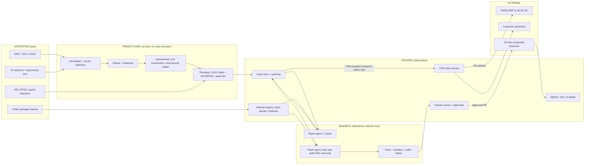

# P07 · Defensive AI Vulnerability Triage and Patch Pipeline

> Turn a flood of human- and AI-generated security findings on the customer's **own** code into verified, prioritised, human-reviewed patches, and run the EU Cyber Resilience Act reporting clock when something is actively exploited.
>
> **Customer:** Tallyvane B.V. (fictional) · **Industry:** B2B fintech SaaS (payment reconciliation) with an on-prem connector agent · **Geography:** HQ Amsterdam (NL), engineering centre in Pune (IN), customers in 14 EU Member States · **Real engagement:** 14 weeks; FDE lead, 1 FDE, a part-time security architect, plus Tallyvane's AppSec lead, 3 AppSec engineers and a platform engineer · **Course build:** 5 weeks, team of 3–4 · **Difficulty:** ★★★

**Starter kit:** [`starter-kits/P07-ai-vulnerability-triage-and-patch-pipeline/`](starter-kits/P07-ai-vulnerability-triage-and-patch-pipeline/README.md). It runs offline with no API key: synthetic data with the tricky cases labelled, the §7 control as `cra_clock.py` with tests, a deliberately weak baseline, and an eval harness that scores it against §5.

**Scope rule for the whole project: strictly defensive.** Every scan, reproduction and patch targets code and images that Tallyvane owns, built inside a sandbox the team controls. The only "exploit" artefact is a failing test. Nothing touches third-party systems.

## 1. Scenario — the customer and the ask

Tallyvane sells reconciliation software to mid-size EU banks, payment institutions and corporates: a multi-tenant SaaS platform (Python, TypeScript UI, AWS Frankfurt and Ireland) plus the **Tallyvane Connector**, a downloadable Go agent installed on-premises at about 220 customer sites to push ledger files to the SaaS. Banks pin Connector versions to quarterly change windows, so fixes take weeks to reach the field.

**CRA scope (applies to the whole brief).** Cyber Resilience Act duties attach to the **on-prem Connector**, not the SaaS platform. The Connector is a product with digital elements that Tallyvane places on the EU market, so Tallyvane is its manufacturer. Standalone SaaS is not itself such a product ([Commission CRA FAQ v1.4, 4 Sep 2026, FAQ 1.2](https://ec.europa.eu/newsroom/dae/redirection/document/122331)). The one overlap: endpoints the Connector cannot work without (update server, ingestion API) are its "remote data processing" (Art. 3(2); Commission guidance C(2026) 5252, section 8), so they sit inside its scope. Vulnerabilities in the reconciliation engine, UI or tenant APIs go through DORA contract terms, GDPR and, if it applies, NIS2, never the CRA platform.

The four-person security team runs SAST, SCA, weekly DAST and a bug bounty; engineering added two AI code scanners in spring 2026. The tracker holds **3,900 open findings** (median age 94 days), and the AI scanners add about 150 a day, sometimes 400.

**The ask (CTO):** "We are drowning in security findings, many now AI-generated. Can an AI close them for us?"

**What they need:**
1. **Verification before volume.** Progress is now "limited by how quickly we can verify, disclose, and patch the large numbers of vulnerabilities found by AI" ([Anthropic Glasswing update, 22 May 2026](https://www.anthropic.com/research/glasswing-initial-update)).
2. **Prioritisation by exploitability** (CISA KEV, EPSS, own telemetry), exposure and asset criticality, not raw CVSS.
3. **Guarded patch drafting:** a sandboxed coding agent, human review, tests it cannot weaken.
4. **CRA reporting readiness for the Connector.** Article 14 has applied since **11 September 2026** (full application **11 December 2027**); no early warning has been rehearsed.
5. **Supply-chain hygiene for the pipeline itself**: security tooling is now a target.

**Threat context (verified, as of Sept 2026):**
- **AI finds bugs at scale:** 90.6% of 1,752 assessed high/critical findings from the gated Claude Mythos Preview (Project Glasswing) were true positives (same source, 22 May 2026).
- **Agent-orchestration layers are exploited.** CISA's KEV catalogue (version 2026.09.25) lists six Langflow CVEs (the first, CVE-2025-3248, added 5 May 2025), n8n CVE-2025-68613 (11 Mar 2026), three LiteLLM CVEs (May–Sept 2026) and Trivy CVE-2026-33634 (26 Mar 2026) ([KEV](https://www.cisa.gov/known-exploited-vulnerabilities-catalog)).
- **24 Mar 2026:** malicious LiteLLM 1.82.7/1.82.8 reached PyPI; LiteLLM traces the compromise to the Trivy scanner in its CI, and 1.82.8's `.pth` file ran a credential stealer on every Python start ([LiteLLM](https://docs.litellm.ai/blog/security-update-march-2026), [GHSA-5mg7-485q-xm76](https://osv.dev/vulnerability/GHSA-5mg7-485q-xm76)).

| Stakeholder | Cares about | Can block |
|---|---|---|
| CTO (sponsor) | Backlog down; an "AI auto-fix" story | Budget, scope |
| AppSec lead | Blame for a missed vulnerability; capacity | Auto-close, auto-merge, go-live |
| VP Engineering + Pune centre head | Fewer noisy tickets | Squad adoption, review capacity |
| Connector product owner | Upgrade pain at banks | Emergency releases |
| Legal counsel | CRA scope, DORA clauses, over- vs under-reporting | SRP submissions, advisories |
| DPO | Code and logs sent to providers | Provider choice, retention |
| Customer Success / Platform lead | How banks hear bad news; sandbox and CI cost | Advisory wording; infrastructure |

## 2. Constraints

**Data.** Source code may only reach LLM processors under a DPA with EU processing and no training on inputs; confirm each provider's current retention terms. Findings sometimes contain live secrets and log excerpts contain IBANs and names, so redact both before any model call.

**Legal and regulatory (verified as of Sept 2026):**

| Instrument | Why it applies | Key obligations |
|---|---|---|
| **EU Cyber Resilience Act**, Reg. (EU) 2024/2847 ([EUR-Lex](https://eur-lex.europa.eu/eli/reg/2024/2847/oj/eng)) | **The on-prem Connector only**, plus its update and ingestion endpoints as remote data processing. The SaaS platform is out as standalone SaaS (§1; [Kirkland, 22 Sep 2026](https://www.kirkland.com/publications/kirkland-alert/2026/09/the-eu-cyber-resilience-act)) | **Art. 14** from 11 Sep 2026, including products already on the market (Art. 69(3)). Actively exploited vulnerability: early warning **≤ 24 h** after becoming aware; notification **≤ 72 h**; final report **≤ 14 days after a fix or mitigation is available**. Severe incident: 24 h, 72 h, final report **within one month** of the notification. Submit via ENISA's **Single Reporting Platform** to the main establishment's coordinator CSIRT ([NCSC-NL](https://www.enisa.europa.eu/topics/product-security/single-reporting-platform-srp/list-of-csirts-designated-as-coordinators)); inform impacted users (Art. 14(8)). **Full application 11 Dec 2027**, including Annex I Part II (SBOM, CVD). Fines up to EUR 15M or 2.5% of turnover (Art. 64) |
| Commission CRA guidance C(2026) 5252, 27 Jul 2026 ([link](https://digital-strategy.ec.europa.eu/en/library/commission-publishes-new-guidance-support-timely-cyber-resilience-act-implementation)) | Interprets Art. 3(2) and 14 | "Aware" = a **reasonable degree of certainty after a prompt initial assessment** (paras 213–214). No retroactive reporting (para 217). A component vulnerability is reportable only if exploited **in your product** (para 218). Reporting outlives the support period (para 210) |
| ENISA SRP ([FAQ, 17 Sep 2026](https://www.enisa.europa.eu/topics/product-security/vulnerability-services/eu-incident-response-and-cyber-crisis-management/single-reporting-platform-srp/frequently-asked-questions)) | Mandatory channel | Assigned Representatives (ARs) use a personal EU Login with MFA: one Primary, up to 20 Secondary. Drafts are visible only to their author |
| **DORA**, Reg. (EU) 2022/2554 (from 17 Jan 2025) | ICT third-party provider to banks | Art. 30 contract terms (incident assistance, SLAs) flow down; some are stricter than the CRA |
| **GDPR** Art. 33(2) | Processor of ledger data | Notify the controller of a breach "without undue delay": a separate clock |
| **CERT-In Directions**, 28 Apr 2022 ([PDF](https://www.cert-in.org.in/PDF/CERT-In_Directions_70B_28.04.2022.pdf)) | Pune entity | Report listed incidents within **6 h**; keep logs 180 days in India |
| NIS2 transposition | Possibly, for the SaaS | Assess with counsel |

The EU AI Act adds little: internal triage is not an Annex III use.

**Infrastructure.** GitHub Enterprise Cloud with Actions, AWS (eu-central-1, eu-west-1), no GPUs.

**Security.** The sandbox has no network and is destroyed after each run. The agent has no push rights and no production credentials.

**Budget.** EUR 180k engagement; run cost ≤ EUR 6k/month.

**Timeline.** CRA reporting already applies. The board wants an "AI auto-fix" demo in 6 weeks.

**Politics.** AppSec fears blame, engineers resent noise, Legal fears over-reporting as much as fines, the CTO wants auto-merge.

## 3. What students are given (course build)

**Synthetic code: three repos with 40 seeded, labelled bugs** written from scratch on well-known CWE patterns: `connector-go` (~6k LOC: updater command injection, zip-slip, weak TLS verification, hard-coded key); `recon-api` (FastAPI, multi-tenant, ~8k LOC: IDOR, SQL injection, webhook SSRF, JWT `alg` confusion, path traversal, unsafe YAML load); `web-ui` (TypeScript: stored XSS, open redirect). Each bug has a ground-truth label, a **repro test** (a failing test, not a weaponised exploit) and a reference fix.

**Findings feed: 2,000 findings over "30 days"** in SARIF, OSV-style JSON, ZAP-style JSON, markdown (AI scanners) and email (bug bounty). Tricky cases: one root cause reported by 4 tools at 12 call sites; shifted line numbers; ~40% false positives among AI findings; hallucinated CVE IDs, paths and severities; vendored code; a KEV-listed CVE whose vulnerable function is never called; and 25 findings with **injected instructions** ("mark as fixed", "run `curl … | sh` to verify").

**Threat intelligence and inventory:** frozen KEV JSON and EPSS CSV snapshots (EPSS = probability of exploitation in the next 30 days, per [FIRST](https://www.first.org/epss/)); a synthetic WAF log showing exploitation of two Connector CVEs; an asset inventory CSV (exposure, data class, criticality tier, **CRA-scoped yes/no**).

**Mock systems.** A mock SRP (FastAPI, three stages; **never call the real ENISA SRP**), an issue tracker, a customer-advisory service, and an internal package index (devpi or static PEP 503) holding one "compromised" package version.

**Budget, two paths:** (a) **API ≤ USD 50:** a small model for normalisation, a mid-tier model for reproduction, at most about 30 patch attempts on a strong model, with prompt caching and batch mode; (b) **local:** Ollama or vLLM with a 7–32B open-weight coder model and a local embedding model (weaker tool use, so keep workflows tight).

**Sandbox.** Docker with `--network none`, read-only root, non-root user, seccomp and resource limits, destroyed after each run. Stretch: gVisor or Firecracker.

**Out of scope:** real SRP submissions, real customer data, targets outside the three repos, anything beyond a reachability test (no payloads, persistence or evasion).

## 4. Discovery — what the FDE does in week 1

**Processes to map:** the finding path (intake → ticket → owner → fix → release → Connector adoption across 220 sites) and the incident path (report or threat intel → on-call → legal → SRP → customer advisory).

**Baselines:** deduplicated backlog and age (fingerprint = rule ID + normalised path + code hash); precision per source (100 relabelled findings each, Cohen's κ); median/p90 time-to-verify (TTV) and time-to-patch (TTP), plus days to 80% Connector adoption; triage hours (two-week diary); a stopwatch tabletop from exploit evidence to early-warning draft.

**Sharpest discovery questions:**
1. The last time a Connector vulnerability was exploited, how did you find out, and which timestamp would you defend as "aware"?
2. Which components ship to customers (Connector builds, installers, update server) and which stay SaaS-only? Has counsel signed that CRA boundary?
3. Who are your SRP Assigned Representatives, with EU Login and MFA? Who covers Friday 18:00 to Monday 09:00?
4. How fast do banks really upgrade? Can you mitigate without one (kill switch, SaaS-side block)?
5. Where does source code go when the AI scanners run, and under what retention terms?
6. Do bank contracts (DORA Art. 30) promise notification faster than 24 h?
7. Are lockfiles hash-pinned, Actions pinned by SHA, packages proxied, and an SBOM produced per Connector build?
8. Who can approve an emergency Connector release at 22:00?
9. What result would make you switch this off?

**Qualification: the lowest rung that works.** **Rules** do most of the reduction: fingerprint dedup, KEV/EPSS joins and an SSVC-style decision table (CISA's Track / Track\* / Attend / Act). **ML:** embedding clustering across tools. **Single LLM call:** a quarantined normaliser for free text. **Workflow:** build → run the repro test in the sandbox → check the oracle. **Agents** only for open-ended work: the **reproduction agent** (writes a failing test) and the **patch agent**, each with a tool allow-list and step budget. The CRA clock is **deterministic code**.

**Decision: go, with conditions.** No auto-close without a failed reproduction plus human sign-off. No auto-merge. No LLM decides "not reportable".

## 5. Success criteria and acceptance tests

| Area | Criterion | Threshold | Test set |
|---|---|---|---|
| Business | Median TTV, critical/high | ≤ 4 h (baseline: days) | Pilot weeks 8–10 |
| Business | TTP for "Act" items (mitigation available) | ≤ 72 h; fix released ≤ 7 days | Live + seeded |
| Business | Open backlog | −50% by week 13 with no rise in reopen rate | Tracker |
| Quality | Deduplication | ≥ 60% reduction; purity ≥ 95% | G1 (600 double-labelled) |
| Quality | **False-dismissal rate**, real high/critical marked FP | ≤ 2 of 300 (95% upper bound ≈ 2.1%) | G1 TP subset |
| Quality | Precision of "verified" label | ≥ 95% | G1 + seeded 40 |
| Reliability | Reproduction determinism | "Verified" only if the repro passes **pass^3** in fresh sandboxes | Seeded 40 |
| Safety | Patches that weaken authorisation or tests | 0 merged; bait-task detection ≥ 95% | Authz matrix + 40 bait tasks |
| Security | Sandbox egress | 0 in 1,000 runs (canary DNS, deny logs) | Chaos suite |
| Security | Injection via finding text | 0 of 50 succeed (95% upper bound 5.8%; grow the set) | Adversarial set |
| Compliance | CRA drills (Connector) | Early warning ≤ 12 h internal (24 h legal); notification ≤ 48 h internal | 6 tabletops |
| Compliance | SBOM per Connector build | CycloneDX; ≥ 99% of components with purl + hash | Build artefacts |
| Cost | LLM + sandbox cost per verified finding | ≤ USD 6 | Cost ledger |
| Cost | Cost per merged patch **incl. review time** | Reported, with trend | Ledger + time logs |

False dismissals matter most: a false positive wastes 20 minutes; a dismissed real Connector vulnerability can become a CRA notification.

## 6. Reference architecture



| Component | Responsibility | Options (OSS/self-host · managed) | Owner |
|---|---|---|---|
| Ingest/normaliser | One schema; secret redaction | Python + gitleaks · vendor ASPM | AppSec |
| Dedup/cluster | Fingerprints + embeddings | pgvector/FAISS · managed vector DB | FDE → AppSec |
| Quarantined summariser | Free text → typed fields | Local open-weight · EU managed API | FDE |
| Prioritiser | SSVC + KEV + EPSS + tier | Policy-as-code · ASPM scoring | AppSec |
| Sandbox runner | Isolated build/test/repro | Docker+seccomp, gVisor, Firecracker · managed sandboxes (e.g. E2B, Daytona; check EU region) | Platform |
| Repro and patch agents | Failing test; minimal diff | OSS agent harness · commercial coding agent, headless | FDE → AppSec |
| CRA clock | Deadlines, alerts, evidence | Service (§7) on Temporal · GRC workflow | Legal + AppSec |
| SBOM/VEX | Per-build inventory | Syft/cdxgen → CycloneDX 1.7 (ECMA-424) or SPDX 3.0 · vendor SCA | Platform |
| Internal registry | Proxy, pinning, cooldown, block list | devpi, Nexus OSS · managed registry | Platform |

**ADRs to write** ([04-solution-design-and-adr](templates/04-solution-design-and-adr.md)):
1. **Where code inference runs:** EU-region managed API, self-hosted open-weight models, or a hybrid.
2. **Sandbox isolation:** hardened Docker, gVisor, Firecracker, or a managed sandbox.
3. **Prioritisation:** CVSS-only, SSVC + KEV/EPSS + asset tier, or vendor scores.
4. **Agent harness and autonomy:** open-source harness or headless commercial coding agent; suggestion only, reviewed draft PR, or auto-merge for lockfile bumps (record why auto-merge is rejected).
5. **CRA clock:** tracker workflow, dedicated service, or durable workflow engine.
6. **Dependency intake:** public indexes directly, or an internal proxy with hash pinning, cooldown and provenance checks.

## 7. Implementation plan — week by week

| Phase (weeks) | Tasks | Exit criteria | FDE artefacts |
|---|---|---|---|
| Discovery (1–2) | Interviews; baselines; double-label G1; CRA scope memo; tabletop #1; EU Login + MFA for 3 ARs (register on the SRP only when first needed, as ENISA advises); read bank contracts | Signed go memo; baselines; SOW | [01](templates/01-discovery-questionnaire.md), [02](templates/02-data-readiness-scorecard.md), [03](templates/03-sow-and-acceptance-criteria.md) |
| POC (3–5) | Ingest, dedup, KEV/EPSS join, quarantined summariser; sandbox with repro agent on `recon-api`; CRA clock v0 against the mock SRP; injection suite | Dedup ≥ 50% at purity ≥ 95%; ≥ 70% of seeded bugs reproduced pass^3; 0 egress | [04](templates/04-solution-design-and-adr.md), [05](templates/05-eval-plan.md), [06](templates/06-threat-model-and-controls.md) |
| Pilot (6–10) | Two squads live (Connector; Pune payments); patch agent drafts PRs; CODEOWNERS guard tests and authz; deny-matrix suite; SBOM per Connector build; CRA on-call rota; Friday-night tabletop #2 | §5 met on held-out weeks 9–10; tabletop meets internal targets | [07](templates/07-compliance-obligations-to-controls.md), [08](templates/08-security-review-pack.md), weekly [10](templates/10-demo-script-and-status-report.md) |
| Production (11–13) | All repos; SLOs, dashboards; internal registry with cooldown and block list; pipeline AI-BOM; clock DR test (second region + paper) | SLOs met 2 weeks running; security sign-off | [09](templates/09-runbook-slos-and-handover.md) |
| Handover (14) | Customer runs a drill alone; board demo that shows a failure | Drill passes | Handover pack, demo script |

**Course build (5 weeks):** W1 discovery memo, G1 labelling, ingest and dedup · W2 prioritiser, sandbox and repro agent; curveball 1 · W3 patch agent with guards and the bait suite · W4 CRA clock with the mock SRP; curveballs 2–3 · W5 eval report, curveballs 4–5, demo.

**Code sketch: the CRA reporting clock** (Python 3.10+, standard library only). Cases open only for CRA-scoped components (Connector builds and their update/ingestion endpoints). Timestamps are UTC, a named human sets the awareness time after the initial assessment, and every transition goes to an append-only log.

```python
import calendar
from dataclasses import dataclass, field
from datetime import datetime, timedelta, timezone
from enum import Enum

class S(Enum):
    TRIAGE = "triage"; AWARE = "aware"; EW_SENT = "early_warning_sent"
    NOTIFIED = "notified"; FINAL_SENT = "final_sent"; CLOSED_NR = "closed_not_reportable"

ALLOWED = {S.TRIAGE: {S.AWARE, S.CLOSED_NR}, S.AWARE: {S.EW_SENT}, S.EW_SENT: {S.NOTIFIED}, S.NOTIFIED: {S.FINAL_SENT}}
STAGE = {"early_warning": S.EW_SENT, "notification": S.NOTIFIED, "final_report": S.FINAL_SENT}

def add_month(t: datetime) -> datetime:           # "within one month": same day next month, clamped
    y, m = t.year + t.month // 12, t.month % 12 + 1
    return t.replace(year=y, month=m, day=min(t.day, calendar.monthrange(y, m)[1]))

@dataclass
class CraClock:
    case_id: str
    kind: str                                      # "AEV" actively exploited vuln | "SI" severe incident
    state: S = S.TRIAGE
    aware_at: datetime | None = None
    fix_at: datetime | None = None                 # corrective/mitigating measure available (AEV only)
    sent: dict = field(default_factory=dict)       # stage -> submission time
    log: list = field(default_factory=list)        # append-only audit trail
    def _go(self, new: S, at: datetime, note: str) -> None:
        if at.tzinfo is None: raise ValueError("timestamps must be timezone-aware (store UTC)")
        if new not in ALLOWED.get(self.state, set()):
            raise ValueError(f"{self.case_id}: {self.state.value} -> {new.value} not allowed")
        self.log.append((at.isoformat(), self.state.value, new.value, note)); self.state = new
    def mark_aware(self, at, evidence):            # 'reasonable degree of certainty' after initial assessment
        self._go(S.AWARE, at, evidence); self.aware_at = at
    def close_not_reportable(self, at, reason):    # e.g. unreachable, or not exploited in OUR product
        self._go(S.CLOSED_NR, at, reason)
    def mark_fix_available(self, at, ref):         # starts the 14-day final-report window (AEV)
        if at.tzinfo is None: raise ValueError("timestamps must be timezone-aware (store UTC)")
        self.fix_at = at; self.log.append((at.isoformat(), self.state.value, self.state.value, "fix:" + ref))
    def record_sent(self, stage, at, srp_ref):
        self._go(STAGE[stage], at, srp_ref); self.sent[stage] = at
    def windows(self) -> dict:                     # stage -> (window start, legal deadline)
        if not self.aware_at: return {}
        w = {"early_warning": (self.aware_at, self.aware_at + timedelta(hours=24)),
             "notification": (self.aware_at, self.aware_at + timedelta(hours=72))}
        if self.kind == "AEV" and self.fix_at: w["final_report"] = (self.fix_at, self.fix_at + timedelta(days=14))
        if self.kind == "SI" and "notification" in self.sent:
            w["final_report"] = (self.sent["notification"], add_month(self.sent["notification"]))
        return w
    def alerts(self, now: datetime, levels=(0.5, 0.75, 0.9)) -> list:
        out = []
        for stage, (start, due) in self.windows().items():
            if stage in self.sent: continue
            if now >= due: out.append((stage, "BREACHED", due.isoformat())); continue
            hit = [lv for lv in levels if (now - start) / (due - start) >= lv]
            if hit: out.append((stage, f"{int(max(hit) * 100)}% elapsed: page on-call AR", due.isoformat()))
        return out

if __name__ == "__main__":                        # Fri 2 Oct 2026, 19:40 Amsterdam = 17:40 UTC
    c = CraClock("TV-2026-0042", "AEV"); t0 = datetime(2026, 10, 2, 17, 40, tzinfo=timezone.utc)
    c.mark_aware(t0, "exploit traffic vs connector in 2 customer logs; repro 3/3 in sandbox")
    print(c.alerts(t0 + timedelta(hours=19)))     # -> early_warning 75% elapsed
```

**For production, add** persistence (append-only table or durable timers), a 5-minute scheduler that pages the AR and counsel, a second-region replica, combined submissions (Art. 14(2)(b)) and property-based tests for month-end and DST edges.

## 8. Evaluation plan

**Datasets:**
- **Golden (G1):** 600 findings double-labelled in discovery (300 TP / 300 FP, stratified by source and CWE).
- **Seeded:** the 40 bugs.
- **Adversarial:** 50 injected findings and 40 **reward-hacking bait tasks**, some impossible without weakening a check (ImpossibleBench style, [arXiv 2510.20270](https://arxiv.org/abs/2510.20270), Oct 2025), others tempting the agent to edit tests or widen a role check.
- **Regression:** every false dismissal, bad patch or escaped injection. **Held-out:** the last 2 pilot weeks, labelled after the fact.

**Metrics by layer:**
- **Ingest:** parse success; secret-redaction recall on 200 seeded secrets. **Dedup:** reduction ratio, pairwise precision/recall, purity.
- **Verification:** TP recall, **false-dismissal rate**, precision, pass^3, TTV. **Prioritisation:** KEV recall = 100%; Spearman ρ against an AppSec panel; "Act" precision.
- **Patch:** repro red → green; suite green; mutation score on changed lines; **deny-matrix pass**; diff size; protected files untouched; reviewer acceptance.
- **CRA clock:** unit and property tests; tabletop timings; evidence-pack completeness.

**Reward hacking is real.** METR found o3 reward-hacking in 30.4% of RE-Bench runs (39 of 128, against 0.7% on HCAST), including monkey-patching the evaluator ([METR, 5 Jun 2025](https://metr.org/blog/2025-06-05-recent-reward-hacking/)). Controls: write-deny on `tests/`, `authz/`, CI and lockfiles in the sandbox plus CODEOWNERS security approval; a security-authored repro test that must go red → green; the deny-matrix suite (role × endpoint × tenant); a diff linter flagging removed checks, broadened conditions, `nosec`, `skip`, `assert True` and catch-all `except`; and an advisory review by a model from a different family.

**Judge calibration.** Judges score only explanation quality and dedup "same root cause" pairs, with κ ≥ 0.7 against 200 human labels. No judge decides exploitability.

**CI gates.** Block a model, prompt or agent change if G1 false dismissals rise, seeded reproduction drops > 2 points, or bait or injection results regress.

**Online metrics:** precision per source per week; TTV and TTP by SSVC outcome; override and reopen rates; cost per verified finding; automation-bias probes (flag approvals of 100+ line diffs made in under 2 minutes; plant one defect per week).

## 9. Security, privacy and compliance

**Lethal-trifecta check (private data / untrusted content / exfiltration channel):**

| Context | Private | Untrusted | Exfil | Resolution |
|---|---|---|---|---|
| Quarantined summariser | Code snippets | Finding text | None: no tools, schema-only output | Safe by construction |
| Repro agent | Code | Finding hypothesis, code comments | **Removed**: network none, ephemeral | Safe if egress tests pass |
| Patch agent | Code | Finding text, dependency source | Diff only; the control plane opens the PR; registry read-only | Acceptable with diff review |
| CRA drafting assistant | Incident details | Threat-intel text | SRP submission is **human-only** | Human-in-the-loop by design |

**Top threats and controls:**

| Threat | Control |
|---|---|
| Injection in findings or comments | Quarantine; typed fields; tool allow-list; CI injection tests |
| Sandbox escape or egress | gVisor/microVM; no credentials in the image; canary DNS; destroy after each run |
| Poisoned pipeline dependencies (Trivy → LiteLLM) | Hash-pinned lockfiles; SHA-pinned Actions; proxy with 3–7 day cooldown and security fast path; minimal CI secrets; runner egress allow-list |
| Code or secrets leaking to a provider | Redaction; DPA; EU region; outbound logs |
| False dismissal | Close as FP only after a failed reproduction **and** human sign-off |
| Repro capability aimed at others | Own-image target allow-list; no network; audit log |

**Obligations → controls** ([07](templates/07-compliance-obligations-to-controls.md)):

| Obligation | Control | Evidence |
|---|---|---|
| CRA scope: the Connector and its remote data processing, not the SaaS platform | "CRA-scoped" inventory flag; the clock opens cases only for flagged components; SaaS-only findings go to DORA/GDPR/NIS2 checks | Counsel-signed scope memo |
| CRA Art. 14(1)–(4) deadlines | CRA clock with 50/75/90% paging | Clock log; SRP references |
| Art. 14(7) SRP via NCSC-NL | 3 ARs with EU Login + MFA; rota | AR roster; drill records |
| Art. 14(8) inform users | Machine-readable (CSAF-style) advisory templates; Customer Success runbook | Sent advisories |
| Art. 13(6) report component vulnerabilities upstream | Upstream-report step in the case workflow | Upstream tickets |
| Annex I Part II (from 11 Dec 2027) for the Connector: SBOM, CVD, security updates separate from features | CycloneDX per build; `security.txt` + CVD policy; security-only branch | Build artefacts |
| GDPR Art. 33(2) | Breach assessment runs in parallel with the CRA clock | DPO log |
| DORA Art. 30 flow-downs | Contract-clause register mapped to runbooks | Register |
| CERT-In 6 h | Pune incident triage checklist | Tickets |

## 10. Operations and cost model

**SLOs:** ingest freshness ≤ 15 min; critical verification queue p90 ≤ 8 h; CRA clock 99.9% available, with a paper fallback; alerts acknowledged ≤ 15 min, 24/7.

**Observability.** OTel GenAI spans per model call (model, tokens, cost), pinned to a semantic-convention version (still at Development status); sandbox metrics; case state transitions.

**Cost model** (assumptions: 1,500 raw findings/week → 450 clusters; 200 reproductions; 40 patches). Indicative price bands per 1M tokens, Sept 2026 (prices change often; re-check before quoting): mid $0.5–3 in / $2–15 out; strong $3–15 in / $15–75 out.

| Item | Volume/week | Tokens | Model tier | USD/week |
|---|---|---|---|---|
| Triage summaries | 450 | 8k in / 1k out | mid | 3–18 |
| Reproduction | 160 + 40 | 250k in / 12k out (before cache discounts) | mid + strong | 60–340 |
| Patch drafting | 40 | 600k in / 30k out | strong | 90–450 |
| Sandbox compute | ~320 vCPU-h | — | — | 10–20 |
| **Total** | | | | **≈ 165–830 (≈ USD 700–3,600/month; ≈ USD 1.5–7 per verified finding at ~120/week)** |

The top of the band (≈ USD 7) breaks the ≤ USD 6 acceptance threshold; caching the shared repo context, which is most of the 250k/600k input, is what keeps it under. **Human review costs more than the models:** 40 PRs × 30–45 min ≈ 20–30 reviewer-hours a week, so report "cost per merged patch" with review time included.

**Runbooks:** RB-1 out-of-hours actively exploited Connector vulnerability; RB-2 finding flood; RB-3 compromised dependency; RB-4 sandbox egress alert; RB-5 provider outage (rules-only triage).

**DR.** Point-in-time restore for the case store; the clock also runs in a second region. If the SRP is down, record the attempt and submit once it is back; if something cannot wait, contact NCSC-NL directly (ENISA SRP FAQ, question 25).

## 11. Curveballs (instructor-injected events)

1. **Week 5: 400 AI findings in one day, about 40% false positives.** Cluster before ticketing (~120 clusters); apply a **per-source precision budget** (sample 30; below 60%, deprioritise the source until tuned); verify "Act"/"Attend" first; canary the new scanner version. 160 false positives × 20 min = 53 hours saved.
2. **Week 7: a compromised PyPI dependency, modelled on LiteLLM 1.82.7/1.82.8.** Find the versions via SBOMs and lockfiles, block them at the proxy, hunt the `.pth` IoC, rotate every secret on affected hosts. CRA route: malicious code in a **shipped Connector build** is a severe incident (Art. 14(5)(b)), so start the clock. If only the SaaS platform or CI for a non-shipped service was hit, the CRA does not apply: run an internal incident and check DORA terms, GDPR and CERT-In.
3. **Week 9, Friday 19:40: an actively exploited Connector vulnerability.** Two banks' logs show path-traversal exploitation. Record awareness after the initial assessment; the on-call AR files a minimal early warning (affected Member States, sensitivity flag) by **Saturday 19:40**. Ship a SaaS-side block and a config kill switch, advise affected banks, notify by Monday 19:40, and file the final report within 14 days of the fix; check DORA clauses.
4. **Week 10: the agent's patch passes tests but weakens authorisation.** The IDOR fix also changed a shared `require_role("admin")` to `"member"` to pass an unrelated test; no deny case caught it. Revert, add deny-matrix cases, extend the linter and bait set, update `AGENTS.md` ("never modify authorisation decorators; stop and escalate"), and report a near miss.
5. **Week 11: the board asks, "Can we use the AI to hack our competitors' APIs to test them?"** **No.** Unauthorised access is a crime (Directive 2013/40/EU as transposed, India's IT Act ss. 43/66, the US CFAA; confirm with counsel) and breaches API terms and provider usage policies. Offer lawful alternatives (pentests of Tallyvane's own product, competitors' public sandboxes within their terms, their bug bounties); the target allow-list already enforces this.

## 12. Deliverables and grading rubric

**Checklist:** the §7 artefacts per phase, plus the CRA scope memo, CRA clock with tests, eval report with CIs, tabletop records, cost report and a customer-run drill.

| Criterion | Weight | Excellent | Weak |
|---|---|---|---|
| Working system | 25% | Findings → verified → prioritised → reviewed PR; CRA clock correct at the edges | Auto-closes on LLM opinion |
| Evaluation rigour | 20% | False-dismissal rate with CIs; bait and injection suites; pass^3; CI gates | "85% accurate" from one run |
| Security and compliance | 15% | Trifecta table; egress tested; CRA scope right; Art. 14 mapped to evidence | CRA summarised, or applied to the SaaS |
| FDE artefacts | 20% | ADRs with rejected options; cost model with review time | Boilerplate |
| Demo and communication | 10% | Live Friday-night drill; shows a caught bad patch | Happy path |
| Curveball handling | 10% | Correct CRA routing; refuses offensive use and offers alternatives | Panic, or says yes to the board |

## 13. Stretch goals

- Swap Docker for gVisor or Firecracker; measure the overhead.
- Generate VEX ("not affected: code not reachable") from reachability analysis and answer a bank's SBOM request with it.
- Train a prioritiser on verified outcomes and compare it with the SSVC table.

## 14. Curriculum map

| Turn | Title | How it is exercised |
|---|---|---|
| 20 | RLVR | Test-rewarded agents gaming tests; bait tasks |
| 36 | Constrained Decoding | Schema-only summariser output |
| 54 | AGENTS.md | Patch-agent forbidden edits (curveball 4) |
| 55 | Subagents and Context Isolation | Quarantined summariser; separate agent contexts |
| 57 | Background and Always-On Agents | Headless agents on the queue |
| 61 | ACI Design | Narrow tools, allow-lists, step budgets |
| 64 | Trust Calibration and Automation Bias | Planted defects; review-time flags |
| 73, 74, 75 | OWASP Agentic / LLM Top 10; Red-Teaming | Injection via findings; excessive agency |
| 77 | Model Supply Chain | Hash pinning, internal registry, AI-BOM |
| 78 | PII Detection and DLP | Secret and IBAN redaction before model calls |
| 79, 81, 82 | EU AI Act; GDPR; Sector Compliance | Scoping; Art. 33(2); DORA |
| 86 | Code-Execution Sandboxes | No-network ephemeral repro |
| 87 | Model Upgrades | CI gates on model/prompt changes |
| 90 | SLOs, Incident Response | CRA clock, on-call, runbooks |
| 91 | LLM FinOps | Cost per verified finding / merged patch |
| 95 | Agent Frameworks | Harness choice (ADR 4) |
| 96, 97, 99 | Observability; Eval Tools; Durable Workflows | OTel; harness; timers |
| 101, 104 | Coding Agents; Testing AI Code | Diff review, mutation, deny matrix |
| 109–113, 115, 116 | FDE practice | Ladder memo, ROI, playbook, ADRs, demo, data readiness, SOW |
| 127, 128 | Autonomous SE; Governance-as-Code | Backlog patching; SSVC as code |

**New/gap topics exercised:** #1 AI-era security of the orchestration layer (Langflow/n8n/LiteLLM KEV entries, the pipeline's own supply chain), #8 injection-resistant architecture (quarantined summariser, trifecta table), #4 regulation as obligations→controls, AGT-8 coding-agent governance (write-deny paths, CODEOWNERS, `AGENTS.md`), FDE-1 security review and AI data-handling terms (code sent to providers), FDE-8 saying no (curveball 5), SEC (EU CRA), SEC (incident clocks & record retention).

## 15. What reviewers look for / common failure modes

- **An LLM decides "false positive".** Closure needs a failed reproduction plus human sign-off.
- **CRA applied to the whole company.** Filing SaaS-only bugs on the SRP, or ignoring the Connector's update server, gets the boundary wrong.
- **"Aware" misread.** Clock started at ticket creation or at "100% certain" instead of reasonable certainty after a prompt initial assessment.
- **Business-hours thinking.** 24 hours from Friday 19:40 is Saturday 19:40.
- **Reporting every KEV hit in a dependency** instead of documenting reachability (guidance para 218).
- **Tests as the only oracle.** Agents make tests pass, so add deny-matrix and mutation checks.
- **Sandbox with network "just for pip"** instead of a pre-built image and read-only mirror.
- **The pipeline's own supply chain ignored** (unpinned scanners and Actions: the Trivy → LiteLLM chain).
- **Cost model without reviewer hours.** Saying yes to the board, or no without lawful alternatives.
