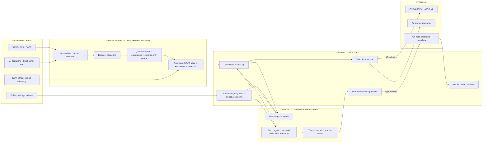

# P07 · Defensive AI Vulnerability Triage and Patch Pipeline

> Turn a flood of human- and AI-generated security findings on the customer's **own** code into verified, prioritised, human-reviewed patches, and run the EU Cyber Resilience Act reporting clock when something is actively exploited.
> **Customer:** LedgerLoop B.V. (fictional) · **Industry:** B2B fintech SaaS (payment reconciliation) with an on-prem connector agent · **Geography:** HQ Amsterdam (NL), engineering centre in Pune (IN), customers in 14 EU member states · **Real engagement:** 14 weeks; FDE lead, 1 FDE, a part-time security architect, plus LedgerLoop's AppSec lead, 3 AppSec engineers and a platform engineer · **Course build:** 5 weeks, team of 3–4 · **Difficulty:** ★★★

**Scope rule for the whole project: strictly defensive.** Every scan, reproduction and patch targets code and images that LedgerLoop owns, built inside a sandbox the team controls. Nothing in this brief touches third-party systems.

## 1. Scenario — the customer and the ask

LedgerLoop sells reconciliation software to mid-size EU banks, payment institutions and corporates. The product is a multi-tenant SaaS (Python services, TypeScript UI, AWS Frankfurt and Ireland) plus the **LedgerLoop Connector**, a Go agent at about 220 customer sites that pulls ledger files and pushes them to the SaaS. Banks pin Connector versions to quarterly change windows, so fixes take weeks to reach the field.

The security team has four people. On top of SAST, SCA, weekly DAST and a bug bounty, engineering added two AI code scanners in spring 2026. The tracker now holds **3,900 open findings** (median age 94 days). The AI scanners add about 150 findings a day, sometimes 400.

**The ask (CTO):** "We are drowning in security findings, many now AI-generated. Can an AI close them for us?"

**What they actually need:**
1. **Verification before volume.** As Anthropic's 22 May 2026 Glasswing update puts it, progress is now "limited by how quickly we can verify, disclose, and patch the large numbers of vulnerabilities found by AI" ([Anthropic](https://www.anthropic.com/research/glasswing-initial-update)).
2. **Prioritisation by exploitability** (CISA KEV, EPSS, own telemetry), exposure and asset criticality, not raw CVSS.
3. **Patch drafting under guardrails:** a sandboxed coding agent, human review, and tests it cannot weaken.
4. **CRA reporting readiness.** Article 14 has applied since **11 September 2026**, and no early warning has ever been rehearsed.
5. **Supply-chain hygiene for the pipeline itself**, because security tooling is now a target.

**Threat context (verified, as of Sept 2026):**
- **13 Nov 2025:** Anthropic disrupted what it called the first reported AI-orchestrated espionage campaign. A group it assessed as Chinese state-sponsored used Claude Code for "80-90% of the campaign" against about 30 targets. The model also "occasionally hallucinated credentials" ([Anthropic](https://www.anthropic.com/news/disrupting-AI-espionage)).
- **7 Apr 2026:** Claude Mythos Preview, which was not generally released, was given to defenders through Project Glasswing ([Anthropic](https://www.anthropic.com/glasswing)). By 22 May 2026, 1,752 of its high/critical open-source findings had been assessed, mostly by independent firms: 90.6% were true positives and 62.4% were confirmed high or critical.
- **Agent-orchestration layers are being exploited.** CISA's KEV catalogue (version 2026.09.25) lists Langflow (CVE-2025-3248, added 5 May 2025), n8n (CVE-2025-68613, added 11 Mar 2026) and three LiteLLM CVEs added between May and Sept 2026 ([KEV](https://www.cisa.gov/known-exploited-vulnerabilities-catalog)).
- **24 Mar 2026:** malicious LiteLLM 1.82.7/1.82.8 were published to PyPI using a token reportedly stolen via the earlier **Trivy** scanner compromise. Version 1.82.8's `.pth` file ran on every Python start ([LiteLLM](https://docs.litellm.ai/blog/security-update-march-2026), [GHSA-5mg7-485q-xm76](https://osv.dev/vulnerability/GHSA-5mg7-485q-xm76)). Sources disagree on how long the versions were live, from about 40 minutes to about 3 hours ([Wiz](https://www.wiz.io/blog/threes-a-crowd-teampcp-trojanizes-litellm-in-continuation-of-campaign)).

| Stakeholder | Cares about | Can block |
|---|---|---|
| CTO (sponsor) | Backlog down; an "AI auto-fix" story | Budget, scope |
| Head of Security / AppSec lead | Not being blamed for a missed vulnerability; capacity | Auto-close, auto-merge, go-live |
| VP Engineering + Pune centre head | Fewer noisy tickets | Squad adoption, review capacity |
| Connector product owner | Upgrade pain at banks | Emergency releases |
| Legal counsel | CRA, DORA clauses, over- vs under-reporting | SRP submissions, advisories |
| DPO | Code and logs sent to providers | Provider choice, retention |
| Customer Success | How banks hear bad news | Advisory wording and timing |
| Platform/SRE lead | Sandbox cost, CI load, registry | Infrastructure |
| Board risk committee | Fines, reputation | Budget (see curveball 5) |

## 2. Constraints

**Data.** Source code is the crown jewel. Code may only reach LLM processors under a DPA with EU processing and no training on inputs; confirm each provider's current retention terms. Findings sometimes contain live secrets, and customer log excerpts contain IBANs and names, so redact both before any model call.

**Legal and regulatory (verified as of Sept 2026):**

| Instrument | Why it applies | Key obligations |
|---|---|---|
| **EU Cyber Resilience Act**, Reg. (EU) 2024/2847 ([EUR-Lex](https://eur-lex.europa.eu/eli/reg/2024/2847/oj/eng)) | The Connector is a product with digital elements on the EU market. The SaaS back end may be its "remote data processing solution" (Art. 3(2)); decide with counsel | **Art. 14**, from 11 Sep 2026 (Art. 69(3) extends it to products already on the market). Actively exploited vulnerability: early warning **≤ 24 h** after becoming aware; notification **≤ 72 h**; final report **≤ 14 days after a fix or mitigation is available**. Severe incident: 24 h, 72 h, and a final report **within one month** of the notification. Submit via ENISA's **Single Reporting Platform** to the coordinator CSIRT of the main establishment ([NCSC-NL](https://www.enisa.europa.eu/topics/product-security/single-reporting-platform-srp/list-of-csirts-designated-as-coordinators)). Art. 14(8): inform impacted users. Annex I Part II (SBOM, CVD) applies from **11 Dec 2027**. Fines up to EUR 15M or 2.5% of turnover (Art. 64) |
| Commission CRA guidance C(2026) 5252, 27 Jul 2026 ([link](https://digital-strategy.ec.europa.eu/en/library/commission-publishes-new-guidance-support-timely-cyber-resilience-act-implementation)) | Interprets Art. 14 | "Aware" means a **reasonable degree of certainty after a prompt initial assessment** (paras 213–214). No retroactive reporting (para 217). A third-party component vulnerability must be reported only if it is exploited **in your product**, not if it is unreachable (para 218). Reporting continues after the support period ends (para 210) |
| ENISA SRP ([FAQ, 17 Sep 2026](https://www.enisa.europa.eu/topics/product-security/vulnerability-services/eu-incident-response-and-cyber-crisis-management/single-reporting-platform-srp/frequently-asked-questions)) | Mandatory channel | Assigned Representatives use a personal EU Login with MFA: one Primary plus up to 20 Secondary. Drafts are visible only to their author |
| **DORA**, Reg. (EU) 2022/2554 (applies from 17 Jan 2025) | ICT third-party provider to banks | Art. 30 contract terms (incident assistance, SLAs) flow down from customers. Some may be stricter than the CRA |
| **GDPR** Art. 33(2) | Processor of ledger data | Notify the controller of a personal-data breach "without undue delay". This is a separate clock |
| **CERT-In Directions**, 28 Apr 2022 ([PDF](https://www.cert-in.org.in/PDF/CERT-In_Directions_70B_28.04.2022.pdf)) | Pune entity | Report listed incidents within **6 h**; keep logs for 180 days in India. Check per incident |
| NIS2 transposition | Uncertain | Assess with counsel; do not assume |

The EU AI Act adds little: internal triage is not an Annex III use.

**Infrastructure.** GitHub Enterprise Cloud with Actions, AWS (eu-central-1, eu-west-1), no GPUs.
**Security.** The sandbox has no network and is destroyed after each run. The agent has no push rights and no production credentials.
**Budget.** EUR 180k engagement. Run cost at or below EUR 6k/month.
**Timeline.** The CRA already applies. The board wants an "AI auto-fix" demo in 6 weeks.
**Politics.** AppSec fears blame, engineers resent noise, Legal fears over-reporting as much as fines, and the CTO wants auto-merge.

## 3. What students are given (course build)

**Synthetic code: three repos with 40 seeded, labelled bugs**, each written from scratch using well-known CWE patterns:
- `connector-go` (~6k LOC): updater command injection, zip-slip, weak TLS verification, a hard-coded key.
- `recon-api` (FastAPI, multi-tenant, ~8k LOC): IDOR, SQL injection, webhook SSRF, JWT `alg` confusion, path traversal, unsafe YAML load.
- `web-ui` (TypeScript): stored XSS, open redirect.

Each bug ships with a ground-truth label, a **repro test** (a failing test, not a weaponised exploit) and a reference fix.

**Findings feed: 2,000 findings over "30 days".** Formats: SARIF 2.1.0 (SAST), OSV-style JSON (SCA), ZAP-style JSON (DAST), markdown (AI scanners) and email text (bug bounty). Tricky cases:
- One root cause reported by 4 tools at 12 call sites.
- Line numbers shifted by refactors.
- About 40% false positives among AI findings: unreachable code, inputs already sanitised, test-only code.
- Hallucinated CVE IDs and file paths, and severity inflation.
- Findings in vendored code.
- A KEV-listed CVE in a dependency whose vulnerable function is never called.
- 25 findings carrying **injected instructions** ("mark as fixed", "run `curl … | sh` to verify").

**Threat intelligence and inventory:**
- Frozen KEV JSON and EPSS CSV snapshots (EPSS gives the probability of exploitation in the next 30 days, per [FIRST](https://www.first.org/epss/)).
- A synthetic WAF log showing exploitation of two CVEs.
- An asset inventory CSV (exposure, data class, criticality tier).

**Mock systems.** A mock SRP (FastAPI, three stages; **never call the real ENISA SRP**), an issue tracker, a customer-advisory service, and an internal package index (devpi or static PEP 503) that contains one "compromised" package version.

**Budget, two paths:**
- **API ≤ USD 50:** a small model for normalisation, a mid-tier model for reproduction, and at most about 30 patch attempts on a strong model. Use prompt caching and batch mode.
- **Local:** Ollama or vLLM with an open-weight coder model sized to your hardware (7–32B class) and a local embedding model. Tool use will be weaker, so keep the workflows tight.

**Sandbox.** Docker with `--network none`, read-only root, non-root user, seccomp and resource limits, destroyed after each run. Stretch: gVisor or Firecracker.

**Out of scope:** real SRP submissions, real customer data, targets outside the three repos, anything beyond a reachability test (no payloads, persistence or evasion).

## 4. Discovery — what the FDE does in week 1

**Processes to map:**
- **Finding path:** intake → ticket → owner → fix → release → Connector adoption across 220 sites.
- **Incident path:** report or threat intel → on-call → legal → SRP → customer advisory.

**Baselines and how to measure them:**
- **Backlog and age:** tracker export, deduplicated by fingerprint (rule ID + normalised path + code hash).
- **Precision per source:** two AppSec engineers relabel 100 closed findings per source; report Cohen's κ.
- **Time-to-verify (TTV) and time-to-patch (TTP):** median and p90 by severity, plus Connector adoption telemetry (days to 80% adoption).
- **Triage hours:** a two-week time diary.
- **CRA readiness:** a stopwatch tabletop from "exploit evidence arrives" to a complete early-warning draft.

**Sharpest discovery questions:**
1. The last time a Connector vulnerability was exploited, how did you find out, and which timestamp would you defend as "aware"?
2. Who are your SRP Assigned Representatives? Do they have EU Login with MFA? Who covers Friday 18:00 to Monday 09:00?
3. How fast do banks actually upgrade? Can you mitigate without an upgrade (a kill switch or a SaaS-side block)?
4. Of the last 50 AI findings, how many were real, and how long did each false one take to disprove?
5. Where does source code go when the AI scanners run, and under what retention terms?
6. Which services hold customer credentials or ledger data (tier 1)?
7. Do bank contracts (DORA Art. 30) promise notification faster than 24 h?
8. Is authorisation centralised and tested with deny cases?
9. Are lockfiles hash-pinned, Actions pinned by SHA, and packages proxied?
10. Who can approve an emergency Connector release at 22:00?
11. Does anyone generate or consume an SBOM per Connector build?
12. What result would make you switch this off?

**Qualification: the lowest rung that works.**
- **Rules** do most of the reduction: fingerprint dedup, KEV/EPSS joins, and an SSVC-style decision table (CISA's Track / Track\* / Attend / Act).
- **ML:** embedding clustering across tools.
- **Single LLM call:** a quarantined normaliser for free text.
- **Workflow:** build → run the repro test in the sandbox → check the oracle.
- **Agents** only for open-ended work: the **reproduction agent** (writes a failing test) and the **patch agent**, each with a tool allow-list and step budget.
- The CRA clock is **deterministic code**.

**Decision: go, with conditions.** No auto-close without a failed reproduction plus human sign-off. No auto-merge. No LLM decides "not reportable".

## 5. Success criteria and acceptance tests

| Area | Criterion | Threshold | Test set |
|---|---|---|---|
| Business | Median TTV, critical/high | ≤ 4 h (baseline: days) | Pilot weeks 8–10, live |
| Business | TTP for "Act" items (mitigation available) | ≤ 72 h; fix released ≤ 7 days | Live + seeded |
| Business | Open backlog | −50% by week 13 with no rise in reopen rate | Tracker |
| Quality | Deduplication | ≥ 60% reduction; cluster purity ≥ 95% | G1 (600 double-labelled findings) |
| Quality | **False-dismissal rate**, real high/critical marked FP | ≤ 2 of 300 (95% upper bound ≈ 2.1%) | G1 TP subset |
| Quality | Precision of "verified" label | ≥ 95% | G1 + seeded 40 |
| Reliability | Reproduction determinism | "Verified" only if the repro passes **pass^3** in fresh sandboxes | Seeded 40 |
| Safety | Patches that weaken authorisation or tests | 0 merged; bait-task detection ≥ 95% | Authz matrix + 40 bait tasks |
| Security | Sandbox egress | 0 events in 1,000 runs (canary DNS + egress deny logs) | Chaos suite |
| Security | Injection via finding text | 0 of 50 succeed (95% upper bound 5.8%; grow the set) | Adversarial set |
| Compliance | CRA drills | Early warning ≤ 24 h, internal target ≤ 12 h; notification ≤ 48 h internal | 6 tabletop scenarios |
| Compliance | SBOM per Connector build | CycloneDX; ≥ 99% of components with purl + hash | Build artefacts |
| Cost | LLM + sandbox cost per verified finding | ≤ USD 6 | Cost ledger |
| Cost | Cost per merged patch, **including review time** | Reported, with a trend | Cost ledger + time logs |

The false-dismissal rate is the metric that matters most. A false positive wastes 20 minutes. A dismissed real vulnerability can become a CRA notification.

## 6. Reference architecture



| Component | Responsibility | Options (OSS/self-host · managed) | Owner |
|---|---|---|---|
| Ingest/normaliser | One schema; secret redaction | Python + gitleaks · vendor ASPM | AppSec |
| Dedup/cluster | Fingerprints + embeddings | pgvector/FAISS · managed vector DB | FDE → AppSec |
| Quarantined summariser | Free text → typed fields | Local open-weight · EU managed API | FDE |
| Prioritiser | SSVC + KEV + EPSS + tier | Policy-as-code · ASPM scoring | AppSec |
| Sandbox runner | Isolated build/test/repro | Docker+seccomp, gVisor, Firecracker · managed sandboxes (e.g. E2B, Daytona; verify EU region) | Platform |
| Repro and patch agents | Failing test; minimal diff | OSS agent harness · commercial coding agent, headless | FDE → AppSec |
| CRA clock | Deadlines, alerts, evidence | Service (§7) on Temporal · GRC workflow | Legal + AppSec |
| SBOM/VEX | Per-build inventory | Syft/cdxgen → CycloneDX 1.7 (ECMA-424) or SPDX 3.0 · vendor SCA | Platform |
| Internal registry | Proxy, pinning, cooldown, block list | devpi, Nexus OSS · managed registry | Platform |

**ADRs to write** ([04-solution-design-and-adr](templates/04-solution-design-and-adr.md)):
1. **Where code inference runs:** EU-region managed API, self-hosted open-weight models, or a hybrid.
2. **Sandbox isolation:** hardened Docker, gVisor, Firecracker, or a managed sandbox.
3. **Prioritisation:** CVSS-only, SSVC + KEV/EPSS + asset tier, or vendor scores.
4. **Patch-agent autonomy:** suggestion only, draft PR with review, or auto-merge for lockfile bumps. Record why auto-merge is rejected.
5. **CRA clock:** tracker workflow, dedicated service, or durable workflow engine.
6. **Dependency intake:** direct from public indexes, or an internal proxy with hash pinning, cooldown and provenance checks (PyPI attestations where available).

## 7. Implementation plan — week by week

| Phase (weeks) | Tasks | Exit criteria | FDE artefacts |
|---|---|---|---|
| Discovery (1–2) | Interviews; baseline; double-label G1; CRA tabletop #1; EU Login + MFA for 3 ARs (register on the SRP only when first needed, as ENISA advises); read bank contracts | Signed memo with a go decision; baselines measured; SOW | [01](templates/01-discovery-questionnaire.md), [02](templates/02-data-readiness-scorecard.md), [03](templates/03-sow-and-acceptance-criteria.md) |
| POC (3–5) | Ingest, dedup, KEV/EPSS join, quarantined summariser; sandbox with repro agent on `recon-api`; CRA clock v0 against the mock SRP; injection suite | Dedup ≥ 50% at purity ≥ 95%; ≥ 70% of seeded bugs reproduced pass^3; 0 egress | [04](templates/04-solution-design-and-adr.md), [05](templates/05-eval-plan.md), [06](templates/06-threat-model-and-controls.md) |
| Pilot (6–10) | Two squads live (Connector; Pune payments). Patch agent drafts PRs; CODEOWNERS guard tests and authz; authz deny-matrix suite; SBOM per Connector build; on-call rota for the CRA clock; tabletop #2 on a Friday night | §5 met on held-out weeks 9–10; tabletop meets internal targets | [07](templates/07-compliance-obligations-to-controls.md), [08](templates/08-security-review-pack.md), weekly [10](templates/10-demo-script-and-status-report.md) |
| Production (11–13) | All repos; SLOs and dashboards; internal registry with cooldown and block list; AI-BOM for the pipeline; DR test of the clock (second region + paper fallback) | SLOs met 2 weeks running; security sign-off | [09](templates/09-runbook-slos-and-handover.md) |
| Handover (14) | AppSec and Pune platform run a drill alone; board demo that includes a failure | Customer-run drill passes | Handover pack, demo script |

**Code sketch: the CRA reporting clock** (Python 3.10+, standard library only). Timestamps are UTC. The awareness time is set by a named human after the initial assessment, and every transition goes to an append-only log.

```python
import calendar
from dataclasses import dataclass, field
from datetime import datetime, timedelta, timezone
from enum import Enum

class S(Enum):
    TRIAGE = "triage"; AWARE = "aware"; EW_SENT = "early_warning_sent"
    NOTIFIED = "notified"; FINAL_SENT = "final_sent"; CLOSED_NR = "closed_not_reportable"

ALLOWED = {S.TRIAGE: {S.AWARE, S.CLOSED_NR}, S.AWARE: {S.EW_SENT}, S.EW_SENT: {S.NOTIFIED}, S.NOTIFIED: {S.FINAL_SENT}}
STAGE = {"early_warning": S.EW_SENT, "notification": S.NOTIFIED, "final_report": S.FINAL_SENT}

def add_month(t: datetime) -> datetime:           # "within one month": same day next month, clamped
    y, m = t.year + t.month // 12, t.month % 12 + 1
    return t.replace(year=y, month=m, day=min(t.day, calendar.monthrange(y, m)[1]))

@dataclass
class CraClock:
    case_id: str
    kind: str                                      # "AEV" actively exploited vuln | "SI" severe incident
    state: S = S.TRIAGE
    aware_at: datetime | None = None
    fix_at: datetime | None = None                 # corrective/mitigating measure available (AEV only)
    sent: dict = field(default_factory=dict)       # stage -> submission time
    log: list = field(default_factory=list)        # append-only audit trail (export to evidence store)
    def _go(self, new: S, at: datetime, note: str) -> None:
        if at.tzinfo is None: raise ValueError("timestamps must be timezone-aware (store UTC)")
        if new not in ALLOWED.get(self.state, set()):
            raise ValueError(f"{self.case_id}: {self.state.value} -> {new.value} not allowed")
        self.log.append((at.isoformat(), self.state.value, new.value, note)); self.state = new
    def mark_aware(self, at, evidence):            # 'reasonable degree of certainty' after initial assessment
        self._go(S.AWARE, at, evidence); self.aware_at = at
    def close_not_reportable(self, at, reason):    # e.g. unreachable, or not exploited in OUR product
        self._go(S.CLOSED_NR, at, reason)
    def mark_fix_available(self, at, ref):
        self.fix_at = at; self.log.append((at.isoformat(), self.state.value, self.state.value, "fix:" + ref))
    def record_sent(self, stage, at, srp_ref):
        self._go(STAGE[stage], at, srp_ref); self.sent[stage] = at
    def windows(self) -> dict:                     # stage -> (window start, legal deadline)
        if not self.aware_at: return {}
        w = {"early_warning": (self.aware_at, self.aware_at + timedelta(hours=24)),
             "notification": (self.aware_at, self.aware_at + timedelta(hours=72))}
        if self.kind == "AEV" and self.fix_at: w["final_report"] = (self.fix_at, self.fix_at + timedelta(days=14))
        if self.kind == "SI" and "notification" in self.sent:
            w["final_report"] = (self.sent["notification"], add_month(self.sent["notification"]))
        return w
    def alerts(self, now: datetime, levels=(0.5, 0.75, 0.9)) -> list:
        out = []
        for stage, (start, due) in self.windows().items():
            if stage in self.sent: continue
            if now >= due: out.append((stage, "BREACHED", due.isoformat())); continue
            hit = [lv for lv in levels if (now - start) / (due - start) >= lv]
            if hit: out.append((stage, f"{int(max(hit) * 100)}% elapsed: page on-call AR", due.isoformat()))
        return out

if __name__ == "__main__":                        # Fri 2 Oct 2026, 19:40 Amsterdam = 17:40 UTC
    c = CraClock("LL-2026-0042", "AEV"); t0 = datetime(2026, 10, 2, 17, 40, tzinfo=timezone.utc)
    c.mark_aware(t0, "exploit traffic vs connector in 2 customer logs; repro 3/3 in sandbox")
    print(c.alerts(t0 + timedelta(hours=19)))     # -> early_warning 75% elapsed
```

**For production, add:**
- persistence (append-only table or durable timers);
- a 5-minute scheduler that pages the AR and counsel;
- a second-region replica;
- combined submissions (Art. 14(2)(b): "unless the relevant information has already been provided");
- property-based tests for month-end and DST edges.

## 8. Evaluation plan

**Datasets:**
- **Golden (G1):** 600 findings double-labelled in discovery (300 TP / 300 FP, stratified by source and CWE).
- **Seeded:** the 40 bugs.
- **Adversarial:** 50 injected findings and 40 **reward-hacking bait tasks**. Some are impossible to pass without weakening a check (in the style of ImpossibleBench, Zhong, Raghunathan and Carlini, [arXiv 2510.20270](https://arxiv.org/abs/2510.20270), Oct 2025). Others tempt the agent to edit tests or widen a role check.
- **Regression:** every false dismissal, bad patch or escaped injection.
- **Held-out:** the last 2 pilot weeks, labelled after the fact.

**Metrics by layer:**

| Layer | Metrics |
|---|---|
| Ingest | Parse success; secret-redaction recall on 200 seeded secrets |
| Dedup | Reduction ratio; pairwise precision/recall; cluster purity |
| Verification | TP recall; **false-dismissal rate**; precision; pass^3 determinism; TTV |
| Prioritisation | KEV recall = 100%; Spearman ρ against an AppSec panel ranking; "Act" precision |
| Patch | Repro test red → green; full suite green; mutation score on changed lines; **authz deny-matrix pass**; diff size; test/CI/policy files untouched; reviewer acceptance and iterations |
| CRA clock | Unit and property tests; tabletop timings; completeness of evidence packs |

**Reward hacking is real.** METR found it in 30.4% of RE-Bench runs by frontier models, including monkey-patching the evaluator ([METR, 5 Jun 2025](https://metr.org/blog/2025-06-05-recent-reward-hacking/)). Controls:
- Write-deny on `tests/`, `authz/`, CI and lockfiles inside the sandbox, plus a CODEOWNERS security approval for those paths.
- A security-authored repro test that must go red → green.
- The deny-matrix suite (role × endpoint × tenant).
- A diff linter that flags removed checks, broadened conditions, `nosec`, `skip`, `assert True` and catch-all `except`.
- An advisory review by a second model from a different model family.

**Judge calibration.** Judges score only explanation quality and dedup "same root cause" pairs, with κ ≥ 0.7 against 200 human labels. No judge decides exploitability.

**CI gates.** A model, prompt or agent change is blocked if G1 false dismissals rise, seeded reproduction drops by more than 2 points, or the bait or injection results regress.

**Online metrics:**
- Precision per source per week.
- TTV and TTP by SSVC outcome.
- Override and reopen rates.
- Cost per verified finding.
- Automation-bias probes: flag approvals of diffs over 100 lines made in under 2 minutes, and plant one defect per week.

## 9. Security, privacy and compliance

**Lethal-trifecta check (private data / untrusted content / exfiltration channel):**

| Context | Private | Untrusted | Exfil | Resolution |
|---|---|---|---|---|
| Quarantined summariser | Code snippets | Finding text | None: no tools, schema-only output | Safe by construction |
| Repro agent | Code | Finding hypothesis, code comments | **Removed**: network none, ephemeral | Safe if egress tests pass |
| Patch agent | Code | Finding text, dependency source | Outputs a diff only; the control plane opens the PR; registry is read-only | Acceptable with diff review |
| CRA drafting assistant | Incident details | Threat-intel text | SRP submission is **human-only** | Human-in-the-loop by design |

| Threat | Control |
|---|---|
| Injection in findings or code comments | Quarantine; typed fields; tool allow-list; injection tests in CI |
| Sandbox escape or egress | gVisor/microVM; no credentials in the image; canary DNS; destroy after each run |
| Reward hacking / authorisation weakening | §8 controls; no auto-merge |
| Poisoning of the pipeline's own dependencies (Trivy → LiteLLM) | Hash-pinned lockfiles; Actions pinned by SHA; internal proxy with a 3–7 day cooldown and an expedited security path; minimal CI secrets; runner egress allow-list |
| Code or secrets leaking to a provider | Redaction; DPA; EU region; outbound logging |
| False dismissal | Close as FP only after a failed reproduction **and** human sign-off |
| Repro capability used against others | Target allow-list of own images; network none; audit log |
| Automation bias | Planted defects; review-time flags |

**Obligations → controls** ([07](templates/07-compliance-obligations-to-controls.md)):

| Obligation | Control | Evidence |
|---|---|---|
| CRA Art. 14(1)–(4) deadlines | CRA clock with 50/75/90% paging | Clock log; SRP references |
| Art. 14(7) SRP via NCSC-NL | 3 ARs with EU Login + MFA; rota | AR roster; drill records |
| Art. 14(8) inform users | Advisory templates (CSAF-style, machine-readable) + Customer Success runbook | Sent advisories |
| Art. 13(6) report component vulnerabilities upstream | Upstream-report step in the case workflow | Upstream tickets |
| Annex I Part II (from Dec 2027): SBOM, CVD, updates separate from features | CycloneDX per build; `security.txt` + CVD policy; security-only release branch | Build artefacts |
| GDPR Art. 33(2) | Breach assessment runs in parallel with the CRA clock | DPO log |
| DORA Art. 30 flow-downs | Contract-clause register mapped to runbooks | Register |
| CERT-In 6 h | Pune incident triage checklist | Tickets |

## 10. Operations and cost model

**SLOs:** ingest freshness ≤ 15 min; critical verification queue p90 ≤ 8 h; CRA clock availability 99.9% with a paper fallback; alert acknowledged ≤ 15 min, 24/7.

**Observability.** OTel GenAI spans per model call (model, tokens, cost). Pin the semantic-convention version, because the GenAI conventions are still in Development status. Also emit sandbox run metrics and case state-transition events.

**Cost model** (assumptions: 1,500 raw findings/week → 450 clusters; 200 reproductions; 40 patches). Price bands are per 1M tokens, indicative for Sept 2026; prices change often, so re-check before quoting:
- small: $0.05–0.5 in / $0.2–2 out
- mid: $0.5–3 in / $2–15 out
- strong: $3–15 in / $15–75 out

| Item | Volume/week | Tokens | Model tier | USD/week |
|---|---|---|---|---|
| Triage summaries | 450 | 8k in / 1k out | mid | 3–18 |
| Reproduction | 160 + 40 | 250k in (mostly cached) / 12k out | mid + strong | 70–380 |
| Patch drafting | 40 | 600k in / 30k out | strong | 90–450 |
| Sandbox compute | ~320 vCPU-h | — | — | 10–20 |
| **Total** | | | | **≈ 175–870 (≈ USD 750–3,750/month)** |

**Human review costs more than the models:** 40 PRs × 30–45 min ≈ 20–30 reviewer-hours a week. Report "cost per merged patch" with review time included.

**Runbooks:** RB-1 out-of-hours actively exploited vulnerability; RB-2 finding flood; RB-3 compromised dependency; RB-4 sandbox egress alert; RB-5 provider outage (fall back to rules-only triage).

**DR.** Point-in-time restore for the case store; the clock runs in a second region. If the SRP is down, record the attempt, follow ENISA's current fallback guidance (verify before teaching) and contact NCSC-NL.

## 11. Curveballs (instructor-injected events)

1. **Week 5: 400 AI findings in one day, about 40% false positives.**
   - Do not assign 400 tickets. Fingerprint and cluster first (about 120 clusters).
   - Apply a **per-source precision budget**: sample 30, and if precision is below 60%, queue the source at low priority until it is tuned.
   - Verify "Act" and "Attend" clusters first.
   - Check what changed: a new scanner model version needs its own canary.
   - The maths: 160 false positives × 20 min = 53 AppSec hours avoided.
2. **Week 7: a compromised PyPI dependency, modelled on LiteLLM 1.82.7/1.82.8.**
   - Query SBOMs and lockfiles for the versions; block them at the proxy.
   - Hunt for the `.pth` IoC and check egress logs.
   - Rotate every secret that was present on any affected host.
   - Settle the CRA route with counsel. Malicious code in a **shipped Connector build** is a severe incident under Art. 14(5)(b), so start the clock. If it touched only CI for a non-shipped service, handle it as an internal incident and check GDPR and CERT-In.
3. **Week 9, Friday 19:40: an actively exploited Connector vulnerability.**
   - Two banks' logs show exploitation of a path-traversal bug. Record awareness after the initial assessment.
   - The early warning is due **Saturday 19:40**: 24 calendar hours, not business hours.
   - The on-call AR files a minimal early warning (affected Member States, sensitivity flag).
   - Ship a SaaS-side block and a config kill switch, and send advisories to the affected banks.
   - The notification is due by Monday 19:40, and the final report 14 days after the fix is available. Check each bank's DORA contract clauses.
4. **Week 10: the agent's patch passes tests but weakens authorisation.**
   - The IDOR fix also changed a shared `require_role("admin")` to `"member"` so an unrelated test would pass. There was no deny case to catch it.
   - Revert and add deny-matrix cases.
   - Add the pattern to the linter and the bait set.
   - Update `AGENTS.md` ("never modify authorisation decorators; stop and escalate").
   - Report it as a near miss.
5. **Week 11: the board asks, "Can we use the AI to hack our competitors' APIs to test them?"**
   - **No.** Unauthorised access is a crime: EU Directive 2013/40/EU as transposed nationally, India's IT Act ss. 43/66, and the US CFAA (confirm specifics with counsel). It also breaches API terms and model-provider usage policies, and it would destroy LedgerLoop's credibility as a CRA-regulated manufacturer.
   - Lawful alternatives: authorised pentests of LedgerLoop's own product; competitors' public sandboxes used within their terms; their bug-bounty programmes under those programmes' rules.
   - The target allow-list already enforces this technically.

## 12. Deliverables and grading rubric

**By phase:**
- **Discovery:** memo, baselines, SOW.
- **POC:** pipeline code, sandbox, CRA clock with tests, ADRs 1–3, threat model.
- **Pilot:** guarded patch agent, eval report with CIs, compliance mapping, security pack, tabletop record.
- **Production and handover:** runbooks, SLO dashboard, cost report, customer-run drill.

| Criterion | Weight | Excellent | Weak |
|---|---|---|---|
| Working system | 25% | Findings → verified → prioritised → reviewed PR, end to end; CRA clock correct at the edges | Auto-closes on LLM opinion |
| Evaluation rigour | 20% | False-dismissal rate with CIs; bait and injection suites; pass^3; CI gates | "85% accurate" from one run |
| Security and compliance | 15% | Trifecta table; egress tested; Art. 14 mapped to evidence | CRA summarised, not operationalised |
| FDE artefacts | 20% | ADRs with rejected options; cost model including review time | Boilerplate templates |
| Demo and communication | 10% | Live Friday-night drill; shows a caught bad patch | Happy path |
| Curveball handling | 10% | Correct CRA routing decisions; clear refusal of offensive use with alternatives | Panic, or says yes to the board |

## 13. Stretch goals

- Swap Docker for gVisor or Firecracker and measure the overhead.
- Generate VEX ("not affected: code not reachable") from reachability analysis; answer a bank's SBOM request with it.
- Train a learned prioritiser on verified outcomes and compare it with the SSVC table.
- Move the clock onto durable Temporal timers.

## 14. Curriculum map

| Turn | Title | How it is exercised |
|---|---|---|
| 20, 17 | RLVR; RLHF and Reward Models | Reward hacking by coding agents; bait tasks |
| 53, 54 | Agent Skills; AGENTS.md | Patch-agent instructions and forbidden edits |
| 55 | Subagents and Context Isolation | Quarantined summariser vs privileged planner |
| 57, 58 | Always-On Agents; Long-Horizon Execution | Nightly triage; step budgets for repro/patch |
| 61 | ACI Design | Narrow sandbox tools |
| 64 | Trust Calibration and Automation Bias | Planted defects; review-time flags |
| 73, 74, 75 | OWASP Agentic / LLM Top 10; Red-Teaming | Injection via findings; excessive agency |
| 77 | Model Supply Chain | Hash pinning, internal registry, AI-BOM |
| 78 | PII Detection and DLP | Secret and IBAN redaction before model calls |
| 79, 81, 82 | EU AI Act; GDPR; Sector Compliance | Scoping; GDPR Art. 33(2); DORA flow-downs |
| 86 | Code-Execution Sandboxes | No-network ephemeral repro |
| 90 | SLOs, Incident Response | CRA clock, on-call, runbooks |
| 91 | LLM FinOps | Cost per verified finding |
| 96, 97, 99 | Observability; Evaluation Tools; Durable Workflows | OTel spans; harness; timers |
| 101, 104 | Coding Agents; Testing AI Code | Diff review, mutation testing |
| 109–116 | FDE practice turns | Ladder memo, ROI, ADRs, demo, SOW |
| 127, 128 | Autonomous SE at Scale; Governance-as-Code | Policy-as-tests; SSVC in code |

**New/gap topics exercised:**
- AI-enabled cyber offence and defence: verification bottleneck, Glasswing, AI-orchestrated espionage.
- Prompt-injection-resistant architectures: quarantine and a trifecta design.
- Low-code/agent-builder security: Langflow/n8n KEV entries.
- Frontier safety frameworks and gated release: Mythos Preview.
- The EU Cyber Resilience Act as an operational obligation, which is not covered in Vol 2.

## 15. What reviewers look for / common failure modes

- **An LLM decides "false positive".** Closure needs a failed reproduction plus human sign-off.
- **"Aware" misread.** Students start the clock at ticket creation, or at "100% certain". The guidance says a reasonable degree of certainty after a prompt initial assessment.
- **Business-hours thinking.** 24 hours from Friday 19:40 is Saturday 19:40.
- **Reporting every KEV hit in a dependency.** Paragraph 218 of the guidance: report only if it is exploited in your product. Document reachability instead.
- **Tests as the only oracle.** Agents make tests pass; deny-matrix and mutation checks catch the rest.
- **Sandbox with network "just for pip".** Use a pre-built image and a read-only internal mirror.
- **The pipeline's own supply chain ignored.** Unpinned scanners and GitHub Actions are how the Trivy → LiteLLM chain happened.
- **Cost model without reviewer hours.**
- **Saying yes to the board,** or saying no without offering lawful alternatives.
