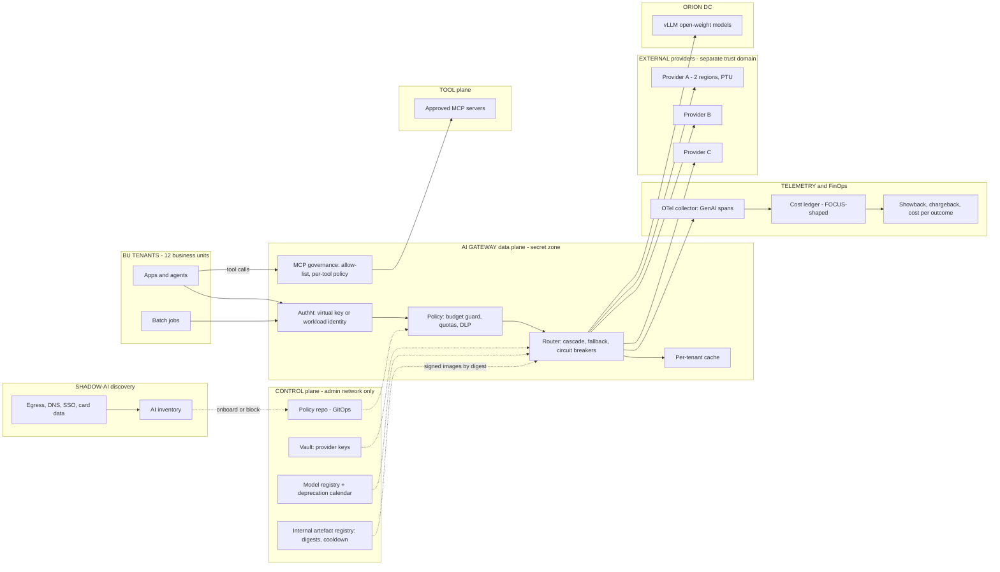

# P12 · Enterprise AI Gateway, FinOps and Model-Lifecycle Platform

> One governed front door for every model call and tool call across 12 business units, with budgets, routing, chargeback, lifecycle management and shadow-AI discovery, built so that the gateway itself does not become the weakest link.
> **Customer:** Orion Holdings (fictional) · **Industry:** Diversified conglomerate (retail, FMCG, cement, logistics, hospitality, diagnostics, an NBFC, real estate, media, chemicals, renewables, IT services) · **Geography:** HQ Mumbai; business units (BUs) in India, the UAE, the UK and Germany · **Real engagement:** 16 weeks; FDE lead, 1 FDE, a part-time security architect, plus Orion's platform team (4), a FinOps analyst and a BU champion per wave · **Course build:** 5 weeks, team of 3–4 · **Difficulty:** ★★★

## 1. Scenario — the customer and the ask

Orion's Group CIO ran a spend census and found AI costs of about **USD 420k/month**, up roughly 4× in a year:

| Spend line | USD/month |
|---|---|
| Pay-as-you-go API usage | 200k |
| Committed and provisioned-throughput contracts | 120k |
| Self-hosted GPU cluster (vLLM, Navi Mumbai data centre) | 60k |
| AI SaaS seats, many on corporate cards | 40k |

The spend runs across three model providers and an on-prem cluster serving open-weight models. There are about **300 AI use cases**; central IT knew about 180 of them. Recent incidents:
- **July:** a logistics agent looped over a weekend and spent USD 38k.
- A diagnostics developer pasted lab reports into a consumer chatbot.
- Two apps broke when a provider retired a model.
- Provider keys are shared over chat and have not been rotated in 14 months.

**The ask (Group CIO):** "Get AI costs and risks under control without slowing teams down."

**What they actually need** is a platform with a paved road:
- A **central AI gateway**: virtual keys per team, routing and cascades, fallback chains, budgets, DLP, and governance of MCP tools.
- **FinOps:** normalised billing, showback then chargeback, and **cost per successful outcome**.
- **Lifecycle management:** a model registry, a deprecation calendar, and shadow and canary evaluation for upgrades.
- **Resilience:** failover drills and quota and provisioned-throughput management.
- **Multi-tenant isolation.**
- **Shadow-AI discovery** that feeds a living AI inventory.

The gateway holds every provider key and sees every prompt. It is the crown jewel, and in 2026 it is also a proven supply-chain and exploitation target (§9).

| Stakeholder | Cares about | Can block |
|---|---|---|
| Group CIO (sponsor) | Visibility, fewer incidents, a platform story | Budget, mandate |
| Group CFO | Predictable spend; chargeback for the FY 2027-28 budget cycle | Chargeback policy |
| Group CISO | Keys, DLP, logging, supply chain | Go-live; egress blocking |
| Group DPO/Legal | DPDP, GDPR, cross-border prompts | Logging scope, providers |
| 12 BU CTOs (esp. Consumer BU, with its own AI team) | Autonomy, latency, not paying a "platform tax" | Onboarding waves |
| German works council | Employee monitoring through prompt logs | Logging for German staff |
| Procurement | Committed-spend minimums, renewals | Provider changes |
| Platform/SRE team (future owner) | Operability, on-call load | Handover |
| Internal audit | Evidence, inventory completeness | Sign-off |

## 2. Constraints

**Data.** Prompts carry loyalty PII (retail), KYC data such as Aadhaar and PAN (NBFC), lab results (diagnostics) and formulations (FMCG, chemicals). Some BUs must keep prompts in-country or on self-hosted models. Sector rules, such as RBI requirements for the NBFC, may add conditions: get each BU's regulatory register rather than assuming.

**Legal and regulatory (verified as of Sept 2026 unless marked):**

| Instrument | Why it applies | What it means for the platform |
|---|---|---|
| **CERT-In Directions**, 28 Apr 2022 ([PDF](https://www.cert-in.org.in/PDF/CERT-In_Directions_70B_28.04.2022.pdf)) | Orion's Indian entities | Report listed incidents within **6 hours**. Item (xx) covers attacks on "Artificial Intelligence and Machine Learning" systems. Keep ICT logs for a **rolling 180 days within India**. This drives gateway log retention and location |
| **DPDP Act 2023 + DPDP Rules 2025** | Personal data of Indian customers and staff | Rules phased in; most duties, including security safeguards and breach notice, from 13 May 2027 per the course fact-check (**verify before teaching**). Build to the standard now |
| **GDPR / UK GDPR** | German and UK BUs | Minimisation for logs; Art. 28 terms with providers; transfer rules for EU prompts routed outside the EEA |
| German co-determination (BetrVG §87(1) no. 6) | Prompt logs can monitor employees | Needs a works-council agreement before identity-linked logging of German staff (confirm with German counsel) |
| **EU AI Act** as amended by the Digital Omnibus, Reg. (EU) 2026/1744 of 8 Jul 2026 ([EUR-Lex](https://eur-lex.europa.eu/legal-content/EN/TXT/HTML/?uri=OJ:L_202601744)) | EU BU deployers | Art. 5 prohibitions apply (e.g. emotion recognition at work). Annex III high-risk duties move to **2 Dec 2027**. Art. 4 AI-literacy duty softened to "take measures to support". The inventory must flag Annex III candidates such as HR screening in the German BU |
| UAE BU | — | Not researched here; local counsel to confirm |

**Infrastructure.** Azure is the group standard; two BUs use AWS; an on-prem GPU cluster runs vLLM. Provider A is used through Azure with provisioned throughput units (PTU), Provider B directly and via Bedrock, Provider C via Google Cloud.

**Security.** No provider master key may live outside the vault. The admin plane must never face the internet.

**Budget.** USD 1.2M platform budget in year 1. Target: 20–30% saving on addressable spend, with no quality loss.

**Timeline.** The CFO needs showback by January 2027 for FY 2027-28 budgets (the Indian financial year starts 1 April).

**Politics.** The Consumer BU runs its own stack and refuses chargeback. Developers fear latency. Security wants full prompt logs; the works council and DPO do not. Committed-spend minimums mean the cheapest list price is not always the cheapest route.

## 3. What students are given (course build)

**Synthetic data:**
- **Use-case catalogue (YAML):** 12 BUs × 25 apps. Each app has a model, task type (classification, extraction, summarisation, chat, agentic), traffic profile (diurnal, month-end spikes), lognormal prompt and output lengths, data class, residency rule and a **success signal** (such as "extraction accepted without correction").
- **Request log:** about 2M metadata records for 30 days, generated from the catalogue, plus 5,000 full prompts for routing and DLP evaluation.
- **Billing exports:** three schemas (per-token, per-PTU-hour, per-request). Include credits, a mid-month price change, and INR, USD and EUR. Students normalise these into a FOCUS-shaped ledger; FOCUS 1.4 now covers AI, cloud and SaaS billing ([FinOps Foundation](https://www.finops.org/focus/)).
- **Discovery logs (1M lines):** egress, DNS, proxy, SSO/OAuth grants and card lines, with 40 seeded shadow-AI cases: direct SDK calls that bypass the gateway, consumer chatbots, an exposed n8n instance, a workstation Ollama server, AI features inside approved SaaS, and card-paid subscriptions.
- **DLP set:** 2,000 prompts in English, Hindi, Marathi and code-mixed text, with checksum-valid Aadhaar numbers (Verhoeff), PAN patterns, card numbers (Luhn), IBANs (mod-97), GSTINs, and patient names with lab values. Add **decoys**, such as 12-digit numbers that fail Verhoeff, plus spaced, Unicode-digit and base64 encodings.
- **Adversarial inputs:** an MCP server whose tool description contains hidden instructions; an agent script that loops on a failing tool call with growing context; a tenant probe that tries to hit another BU's cache.

**Mock systems.** Three mock providers (FastAPI) with configurable latency, 429/5xx errors, a "region down" switch, token accounting and a "retired model" switch (404/410); mock MCP servers; a local "self-hosted" tier on Ollama.

**Budget, two paths:**
- **API ≤ USD 50:** a small and a mid-tier model; use the strong tier only on eval samples.
- **Local:** two open-weight sizes on Ollama or vLLM (for example 3–4B and 8–14B) to emulate cheap and expensive tiers, with mock providers for failover.

**Gateway choice.** Self-host LiteLLM, Agent Router (formerly Envoy AI Gateway) or agentgateway in Docker or kind. Alternatively, build a thin FastAPI gateway around the §7 sketch to learn the mechanics.

**Out of scope:** real provider contracts, TLS interception or monitoring of real employees, real multi-region HA (simulate it), and production SSO.

## 4. Discovery — what the FDE does in week 1

**Processes to map:** how teams get model access (ticket → procurement → a key pasted in chat); how AI is paid for (enterprise agreement, corporate card, cloud marketplace); how models are chosen and upgraded; what happens in an outage; how a new use case gets risk review, if it does.

**Baselines and how to measure them:**
- **Spend census:** 6 months of invoices, card data and cloud billing in one ledger.
- **Key census:** secret scanning of repos and CI, plus provider consoles (count, age, owner).
- **Gateway traffic share:** egress logs matched to provider domains (baseline 0%).
- **Cost per successful outcome** for 3 anchors (FMCG invoice extraction, retail email triage, diagnostics summarisation), measured from the success signal, not token counts.
- **Latency p50/p95** per anchor; hourly PTU utilisation; a 6-month incident log.

**Sharpest discovery questions:**
1. Which three AI use cases would the CFO defend in a budget cut, and what evidence shows they work?
2. Where is each provider key, who has it, and when was it last rotated?
3. What committed-spend and PTU contracts exist, with what minimums and expiry dates?
4. What counts as "success" for each anchor, and where is that signal recorded?
5. Which BUs and data classes must stay in India, in the EU, or on self-hosted models?
6. What did the last model retirement break, and how long did the fix take?
7. In the July loop incident, who noticed, and after how long?
8. What logging will the works council and DPO accept: metadata, redacted, or full?
9. How much extra latency can each app tolerate?
10. Which MCP servers do agents use, and who approved them?
11. Which BU will fight chargeback, and why?
12. What would make a team bypass the gateway, and how do we make the paved road faster than the bypass?

**Qualification: the lowest rung that works.** Almost all of this is **not AI**: configuration, policy-as-code, deterministic routing and accounting.
- **Rules:** static route tables, budgets, allow-lists and regex-plus-checksum DLP.
- **ML:** a small learned router trained on logged outcomes, only after 8–12 weeks of data exist.
- **Single LLM call:** an LLM validator for cascade acceptance, only where no deterministic check (schema, totals reconcile, citation exists) is possible.
- **Workflow:** the model-migration pipeline.
- **Agents:** none in the request path.

**Decision: go, with conditions.** Security controls are mandatory group policy; chargeback is negotiated per BU.

## 5. Success criteria and acceptance tests

| Area | Criterion | Threshold | Test / evidence |
|---|---|---|---|
| Business | Share of LLM spend through the gateway | ≥ 90% by week 15 | Gateway ledger reconciled to invoices; egress blocks for non-exempt apps |
| Business | Cost per successful outcome, 3 anchors | −30% or better, with quality **non-inferior** (margin 2 pp, one-sided 95%, n ≥ 1,000 per arm) | Anchor golden sets + live A/B |
| Business | Chargeback accuracy | Allocated vs invoiced within ±2%; unallocated ≤ 3% | Monthly close |
| Inventory | Shadow-AI discovery | Seeded recall ≥ 90%; 100% of discovered use cases have owner, data class and risk tier | 40 seeded cases; inventory audit |
| Reliability | Gateway availability | 99.95% monthly (21.6 min error budget) | Synthetic probes, both regions |
| Reliability | Failover drill: primary provider region down | ≥ 99% requests succeed; p95 ≤ 2× baseline; **pass^3** over 3 drills | Game days |
| Latency | Gateway overhead p95 | ≤ 30 ms (rules DLP); ≤ 120 ms on routes with ML DLP | Load test at 3× peak |
| Cost control | Runaway-loop containment | Key throttled ≤ 60 s after crossing the hourly cap; overspend ≤ one request's cost | Loop simulator |
| Safety/DLP | PII detection | Recall ≥ 97% on checksum-valid IDs, ≥ 90% on names + health; precision ≥ 90%; false blocks ≤ 0.5% of clean traffic | DLP set (per language) |
| Isolation | Cross-tenant leakage | 0 cross-BU cache hits in 10,000 probe pairs; 0 cross-BU key use | Isolation suite |
| Lifecycle | Model references | 100% of routes use registry aliases; every model has a retirement date on the calendar | Config lint in CI |
| Supply chain | Gateway artefacts | 100% deployed by digest from the internal registry; hash-pinned lockfiles; KEV-listed gateway CVEs patched ≤ 72 h | Deploy audit; drill |
| Security | Tool governance | Only registry-approved MCP servers are reachable; the poisoned tool description is blocked or flagged | Adversarial suite |

A cascade that saves 40% but loses 5 points of accuracy moves the cost to the BU's reviewers; that is not a saving.

## 6. Reference architecture



| Component | Responsibility | Options (OSS/self-host · managed) | Owner |
|---|---|---|---|
| Gateway data plane | Auth, policy, routing, cache, MCP | **LiteLLM**; **Agent Router** (formerly Envoy AI Gateway; 1.0 on 23 Jun 2026; joined the Agentic AI Foundation under the new name, announced 9 Sep 2026, [site](https://theagentrouter.ai/)); **agentgateway** (Linux Foundation, in AAIF, [site](https://agentgateway.dev/)) · **Kong AI Gateway** (Konnect-managed, self-hosted data planes); **Azure APIM AI gateway** (`llm-token-limit`, `llm-emit-token-metric`, circuit breaker, MCP/A2A, [docs](https://learn.microsoft.com/en-us/azure/api-management/genai-gateway-capabilities)); **Prisma AIRS AI Gateway** (Portkey after its acquisition by Palo Alto Networks; GA announced 16 Jul 2026; verify the OSS gateway's status); **Cloudflare AI Gateway** | Platform |
| Vault | Provider keys; rotation | OpenBao / HashiCorp Vault · Azure Key Vault | Security |
| DLP | Detect, redact, block | Presidio + checksum validators · Kong AI Sanitizer, Azure AI Content Safety | Security |
| Cache | Exact/semantic cache, per tenant | Redis with tenant namespaces · APIM semantic cache | Platform |
| Self-hosted serving | Cheap tier; residency-bound data | vLLM (`cache_salt` for prefix-cache isolation), SGLang · provider provisioned throughput | Platform |
| Model registry | Aliases → versions, retirement dates, eval evidence | Git + YAML + CI · vendor model catalogue APIs as inputs | Platform |
| Observability | Traces, metrics, cost | OTel Collector + Langfuse / Arize Phoenix + Grafana · Azure Monitor, Datadog | SRE |
| FinOps ledger | Normalise, allocate, report | FOCUS schema in DuckDB/Postgres + dbt · FOCUS-capable FinOps tools | FinOps |
| MCP registry | Approved servers, pinned tool descriptions | Private sub-registry following the official MCP Registry API (preview since 8 Sep 2025, [blog](https://blog.modelcontextprotocol.io/posts/2025-09-08-mcp-registry-preview/)) · Azure API Center | Security + Platform |
| Shadow-AI discovery | Find unsanctioned AI | Zeek/DNS logs + domain list + SSO grant export · SSE/CASB generative-AI app discovery (verify vendor features) | Security |

**ADRs to write** ([04-solution-design-and-adr](templates/04-solution-design-and-adr.md)):
1. **Gateway product:** OSS (LiteLLM, Agent Router, agentgateway), commercial (Kong, Prisma AIRS), cloud-native (APIM), or two layers (APIM at the edge, OSS for on-prem and MCP).
2. **Topology:** one central gateway, per-region data planes, or per-BU data planes under a central control plane. The negotiation with the Consumer BU is settled here.
3. **Routing:** static per use case, a cascade with validators, or a learned router.
4. **Logging and retention:** metadata only by default; redacted payload samples; full payloads only for opted-in debug windows. Must reconcile CERT-In's 180 days in India, GDPR minimisation and the works council.
5. **Chargeback model:** showback only, actuals, or blended rates with PTU amortisation (unused commitment charged to the platform, not the BUs).
6. **Supply chain and upgrades:** pin by digest, internal mirror, a 3–7 day cooldown for new releases, staged rings, and an **expedited path for KEV-listed fixes** so that pinning does not become an excuse for staying vulnerable.

## 7. Implementation plan — week by week

| Phase (weeks) | Tasks | Exit criteria | FDE artefacts |
|---|---|---|---|
| Discovery (1–3) | Spend and key census; inventory v0 from discovery logs; anchor use cases and success signals; works-council consultation opened; gateway shortlist bake-off | Signed memo; baselines; SOW | [01](templates/01-discovery-questionnaire.md), [02](templates/02-data-readiness-scorecard.md), [03](templates/03-sow-and-acceptance-criteria.md) |
| POC (4–6) | Gateway in non-prod for 2 BUs; virtual keys; budgets; OTel; cascade on 1 anchor; DLP in monitor mode; internal mirror + digest pinning; failover drill #1 in staging | Overhead ≤ 30 ms p95; cascade non-inferior on anchor 1; drill passes | [04](templates/04-solution-design-and-adr.md), [05](templates/05-eval-plan.md), [06](templates/06-threat-model-and-controls.md) |
| Pilot (7–11) | 3 BUs in production (~60 use cases); showback; DLP enforce mode for ID classes; MCP allow-list; model registry and calendar; shadow-eval harness; game day #2 in production | §5 met for pilot BUs; showback reconciles ±2% | [07](templates/07-compliance-obligations-to-controls.md), [08](templates/08-security-review-pack.md), weekly [10](templates/10-demo-script-and-status-report.md) |
| Production (12–15) | Onboarding waves for the remaining 9 BUs; direct-egress blocks; chargeback live; two-region HA; gateway pen test; runbooks | SLOs met 2 weeks; ≥ 90% of spend through the gateway | [09](templates/09-runbook-slos-and-handover.md) |
| Handover (16) | Platform team runs a failover drill and a model migration alone | Customer-run drill passes | Handover pack |

**Course build (5 weeks):**
- **W1:** gateway, virtual keys, mock providers, OTel.
- **W2:** budgets, cascade and circuit breaker; curveball 2.
- **W3:** DLP, cache isolation, MCP allow-list; curveball 3.
- **W4:** FOCUS ledger, showback and shadow-AI discovery; curveball 5.
- **W5:** shadow/canary migration and failover drill; curveballs 1 and 4; demo.

**Code sketch: routing cascade with budget guard and circuit breaker** (library-agnostic Python 3.10+; `call_fn` wraps whichever gateway or SDK you use):

```python
import time
from dataclasses import dataclass, field

class BudgetExceeded(Exception): pass

@dataclass
class Breaker:                                   # per deployment (provider x region x model)
    fail_threshold: int = 5; cooldown_s: float = 30.0
    fails: int = 0; opened_at: float | None = None
    def available(self, now: float) -> bool:     # after cooldown: half-open, one failure re-opens
        return self.opened_at is None or now - self.opened_at >= self.cooldown_s
    def record(self, ok: bool, now: float) -> None:
        if ok: self.fails, self.opened_at = 0, None
        else:
            self.fails += 1
            if self.fails >= self.fail_threshold: self.opened_at = now

@dataclass
class Budget:                                    # per virtual key; money in USD, from a price table
    monthly_usd: float
    hourly_cap_usd: float                        # burn-rate cap: catches runaway agent loops
    spent: float = 0.0; hour_start: float = 0.0; hour_spent: float = 0.0
    def reserve(self, est: float, now: float) -> None:
        if now - self.hour_start >= 3600: self.hour_start, self.hour_spent = now, 0.0
        if self.spent + est > self.monthly_usd: raise BudgetExceeded("monthly budget exhausted")
        if self.hour_spent + est > self.hourly_cap_usd: raise BudgetExceeded("hourly burn-rate cap hit")
        self.spent += est; self.hour_spent += est
    def settle(self, est: float, actual: float) -> None:
        self.spent += actual - est; self.hour_spent += actual - est
    def allowed_tiers(self, tiers: list) -> list:  # soft limit: above 80% spend, drop the priciest tier
        return tiers if self.spent < 0.8 * self.monthly_usd or len(tiers) == 1 else tiers[:-1]

@dataclass
class Deployment:
    name: str
    usd_per_1k_in: float
    usd_per_1k_out: float
    breaker: Breaker = field(default_factory=Breaker)
    def cost(self, tin: int, tout: int) -> float:
        return tin / 1000 * self.usd_per_1k_in + tout / 1000 * self.usd_per_1k_out

def route(request, tiers, budget, call_fn, accept, est_in, est_out, clock=time.monotonic):
    """tiers: cheapest first; each tier is a fallback chain of Deployments (other provider/region).
    call_fn(name, request) -> (text, tokens_in, tokens_out) or raises. accept(text) -> bool."""
    trace = []
    for tier in budget.allowed_tiers(tiers):
        for dep in tier:
            if not dep.breaker.available(clock()): trace.append((dep.name, "breaker_open")); continue
            est = dep.cost(est_in, est_out); budget.reserve(est, clock())   # may raise BudgetExceeded
            try:
                text, tin, tout = call_fn(dep.name, request)
            except Exception as e:                     # timeout, 429, 5xx: try next in chain
                budget.settle(est, 0.0); dep.breaker.record(False, clock())
                trace.append((dep.name, f"error:{type(e).__name__}")); continue
            dep.breaker.record(True, clock()); budget.settle(est, dep.cost(tin, tout))
            if accept(text): trace.append((dep.name, "accepted")); return text, dep.name, trace
            trace.append((dep.name, "rejected:escalate")); break          # quality miss -> next tier
    raise RuntimeError(f"no acceptable answer: {trace}")
```

**Production gaps to close:** distributed counters (atomic Redis/Lua) and a single-probe half-open state; streamed-token accounting, with `max_tokens` on every request so the reservation is a true upper bound; prices from the registry; residency filters applied to tiers **before** fallback, so an outage never moves Indian health data offshore; the trace emitted as OTel span events.

## 8. Evaluation plan

**Datasets:**
- **Golden:** 1,000 frozen items per anchor, labelled by BU experts.
- **Adversarial:** DLP evasions, the poisoned MCP description, cache probes, the loop script.
- **Regression:** every escaped PII case, bad cascade acceptance and failed drill.
- **Held-out:** two weeks of live pilot traffic, labelled afterwards.
- **Seeded discovery:** the 40 shadow-AI cases.

**Metrics by layer:**

| Layer | Metrics |
|---|---|
| Cascade | **Validator false-accept rate** (cheap answer accepted but wrong), escalation rate, quality vs strong-only baseline with CIs, cost per success |
| Router/resilience | Fallback success, breaker open time, p95 under chaos (429/5xx/latency/region down), pass^3 across drills |
| Budget | Time-to-throttle, overspend beyond cap, false throttles on legitimate spikes (month-end) |
| DLP | Precision/recall per entity × language; encoded-evasion recall; added latency |
| Isolation | Cross-tenant hit count; prefix-cache timing test with and without `cache_salt` |
| Lifecycle | Shadow-eval deltas per use case; canary SLO breaches; rollback time |
| FinOps | Reconciliation error; unallocated share; cost-per-outcome trend |
| Discovery | Recall on seeded cases; precision of flagged domains; time from detection to inventory entry |

**Judge calibration.** Use an LLM validator only where no deterministic check exists. Calibrate it on 300 human labels per use case (κ ≥ 0.7), re-check monthly, and treat judge drift after a model upgrade as a canary failure.

**CI gates on the policy repo:**
- Config lint: no raw model IDs, every key has a budget, residency tags present.
- Policy unit tests.
- A route change is blocked if its golden-set quality falls outside the non-inferiority margin.

**Online metrics:** cost per successful outcome per use case; escalation and fallback rates; cache hit rate per tenant; DLP blocks; budget alerts; share of traffic through the gateway; gateway p95 overhead.

## 9. Security, privacy and compliance

**The gateway is the crown jewel.** It holds every provider key, sees every prompt, and can reach every tool.

**Case study: LiteLLM on PyPI, 24 Mar 2026 (verified).**
- Versions 1.82.7 and 1.82.8 carried credential-harvesting malware, published with a token reportedly stolen in the earlier Trivy scanner compromise. Version 1.82.8's `litellm_init.pth` ran on any Python start.
- Users of the official Docker image were unaffected because that path "pins dependencies" ([LiteLLM](https://docs.litellm.ai/blog/security-update-march-2026); [GHSA-5mg7-485q-xm76](https://osv.dev/vulnerability/GHSA-5mg7-485q-xm76)).
- Separately, CISA's KEV added three LiteLLM CVEs in 2026: CVE-2026-42208 (SQL injection in key verification, 8 May), CVE-2026-42271 (command execution by **low-privilege internal-user keys** via MCP test endpoints, 8 Jun) and CVE-2026-59822 (MCP authentication bypass, 2 Sep).
- **Lessons:** pin by hash and deploy by digest from a mirror with a cooldown, **and** keep a 72-hour path for KEV fixes, because the gateway will need emergency patches.

**Lethal-trifecta check:**

| Context | Private data | Untrusted content | Exfiltration | Control |
|---|---|---|---|---|
| BU agent with RAG + web tool + email tool (via gateway) | Yes | Yes | Yes | **Break a leg:** the gateway's per-agent tool policy denies "untrusted-read + external-send" combinations without human confirmation |
| Gateway itself (non-LLM) | All prompts, keys | All prompts | Egress to providers | Egress allow-list; no general internet; admin plane on a separate network |
| Optional FinOps assistant | Spend data | Low | None | Read-only; no budget writes |

| Threat | Control |
|---|---|
| Upstream package compromise | Hash-pinned lockfiles, mirror, 3–7 day cooldown, SBOM per image, few environment secrets, egress allow-list |
| Exploited gateway CVE | KEV watch; 72 h patch path; no internet-facing admin UI; least-privilege internal keys |
| Provider-key theft | Vault, short-lived fetch, rotation runbook; only virtual keys in apps |
| Cross-tenant cache leakage | Tenant-scoped cache keys; vLLM `cache_salt` per BU. Gu et al. found cache sharing across users at seven API providers ([arXiv 2502.07776](https://arxiv.org/abs/2502.07776)), so ask providers about isolation |
| Denial of wallet | Hourly caps, per-run step limits, repeated-call detection |
| DLP evasion | Normalise before detection; checksums; adversarial set in CI |
| MCP tool poisoning / rug pull | Allow-list; pinned tool-description hashes; re-approval on change |
| Log store as breach target | Metadata-only default; redaction; 180-day India retention, then deletion |
| Bypass | Direct-provider egress blocked; exceptions logged |

**Obligations → controls** ([07](templates/07-compliance-obligations-to-controls.md)):

| Obligation | Control | Evidence |
|---|---|---|
| CERT-In 6 h report; 180-day logs in India | Incident runbook with a CERT-In step; log store in an Indian region | Drill record; retention config |
| DPDP security safeguards (dates per Rules; verify) | Encryption, access control, DLP, breach runbook | Security pack |
| GDPR minimisation and transfers | Metadata-only default; residency routing; SCCs with providers | ADR-4; DPA register |
| BetrVG §87(1) no. 6 | Works-council agreement on logging scope | Signed agreement |
| EU AI Act Art. 5 and Annex III (from 2 Dec 2027) | Inventory screening questions; high-risk flag triggers review | Inventory records |
| EU AI Act Art. 4 (as amended) | Literacy module required before a virtual key is issued | Training records |

## 10. Operations and cost model

**SLOs:** availability 99.95% per month; gateway-attributable errors ≤ 0.05%; overhead p95 ≤ 30 ms; spend data fresh within 5 minutes; chargeback closed by working day 5.

**Observability.** Emit OTel GenAI spans with `gen_ai.request.model`, `gen_ai.usage.input_tokens` and `gen_ai.usage.output_tokens`, plus Orion attributes (`orion.bu`, `orion.use_case`, `orion.tier`, `orion.outcome`). The GenAI conventions now live in a separate repository and are still in **Development** status ([OTel](https://opentelemetry.io/docs/specs/semconv/gen-ai/)), so pin the version and expect renames.

**Capacity.** 25M requests a month is about 10 req/s on average and about 100 req/s at peak. With ~8 s streams, that means ~800 concurrent streams at peak. Plan 3–6 replicas per region.

**Quotas and reserved capacity.** Set per-key TPM/RPM quotas at the gateway, below provider quotas, and route PTU spillover to pay-as-you-go. Reserved options differ:
- Azure PTU capacity is fungible across provisioned deployments ([Microsoft](https://learn.microsoft.com/en-us/azure/ai-foundry/openai/concepts/model-retirements)).
- Amazon Bedrock Provisioned Throughput offers no-commitment, 1-month and 6-month terms ([AWS](https://docs.aws.amazon.com/bedrock/latest/userguide/prov-throughput.html)).
- Google sells fixed-term Provisioned Throughput subscriptions ([Google Cloud](https://cloud.google.com/vertex-ai/generative-ai/docs/provisioned-throughput/overview)).

Review utilisation weekly against commitment minimums.

**Cost model.** Ranges; prices change monthly, so recompute from current price pages or an open pricing dataset. Batch APIs typically cost about half the synchronous price at major providers.

| Lever | Assumption | Saving (USD/month) |
|---|---|---|
| Cascade on eligible work (~40% of PAYG, now on the strong tier) | Cheap tier accepts 60–80%; cheap cost 10–25% of strong; new cost = 80k × (cheap share + escalation share) | 28–56k |
| Caching (per tenant) + provider prompt caching | 3–10% of PAYG | 6–20k |
| Batch for offline jobs | 15–25% of PAYG at ~50% discount | 15–25k |
| PTU right-sizing | Utilisation 55% → 75–80%; spillover to PAYG | 20–35k |
| SaaS seat consolidation | 20–40% of USD 40k | 8–16k |
| **Gross saving** (levers overlap: compute them in sequence, not as a sum, in the real model) | | **≈ 77–152k (18–36%)** |
| Platform run cost | Infra 6–15k + 5 FTE platform team 20–35k | −26–50k |
| **Net** | | **≈ +27k to +126k** |

At the low end this is a governance programme that pays for itself, not a cost-cutting miracle. Say so in the business case.

**Worked cost per outcome, FMCG invoice extraction (illustrative):**
- Strong-only: USD 0.012 per invoice at 92% success = **USD 0.0130 per success**.
- Cascade: cheap tier at USD 0.001, with the validator (schema + line totals reconcile) passing 80%, and 20% escalated. Cost is 0.001 + 0.2 × 0.012 = 0.0034 per invoice at 93% success = **USD 0.0037 per success**.

**Runbooks:** RB-1 provider or region outage; RB-2 runaway spend; RB-3 gateway package or CVE emergency; RB-4 model retirement; RB-5 key compromise; RB-6 DLP false-block storm (monitor mode, with CISO approval).

**DR.** Active-active gateways in two Azure regions, with on-prem as a third path for self-hosted routes; configuration rebuilt from Git and digests. **Break-glass** direct-provider keys stay in the vault for Sev-1 only: time-boxed, dual-approved, audited. Key rotation is drilled quarterly.

## 11. Curveballs (instructor-injected events)

1. **Week 10: a provider announces a model retirement with 60 days' notice.**
   - Both Anthropic and Microsoft Foundry commit to at least 60 days' notice for GA models ([Anthropic](https://platform.claude.com/docs/en/about-claude/model-deprecations), [Microsoft](https://learn.microsoft.com/en-us/azure/ai-foundry/openai/concepts/model-retirements)). Foundry retirement dates are not extendable, and provisioned deployments are **not** auto-upgraded.
   - Query the registry for dependent aliases and use cases (say 43).
   - Run a **shadow** evaluation on 5% mirrored traffic, then canary at 5% → 25% → 100% with SLO-based rollback.
   - Check API-contract changes as well as quality: Claude Opus 4.7 and later models return a 400 error for non-default `temperature`/`top_p`/`top_k`.
   - Re-check PTU capacity, and finish by day 40.
2. **Week 5: an agent loop burns a month's budget overnight.**
   - Throttle or revoke the key and confirm spend has flattened.
   - Trace the cause (e.g. a failing tool call retried with growing context).
   - Add the hourly cap, per-run step limits, repeated-call detection and spend-velocity alerts against a 7-day baseline.
   - Hold a blameless review. Credits from the provider are not guaranteed; ADR-5 decides who pays.
3. **Week 8: the gateway package is compromised upstream (a LiteLLM-style event).**
   - Compare deployed digests with the bad versions. Check whether the mirror ever served them; the cooldown should have blocked them.
   - Hunt for the `.pth` IoC in dev and CI.
   - If the package ran anywhere with provider keys, **rotate every provider key** and revoke sessions.
   - Check egress to the exfiltration domain.
   - File the CERT-In report within 6 hours if Indian systems are affected, and assess GDPR.
   - Brief the CISO with the timeline.
4. **Week 11, during pilot traffic: a provider has a regional outage.**
   - Breakers open and fallback chains engage **within residency rules**. Diagnostics routes may use only in-country or self-hosted tiers, so they degrade to queueing rather than cross a border.
   - Measure fallback quality against pre-evaluated pairs, and post the drill metrics.
5. **Week 13: the Consumer BU refuses chargeback.**
   - Separate **mandatory controls** (vault keys, DLP, logging, inventory; group CISO policy) from **commercial terms**.
   - Offer a federated data plane under the central control plane, and start with showback of the BU's own cost per outcome.
   - Take a decision memo to the CFO. Record the compromise in ADR-2 and ADR-5.

## 12. Deliverables and grading rubric

**By phase:**
- **Discovery:** census, memo, SOW.
- **POC:** gateway configuration, router with tests, OTel, ADRs 1–4, threat model.
- **Pilot:** DLP and isolation reports, showback, registry and calendar, drill report, compliance mapping, security pack.
- **Production and handover:** runbooks, SLO dashboards, chargeback, customer-run drill.

| Criterion | Weight | Excellent | Weak |
|---|---|---|---|
| Working system | 25% | Budgets, cascade, fallback and isolation proven under chaos | A proxy that forwards requests |
| Evaluation rigour | 20% | Non-inferiority tests with CIs; validator false-accept rate; pass^3 drills | "Savings 40%" with no quality check |
| Security and compliance | 15% | Supply-chain controls with a KEV fast path; residency-aware fallback; logging agreement | Keys in environment variables; full prompt logs by default |
| FDE artefacts | 20% | ADRs with rejected options; honest net-savings model | Vendor feature lists |
| Demo and communication | 10% | Live outage and runaway-loop drill | Slides |
| Curveball handling | 10% | Calm, evidence-based, recorded in ADRs | Ad-hoc config edits in production |

## 13. Stretch goals

- A learned router trained on logged outcomes, compared with the rule cascade.
- PTU vs pay-as-you-go break-even analysis from hourly utilisation.
- An MCP sub-registry with signed tool manifests.
- A prefix-cache timing experiment on vLLM with and without `cache_salt`.

## 14. Curriculum map

| Turn | Title | How it is exercised |
|---|---|---|
| 100 | AI Gateways | The core build |
| 91 | LLM FinOps | Ledger, chargeback, cost per outcome |
| 87, 88 | Model Upgrades and Deprecation; A/B and Canary | Registry, calendar, shadow → canary |
| 94, 90 | Provider Failover and DR; SLOs and Incidents | Breakers, drills, error budgets |
| 96, 97 | Observability; Evaluation Tools | OTel GenAI spans; golden-set harness |
| 78 | PII Detection and DLP | Checksum validators; multilingual evaluation |
| 65, 66, 71 | MCP Spec; MCP Authorization; Agent Identity | Tool governance; per-agent policies |
| 68 | The Agentic AI Foundation | agentgateway and Agent Router governance |
| 73, 74, 77 | OWASP Agentic/LLM; Model Supply Chain | Denial of wallet, tool poisoning, pinning |
| 29, 31, 33, 35 | Serving Engines; Prefix Caching; Capacity; Batch | Self-hosted tier; `cache_salt`; PTU sizing; batch savings |
| 38, 57, 58 | Evaluator Loops; Always-On Agents; Long-Horizon | Cascade validators; loop containment |
| 79, 80, 81 | EU AI Act; NIST/ISO 42001; GDPR/DPDP | Inventory screening; logging scope |
| 92, 93, 134 | On-Prem/Sovereign; IaC; Open-Weight Ecosystems | Residency tiers; GitOps policy |
| 102 | Model Provider Landscape | Multi-provider fallback pairs |
| 109–116 | FDE practice turns | Census, ROI, ADRs, change management, SOW |
| 128 | Governance-as-Code | Policy repo with tests |

**New/gap topics exercised:**
- AI-enabled cyber offence and defence: the orchestration layer as a target (LiteLLM supply chain and KEV entries).
- Low-code/visual builder security: exposed n8n in shadow-AI discovery.
- Distribution inside AI assistants: MCP Registry and sub-registries.
- Prompt-injection-resistant architecture: trifecta-breaking tool policies at the gateway.

## 15. What reviewers look for / common failure modes

- **Savings without quality.** A cascade reported without non-inferiority tests or a validator false-accept rate.
- **Pinning without patching.** A cooldown with no KEV fast path; the gateway runs a vulnerable version for months.
- **Fallback that ignores residency.** An outage moves health or KYC prompts offshore.
- **Shared caches across BUs.** Semantic or prefix caches keyed only on prompt text.
- **Full prompt logging by default,** or logs outside India when CERT-In applies.
- **Budgets as monthly alerts only.** No hourly burn-rate cap, so the July incident repeats.
- **Raw model IDs in app code.** Every retirement becomes a 12-team fire drill.
- **Treating chargeback as a technical problem.** It is a negotiation; bring the BU's own numbers.
- **Chargeback that charges BUs for unused PTU.** This creates perverse incentives to bypass.
