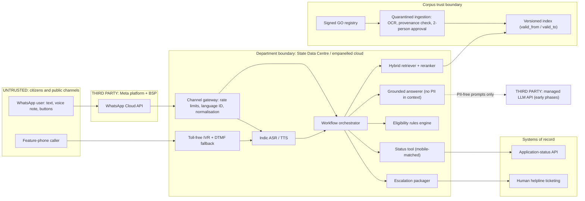

# P14 · Multilingual Citizen-Services Assistant

> A WhatsApp and IVR assistant that answers welfare-scheme questions from official government orders and looks up application status in Telugu, Hindi, Urdu and English. It is built for low-literacy, low-bandwidth citizens, escalates honestly to humans, and does not repeat a forged circular.
>
> **Customer:** Praja Seva Directorate (fictional), welfare department of a fictional Telugu-majority Indian state where Urdu is also an official language · **Industry:** Public sector / social welfare · **Geography:** India · **Real engagement:** 22–24 weeks. Team: 2 FDEs, 1 applied scientist (multilingual retrieval and speech), 1 conversation designer/linguist, part-time security and accessibility specialists, plus the state IT cell, the application-system team and the helpline vendor · **Course build:** 6 weeks, team of 3–4 · **Difficulty:** ★★★

---

## 1. Scenario — the customer and the ask

The Directorate runs about 40 welfare schemes (pensions, scholarships, housing, farmer support). Its helpline takes about **9,000 calls a day** on 140 contract seats; in fictional discovery numbers, peak waits reach 11 minutes and abandonment 38%. About 70% of calls ask either *"Am I eligible, and which documents do I need?"* or *"What is my application status?"* The rules live in roughly 1,100 Government Orders (GOs) and circulars, mostly Telugu PDFs, 35% scanned, many amending earlier GOs clause by clause. The Director asks for **"an AI helpline for all schemes."**

What citizens need is narrower: grounded eligibility answers for the **12 schemes behind about 80% of queries**, each citing its GO; status lookup through the department API; voice in and out (WhatsApp voice notes and a toll-free IVR); simple, accessible language; and **honest escalation** to a human centre. Users include elderly pensioners on shared feature phones, farmers on patchy 2G/3G, students, and Urdu-speaking families who today get Telugu-only answers. The assistant never *decides* eligibility ("you appear to meet the conditions in GO X; the verifying officer decides"), never collects Aadhaar numbers in chat, and says nothing political.

| Stakeholder | Cares about | Can block |
|---|---|---|
| Director (sponsor) | Grievance counts, visible launch | Scope, launch date |
| Scheme programme officers (×12) | Correct rules, no false promises | Per-scheme content sign-off (a hard gate) |
| State IT / State Data Centre | Hosting, security audit | Hosting approval, audit certificate |
| Application-system team | API load, PII exposure | API access, rate limits |
| Helpline vendor and agents | Jobs, workload, blame | Escalation-desk adoption |
| Legal / DPDP nodal officer | Notice, consent, children's data | Go-live |
| Official-language cell | Correct Telugu/Urdu terminology | Glossary approval |
| Information and Public Relations (I&PR) | Messaging, election-period risk | Public launch, WhatsApp templates |
| Disability-rights advocates | Accessible design | Public criticism, audits |
| WhatsApp Business Solution Provider (BSP) | Policy compliance | Template approval, account quality |

## 2. Constraints

**Data.** 35% of GOs are scanned (stamps, skew, handwriting); about 10% of older GOs use **legacy non-Unicode Telugu fonts** that extract as mojibake; income limits sit in tables. Urdu versions exist for only 8 schemes. In a fictional audit, 14% of 100 vendor-FAQ answers contradicted current GOs. The status API has a p95 of 1.8 s and fails about 2% of calls. No helpline recordings are consented for AI use.

**Legal and regulatory (as of Sept 2026; *verify* marks items not confirmed from a primary source).**
- **DPDP Act 2023 and DPDP Rules 2025** (G.S.R. 846(E), Nov 2025; [commencement](https://dpdpa.dcomply.in/rules/)).
  - Status lookup can rely on the **s.7(b) legitimate use** for State subsidies, benefits and services (prior consent, or data in a notified State database), under Rule 5 and Second Schedule standards ([s.7](https://www.dpdpa.com/dpdpa2023/chapter-2/section7.html)).
  - The notice must be available in English or any **Eighth Schedule language** (s.5(3); Rule 3); Telugu, Hindi and Urdu all qualify ([s.5](https://www.dpdpa.com/dpdpa2023/chapter-2/section5.html)).
  - Scholarship applicants include **children**: s.9 requires verifiable parental consent and bars tracking and behavioural monitoring (Rule 10 covers verification). Fourth Schedule exemptions: *verify*.
  - Core rules apply about 18 months after publication (≈ May 2027); MeitY consulted in Jan 2026 on shortening this to 12 ([report](https://www.business-standard.com/technology/tech-news/meity-may-cut-compliance-timeline-for-key-dpdp-rules-to-12-months-126012201293_1.html)). s.17 exemptions for State bodies: *verify*. Design as if the Act fully applies.
- **IT Rules amendment on synthetically generated information (SGI)** (G.S.R. 120(E), in force 20 Feb 2026).
  - Duties target **intermediaries** (those enabling SGI creation, and significant social media intermediaries such as WhatsApp): labels and, for audio, a "prominently prefixed audio disclosure" ([Khaitan & Co](https://www.khaitanco.com/thought-leadership/MeitY-notifies-the-IT-Amendment-Rules-2026)). The definition excludes uses "solely to improve accessibility, clarity, quality, translation…" that do not manipulate the underlying content ([SCC Online](https://www.scconline.com/blog/post/2026/02/12/it-rules-2026-ai-and-intermediary-compliance/)).
  - A department voicing its own answers is probably not an intermediary, and accessibility TTS may be excluded. But a human-sounding government voice could be mistaken for an official, and WhatsApp may apply its own SGI declarations. **Decision:** prefix every synthetic audio reply with "This is Praja Seva's automated voice", never clone an official's voice, and get the state law department's written opinion.
- **India AI Governance Guidelines** (MeitY, 5 Nov 2025; voluntary). The seven sutras include "People First" and "Understandable by Design", and the guidelines call for "accessible, multilingual and responsive grievance-redressal mechanisms" and content authentication ([AZB summary](https://www.azbpartners.com/bank/meity-releases-guidelines-on-ai-governance-the-way-ahead-and-roadmap-for-ai-use-in-india/)). We adopt them as design principles.
- **WhatsApp Business Platform** (a contract, not law, but it can stop the service).
  - Government entities must use a Solution Provider. Opt-in is required, business-initiated messages need approved templates, free replies are allowed inside the 24-hour window, and "prompt, clear, and direct escalation paths" are mandatory ([policy](https://whatsappbusiness.com/policy/)).
  - Meta's terms prohibit "AI Providers" whose *primary* functionality is general-purpose AI (Meta decides), and restrict using platform data to train AI models ([terms](https://www.facebook.com/legal/Meta-Terms-for-WhatsApp-Business-Platform)), so chats cannot simply feed a fine-tuning flywheel.
- **CERT-In Directions (2022).** Government organisations must report covered incidents within 6 hours ([CERT-In](https://www.cert-in.org.in/PDF/CERT-In_Directions_70B_28.04.2022.pdf)).
- **Accessibility** duties under the RPwD Act 2016 and the government web/app guidelines (GIGW) apply; exact clauses, and whether they reach WhatsApp and IVR, are *verify*.
- **Election Model Code of Conduct** restrictions on government publicity during polls: current ECI instructions, including any on AI-generated content, are *verify*.

**Infrastructure.** Production runs in the State Data Centre (SDC) or a MeitY-empanelled cloud (confirm empanelment). GPU procurement through GeM takes 8–12 weeks, so early phases use managed APIs on **PII-free paths only**.

**Budget.** The opex target is ≤ ₹3 per resolved text query and ≤ ₹8 per resolved IVR call. A human-handled call costs about ₹25–40.

**Politics.** I&PR wants a launch event before an election five months away; the vendor fears losing seats; officers fear blame.

## 3. What students are given (course build)

| Dataset | Volume | Schema | Tricky cases |
|---|---|---|---|
| Scheme corpus | 40 fictional schemes, 400 docs (GOs, circulars, FAQs) | go_no, date, scheme_id, valid_from, supersedes, lang, signed, source | 35% scanned (skew, stamps, handwriting); 10% legacy-font PDFs; income-slab tables; clause-level amendments; Urdu for only 5 schemes |
| Forged/poisoned docs | 6 (red-team folder) | same | Fake GO raising an income ceiling; circular demanding a ₹500 "processing fee" to a UPI ID; white-text instructions to the assistant |
| Eligibility rules | JSON per scheme | age, income, category, land, district, occupation, gender | Overlapping schemes; mutually exclusive benefits; effective-dated changes |
| Applications | 100,000 | app_id, mobile, scheme, status, reason_code, applicant_age | Minors; one phone shared by a family; stale status |
| Queries | 3,000 text + 600 voice | lang (te, hi, ur, en, Tenglish, Roman Urdu), intent, gold_doc_ids, gold_answer, answerable | "naaku pension eligibility undha?"; dialect words; misspellings; unanswerable; political; multi-scheme |

**Query and audio generation.** Native speakers *write* queries rather than translating English ones (translationese inflates retrieval scores). Voice notes use varied TTS voices plus noise, encoded as WhatsApp Opus and 8 kHz IVR audio.

**Mock systems:** a status API (needs app_id plus matching mobile; injects 503s and stale records); a WhatsApp simulator (webhook-shaped JSON enforcing the 24-hour window, template-only outbound and interactive-list limits); an IVR simulator (DTMF plus audio); a helpline ticketing API; and a GO registry with an Ed25519-signed manifest standing in for digitally signed PDFs.

**Budget paths.**
- **(A) API, ≤ USD 50.** Small hosted LLM, embeddings and translation. About 3,600 eval queries × 5k tokens ≈ 18M tokens fits on small models.
- **(B) Local.** Embeddings [bge-m3](https://huggingface.co/BAAI/bge-m3) or [multilingual-e5-large](https://huggingface.co/intfloat/multilingual-e5-large) with [bge-reranker-v2-m3](https://huggingface.co/BAAI/bge-reranker-v2-m3); pivot translation with [IndicTrans2](https://huggingface.co/ai4bharat/indictrans2-en-indic-1B) (covers Urdu); an open-weight LLM on Ollama/vLLM, e.g. [Sarvam-30B](https://huggingface.co/sarvamai/sarvam-30b) (GGUF exists), Qwen or Gemma; Tesseract (`tel`, `urd`, `hin`) as the OCR baseline; [IndicConformer](https://huggingface.co/ai4bharat/indic-conformer-600m-multilingual) for ASR and [Indic Parler-TTS](https://huggingface.co/ai4bharat/indic-parler-tts), which lists Urdu, for TTS. IndicF5 and Sarvam's Bulbul v3 do **not** list Urdu as of Sept 2026; Sarvam's Saaras v3 ASR does ([docs](https://docs.sarvam.ai/)).

**Out of scope:** a real WhatsApp number or BSP onboarding, real department data, Aadhaar/e-KYC, payments and consent-manager integration.

## 4. Discovery — what the FDE does in week 1

**Map** the citizen journey (hear about scheme → eligibility → apply at a village service centre or online → field verification → sanction → disbursement) and where calls originate. Spend two days on the helpline floor and one in a village service centre ([Template 01](templates/01-discovery-questionnaire.md), [Template 02](templates/02-data-readiness-scorecard.md)).

**Baselines:** ACD data by language and hour; 300 calls relabelled by reason; a **100-answer accuracy audit** by scheme officers against current GOs; OCR character error rate (CER) on 50 GOs per script; a BM25 retrieval baseline; status API latency and availability; and a 200-person phone survey on smartphone access, WhatsApp use and preferred language.

**Sharpest questions:**
1. Which 12 schemes produce 80% of queries, by language and district?
2. When the GO, the scheme portal and the officer disagree, which is authoritative?
3. Is there a canonical, signed GO repository, or do GOs circulate as scans and forwards?
4. How fast must a rule change reach citizens, and who approves the new answer?
5. What wording has legal approved for eligibility statements: indicative or determinative?
6. How does the status API identify a citizen, and which PII fields does it return?
7. What share of callers want Urdu, and which Urdu source documents exist?
8. What do agents do today when they do not know an answer, and what will their job become?
9. Which accessibility groups will test with us?
10. When does the next Model Code of Conduct period start, and what will I&PR require during it?
11. Is there already a verified WhatsApp account, a BSP contract and approved templates? Which audit gates go-live?

**Qualification: the lowest rung that works.** *Status* is already a DTMF lookup by application number; keep it as the fallback and add voice and WhatsApp on top. *Eligibility* belongs in a **deterministic rules engine** authored from the GOs and signed off by officers; an LLM reasoning freely over GOs is rejected for decisions. *Questions* need a single grounded LLM call over retrieved GO passages, with citations and simplified language. A *workflow* ties these together (language ID → intent → status tool | rules questionnaire | grounded Q&A | escalate). No autonomous agent is needed.

**Decision: Go with conditions.** Start with 12 schemes. **Launch each language separately** once it passes its gate, so Urdu may lag. The provenance gate goes live before any public traffic. No Aadhaar in chat.

## 5. Success criteria and acceptance tests

| Dimension | Criterion | Threshold | Test set | Justification |
|---|---|---|---|---|
| Business | Scheme-info and status contacts resolved without a human | ≥ 40% by pilot week 8; abandonment ≤ 20% (from 38%) | 3 pilot vs 3 control districts | Status and FAQ questions dominate |
| Retrieval | hit@5 per language slice | 95% CI lower bound ≥ 0.85 | ≥ 150 answerable golden queries per slice | No right answer without the right GO |
| Faithfulness | Every claim supported by the cited GO | CI lower bound ≥ 0.93 | Same set; judge calibrated to native raters | Unsupported claims about benefits cause real harm |
| Eligibility | Agreement with the rules engine and an officer panel | ≥ 97%; 0 determinative "you are eligible" statements | 400 synthetic applicant profiles | The officer decides; the bot only indicates |
| Parity | hit@5 and faithfulness gap vs Telugu | Not credibly > 0.07 (bootstrap) | Golden set | Equal service across languages is the point |
| Safety | Abstain or escalate on unanswerable or out-of-scope queries | ≥ 95%; confident wrong answers ≤ 1% | 250 unanswerable + 100 political queries | |
| Security | Forged or injected content served | 0 | 6 forged docs + 50 injection variants | |
| Privacy | Status disclosed to a non-matching mobile | 0 of 500 attempts | Enumeration red team | |
| Reliability | Status-flow pass^4 with API faults injected | ≥ 0.95 | 200 scenarios × 4 runs | |
| Latency | WhatsApp text / voice-note reply; IVR turn | p95 ≤ 6 s / ≤ 12 s; ≤ 2.5 s | Load test at 2× the application-window peak | Messaging users tolerate seconds; phone users do not |
| Accessibility | Task success with 24 low-literacy or visually impaired testers | ≥ 80% complete a status check; ≥ 70% get correct eligibility guidance | Moderated sessions in te/ur | |
| Freshness | Approved rule change live | ≤ 4 working hours | Change drill | |
| Cost | Per resolved query | ≤ ₹3 text; ≤ ₹8 IVR | Metered pilot | |

## 6. Reference architecture



| Component | Responsibility | Self-hostable | Managed | Owner |
|---|---|---|---|---|
| Channel gateway | WhatsApp webhooks, IVR, SMS fallback, rate limits | FastAPI + FreeSWITCH/Asterisk | WhatsApp Cloud API via BSP; CPaaS IVR/SMS | FDE → state IT |
| Normalisation, language ID | NFC, Urdu code-point unification, transliteration | [IndicXlit](https://huggingface.co/ai4bharat/IndicXlit), rules | BHASHINI (MeitY) APIs (*verify* coverage, terms) | Applied scientist |
| Ingestion and OCR | Text, tables, legacy-font detection | Tesseract, VLM-based OCR | Cloud document AI (check te/ur support) | FDE |
| Provenance gate | Signature and registry check, approvals | In-house | — | Directorate content ops |
| Retrieval | Hybrid BM25 + dense, per-language evaluation | bge-m3/e5 + OpenSearch, Qdrant or pgvector | Hosted vector DB and embeddings | Applied scientist |
| Translation pivot | Urdu/Hindi ↔ Telugu/English | IndicTrans2 | Sarvam translate, BHASHINI | Applied scientist |
| LLM | Grounded simple-language answers | Open weights (Sarvam-30B, Qwen, Gemma) on vLLM | Managed APIs, PII-free paths only | FDE |
| Rules engine | Indicative eligibility | Python/JSON-logic | — | Scheme officers own the rules |
| Speech | ASR/TTS in 4 languages | AI4Bharat IndicConformer, Indic Parler-TTS; BharatGen [Shrutam ASR / Sooktam TTS](https://huggingface.co/bharatgenai) (Hindi only; government-funded, *verify* funder) | Sarvam Saaras/Bulbul, BHASHINI, hyperscalers | Applied scientist |
| Escalation | Ticket plus context packet to humans | — | Helpline CRM | Helpline vendor |
| Observability | OTel traces, per-language dashboards | Langfuse/Phoenix + OTel collector | APM vendors | State IT |

**ADRs** ([Template 04](templates/04-solution-design-and-adr.md)):
1. **Retrieval per language:** native multilingual embeddings vs pivot translation to Telugu/English vs hybrid BM25 + dense with a reranker, decided per language from the harness.
2. **Model hosting:** managed APIs vs open weights in the SDC vs phased, judged on sovereignty, GPU lead time and Urdu quality.
3. **Eligibility:** rules engine vs LLM reasoning vs hybrid (the LLM collects facts and explains; the engine decides the indicative outcome).
4. **Corpus trust:** open upload by district staff vs signed-registry-only ingestion with two-person approval and effective dating.
5. **Speech stack and voice persona:** BHASHINI vs Sarvam vs self-hosted AI4Bharat vs hyperscalers, plus synthetic-voice disclosure and no cloning.
6. **Channel strategy:** WhatsApp-first vs IVR-first vs both with SMS fallback, weighing the AI-provider clause and template approvals.

## 7. Implementation plan — week by week

| Phase (real) | Weeks | Key tasks | Exit criteria | FDE artifacts |
|---|---|---|---|---|
| Discovery | 1–3 | Journey map, corpus inventory, OCR audit, top-12 rules drafted with officers, BSP and hosting status | Memo signed; 12 schemes named | Templates 01, 02; [SOW](templates/03-sow-and-acceptance-criteria.md) |
| POC | 4–8 | Provenance-gated ingestion; per-language retrieval harness; tokeniser-cost study; rules engine for 3 schemes; mobile-matched status tool | te/en pass gates; Urdu gap diagnosed with a plan | ADRs 1–4, [eval plan](templates/05-eval-plan.md), [threat model](templates/06-threat-model-and-controls.md) |
| Pilot | 9–16 | WhatsApp (text + voice notes) and IVR in 3 districts; 12 schemes; escalation desk; accessibility sessions; red team; security audit | Section 5 met in pilot; audit passed | [Obligations map](templates/07-compliance-obligations-to-controls.md), [security pack](templates/08-security-review-pack.md), [status reports](templates/10-demo-script-and-status-report.md) |
| Production | 17–22 | Statewide rollout, SDC hosting, content-ops process for rule changes, election-period mode | SLOs met for 3 weeks; 2 rule-change drills | [Runbook](templates/09-runbook-slos-and-handover.md) |
| Handover | 23–24 | Train content ops and state IT; hand over eval ownership | Directorate ships a rule change and re-evaluates it unaided | Handover checklist |

**Course build:** W1 discovery memo and data scorecard · W2 ingestion, OCR, provenance gate · W3 retrieval and per-language harness · W4 rules engine, status tool, WhatsApp simulator · W5 voice, accessibility, red team · W6 curveballs and demo.

**Change management with helpline staff.** Agents are not replaced in the pilot: they become the **escalation desk**, receive tickets with context, and flag wrong bot answers in one click (feeding the regression set). The best agents write golden queries and review simple-language phrasing, because they know how citizens really ask. The vendor contract moves to per-resolution-and-quality pricing before scale-up, bot metrics never discipline individual agents, and a weekly note says "what the bot got wrong and what we fixed" ([Template 10](templates/10-demo-script-and-status-report.md)).

**Offline and low-bandwidth fallback.** WhatsApp replies are text-first and under 500 characters, with no images or PDFs unless asked for, and voice only for users who send voice. The IVR keeps a no-data DTMF status path and pre-recorded audio for the top 50 FAQs. SMS status works by keyword (register templates under TRAI's DLT rules; *verify*), a missed call triggers a callback, and pre-approved cached answers cover the top 100 questions if the LLM is down.

**Code sketch: per-language evaluation harness** (library-agnostic): hit@k and faithfulness per slice with bootstrap CIs, gating on the *lower* bound and on credible parity gaps against Telugu.

```python
import random
from collections import defaultdict
from statistics import mean

def hit_at_k(gold_ids, retrieved_ids, k):
    return 1.0 if set(gold_ids) & set(retrieved_ids[:k]) else 0.0

def bootstrap(xs, stat=mean, n_boot=2000, alpha=0.05, seed=13):
    rng = random.Random(seed)
    boots = sorted(stat(rng.choices(xs, k=len(xs))) for _ in range(n_boot))
    return stat(xs), boots[int(n_boot * alpha / 2)], boots[int(n_boot * (1 - alpha / 2)) - 1]

def diff_ci(a, b, n_boot=2000, alpha=0.05, seed=13):
    """CI for mean(a) - mean(b) with independent resampling (different items per language)."""
    rng = random.Random(seed)
    d = sorted(mean(rng.choices(a, k=len(a))) - mean(rng.choices(b, k=len(b))) for _ in range(n_boot))
    return mean(a) - mean(b), d[int(n_boot * alpha / 2)], d[int(n_boot * (1 - alpha / 2)) - 1]

def evaluate(records, k=5, floors=None, ref_lang="te", max_gap=0.07, min_n=100):
    """records: dicts with lang (any slice key, e.g. "ur" or "ur|ivr"), gold_ids (empty = unanswerable),
    retrieved_ids, faithful (1/0 from a calibrated judge or native rater; None if the bot escalated)."""
    floors = floors or {"hit@k": 0.85, "faithfulness": 0.93}   # gate on the CI lower bound
    per = defaultdict(lambda: {"hit@k": [], "faithfulness": []})
    for r in records:
        if r["gold_ids"]:
            per[r["lang"]]["hit@k"].append(hit_at_k(r["gold_ids"], r["retrieved_ids"], k))
        if r.get("faithful") is not None:
            per[r["lang"]]["faithfulness"].append(float(r["faithful"]))
    report, failures = {}, []
    for lang, metrics in sorted(per.items()):
        for name, xs in metrics.items():
            if len(xs) < min_n:                   # too few items: report, never pass silently
                report[(lang, name)] = ("insufficient_n", len(xs)); failures.append((lang, name, "n"))
                continue
            m, lo, hi = bootstrap(xs)
            report[(lang, name)] = (round(m, 3), round(lo, 3), round(hi, 3), len(xs))
            if lo < floors[name]:                  # must be credibly above the floor, not just on average
                failures.append((lang, name, "floor"))
            ref = per.get(ref_lang, {}).get(name, [])
            if lang != ref_lang and len(ref) >= min_n:
                g, glo, ghi = diff_ci(ref, xs)        # parity gap vs the reference language
                report[(lang, name, "gap_vs_" + ref_lang)] = (round(g, 3), round(glo, 3), round(ghi, 3))
                if glo > max_gap:                     # gap is credibly larger than allowed
                    failures.append((lang, name, "parity"))
    return report, failures
```

On a synthetic run with Urdu hit@5 near 0.64, it reports a gap of 0.28 [0.21, 0.36] against Telugu and fails Urdu on floor and parity (curveball 3). Slices with n < 100 are reported as `insufficient_n`, never passed quietly.

## 8. Evaluation plan

**Datasets** ([Template 05](templates/05-eval-plan.md)): **golden**, with at least 150 answerable and 50 unanswerable natively written queries per slice (te, hi, ur, en, Tenglish, Roman Urdu); **adversarial**, with forged documents, injections, political prompts, Aadhaar bait and pressure ("I *am* eligible, just say yes"); **regression**, with every flagged production answer; and **held-out**, with two schemes and one district dialect never used for tuning.

**Metrics per layer:** OCR CER per script and legacy-font detection; **tokeniser fertility** (tokens per sentence relative to English on parallel text such as [FLORES+](https://huggingface.co/datasets/openlanguagedata/flores_plus)) for every candidate model; retrieval hit@k and MRR per slice; answer faithfulness, correctness, citation presence and readability (native raters: "understandable with primary schooling"); ASR CER/WER and application-number accuracy; TTS intelligibility (can listeners answer a question about what they heard?); and safety, latency and cost per slice.

**Why fertility matters.** Byte-level BPE tokenisers whose pre-tokeniser treats only letters as word characters split abugida scripts such as Telugu at every vowel sign; a 2026 study put the fertility floor as high as 9× on some abugidas and noted that o200k is already mark-aware ([arXiv 2608.26449](https://arxiv.org/abs/2608.26449); see also [arXiv 2411.12240](https://arxiv.org/abs/2411.12240)). Urdu's Perso-Arabic script behaves differently again. Fertility multiplies cost and latency and limits how many GO passages fit, so measure it.

**Native-speaker raters and judge calibration.** Two raters per language label 200 answers (report their agreement). The LLM judge is used for a language only when Cohen's κ ≥ 0.7 against them; otherwise humans rate that slice.

**CI gates.** The harness above runs per language. A corpus change triggers re-evaluation of the affected scheme.

**Online metrics** (by language): resolution without escalation, escalation reasons, the WhatsApp "helpful?" button and repeat contact, plus officers' weekly spot-check of 50 answers per scheme.

## 9. Security, privacy and compliance

| Context | Private data | Untrusted content | External channel | Design response |
|---|---|---|---|---|
| Grounded Q&A | **No** PII in context | Citizen message + corpus (maybe poisoned) | Reply | Provenance gate; only allow-listed government links |
| Status lookup | Yes (one application) | Citizen message | Reply | Deterministic mobile-matched tool; **no corpus text in this context**, so a poisoned GO cannot steer it; the LLM only phrases returned fields |
| Ingestion / OCR / VLM | No | Uploaded documents | Index (after approval) | Quarantined reader extracts typed fields; hidden text stripped; two-person approval |
| Escalation packager | Yes | Conversation | Internal ticket | Identity and status fields come from systems, not the summary |

**Top threats and controls:**
- **Forged circular / corpus poisoning.** Ingest only from the signed registry, cross-check GO number and date, alert on rule diffs, require two-person approval, and make every answer cite a GO number and date.
- **Fee scams impersonating the service.** A verified number publicised on posters; the bot states the scheme never asks for money or OTPs (a canary test checks this).
- **Status enumeration.** Mobile match, OTP when the number differs, per-number rate limits and minimal fields.
- **Children's data.** A minor's status goes only to the guardian's registered mobile, with no profiling.
- **Political jailbreaks.** A fixed neutrality policy, an election-period mode and a red-team set.
- **Synthetic voice mistaken for an official.** Prefixed disclosure, a neutral voice persona and no cloning.
- **Cost/DoS abuse.** Per-number rate limits.

**Obligations → controls** ([Template 07](templates/07-compliance-obligations-to-controls.md)):

| Obligation | Control | Evidence |
|---|---|---|
| DPDP notice in the user's language (s.5(3), Rule 3) | Short notice in te/hi/ur/en before the first lookup, with a link to the full notice; audio notice on the IVR | Notice texts approved by the language cell |
| DPDP legitimate use for State benefits (s.7(b), Rule 5) | Processing limited to scheme purposes; Second Schedule standards mapped | Records of processing |
| DPDP children (s.9, Rule 10) | Guardian-mobile delivery; no tracking or profiling of minors | Test cases |
| DPDP safeguards and breach (Rules 6–7); CERT-In 6 h | Encryption, access logs, incident playbook | Drill record |
| IT Rules SGI (likely not directly applicable; *verify*) | Prefixed audio disclosure; no cloned voices | Audio samples |
| AI Governance Guidelines (voluntary) | Multilingual grievance route; published model card | Public page |
| WhatsApp terms and policy | Opt-in, templates, human escalation, no training on platform data | BSP approvals |
| RPwD / GIGW (*verify*) | Screen-reader-friendly text, voice everywhere, accessibility testing | Test reports |

## 10. Operations and cost model

**SLOs:** WhatsApp path 99.5% (bounded by Meta); IVR 99.9% with DTMF fallback; answer p95 as in Section 5; rule-change freshness ≤ 4 working hours; human callback on escalations within 1 working day.

**Observability.** OTel GenAI spans tagged with language, scheme, cited GO IDs and index version; per-language dashboards; a content-ops queue of pending approvals.

**Cost model** (assumptions; prices change, so re-price quarterly):

| Driver | Assumption | Range |
|---|---|---|
| Volume | 30,000 WhatsApp sessions/day × 3 answers; 20% voice notes; 6,000 IVR calls/day × 3 min | — |
| Tokens per answer | ~1.2k instructions + ~2.5k English-equivalent retrieved text × fertility (1.2–3×) + 200 output | ~4k–9k tokens |
| LLM per answer | Small/open model to frontier model price bands | $0.0003–0.01 |
| Voice note | 20 s ASR + 25 s TTS | $0.003–0.02 |
| WhatsApp fees | Per-message pricing since 1 July 2025: replies and utility templates free inside the window, templates outside it charged ([pricing](https://developers.facebook.com/docs/whatsapp/pricing)) | Check the India rate card |
| IVR | Toll-free telephony + speech + LLM | $0.01–0.05 per minute |

This gives **≈ ₹0.1–3.5 per resolved text query** (three answers) and **≈ ₹3–15 per IVR call**. The IVR's upper range breaks the ₹8 target unless speech is self-hosted in the SDC, the key input to ADR 2. Fertility is the swing factor, so compare tokenisers *before* choosing the model.

**Runbook entries:**

| Trigger | Response |
|---|---|
| Status API down | Say so, queue a WhatsApp/SMS callback, keep the IVR DTMF path |
| Template rejected or quality rating drops | SMS fallback, then fix the template |
| Corpus incident | Freeze the scheme's answers to "please call the helpline"; roll back the index |
| One language regresses | Route that language to humans |
| MCC begins | Switch to the election-mode configuration |

**DR.** Immutable, restorable index versions; SDC plus a DR site; static IVR menus.

## 11. Curveballs (instructor-injected events)

1. **Week 3: a forged scheme circular enters the corpus.** A district clerk uploads a WhatsApp-forwarded "GO" that raises the pension income limit and asks for a ₹500 fee to a UPI ID; the bot quotes it 212 times.
   - Freeze the scheme's answers and roll back the index. Trace every affected conversation and send corrected utility templates.
   - Report within the CERT-In window if it qualifies, fix the root cause (registry-only ingestion), and run a post-mortem that does not blame the clerk.
2. **Week 4: an eligibility rule changes overnight.** A new GO lowers the age limit with immediate effect.
   - Effective-dated rules and index entries (valid_from) let the officer approve the change once. Clear answer caches, re-run that scheme's golden set, brief agents, and publish the freshness SLO result.
3. **Week 4: Urdu retrieval is far worse than Telugu.** Diagnose before tuning: Arabic vs Urdu code points for *yeh*, *kaf* and *heh* (e.g. U+064A vs U+06CC); Roman-Urdu queries; few Urdu source documents, so retrieval is really cross-lingual; and poor Nastaliq OCR.
   - Fix with normalisation, pivot translation for retrieval (answering in Urdu), BM25 hybrid and a curated Urdu FAQ, then embedding fine-tuning on native pairs if needed.
   - Report with CIs, and route Urdu to Urdu-speaking agents until the gate passes.
4. **Week 5: a politically sensitive question during the election period.** *"Which party started this scheme; will it stop if X wins?"*
   - Give a neutral answer with only the GO facts and date: no commentary, and no promotion of new schemes under the MCC. Log it, using wording agreed with I&PR in advance.
5. **Week 5: WhatsApp template or policy restrictions block a flow.** The "application approved" utility template is recategorised as marketing and paused, or the BSP flags the account under the AI-provider clause.
   - Switch to SMS or IVR callback and redesign the template within utility rules.
   - Document why the assistant is ancillary to a government service, showing that the channel-risk ADR anticipated this.

## 12. Deliverables and grading rubric

**Checklist:** discovery memo and data scorecard; SOW; ADRs 1–6; tokeniser-fertility study; per-language eval report with CIs; threat model and obligations map; working WhatsApp and IVR simulators with the provenance gate; accessibility test notes; runbook; change-management plan; a 15-minute demo in Telugu and Urdu that shows a visible failure; curveball log.

| Criterion | Weight | Excellent | Weak |
|---|---|---|---|
| Working system | 25% | Cited answers in four languages; mobile-matched status; honest escalation; DTMF fallback | English-first bot, translated output |
| Evaluation rigour | 20% | Per-language CIs, native raters, calibrated judge, fertility measured | One pooled number from translated queries |
| Security and compliance | 15% | Provenance gate, split contexts, obligations with *verify* flags | "The LLM filters bad documents" |
| FDE artifacts | 20% | ADRs backed by numbers; a real change-management plan | Templates copied unfilled |
| Demo and communication | 10% | Shows the Urdu gap honestly, with the plan | Hides weak languages |
| Curveball handling | 10% | Containment, citizen correction, root cause | Hot-fixes the prompt |

## 13. Stretch goals

- Fine-tune the embeddings for Urdu and Tenglish (Turn 24) and show the before/after CIs.
- Build a content-ops UI where officers diff GO clauses and approve rule changes.

## 14. Curriculum map

| Turn | Title | How it is exercised |
|---|---|---|
| 1 | Tokenization Algorithms | Fertility study per language and script |
| 41 | Multilingual Prompting | Tenglish, Roman Urdu, simple-language answers |
| 42, 43 | Document Parsing and Ingestion; Multimodal RAG | Scanned GOs, legacy fonts, tables |
| 24, 48, 49, 50 | Embedding and Reranker Fine-Tuning; Embedding-Model Selection; RAG Evaluation Tooling; Named Vector Databases and Search Engines | Per-language retrieval choice and harness |
| 52 | Data Lineage and Deletion in RAG | Effective-dated index, rollback |
| 14 | Hallucination in Depth | Faithfulness gates, abstention |
| 60, 106 | Voice Agents; Speech AI | IVR and voice notes in four languages |
| 64, 83 | Trust Calibration and Automation Bias; Responsible AI Practice | Indicative eligibility, language parity |
| 76, 74, 75 | Data and Memory Poisoning; OWASP Top 10 for LLM Applications; Jailbreaks and Red-Teaming Practice | Forged circulars, injections, political prompts |
| 78, 81, 84 | PII Detection and DLP; Privacy Law (DPDP); Content Provenance and Watermarking | Status privacy, children, signed registry, audio disclosure |
| 89, 91, 92 | Feedback Loops and the Data Flywheel; LLM FinOps; On-Prem, Air-Gapped and Sovereign Deployment | Platform-data limits, fertility cost, SDC hosting |
| 90, 96, 97 | SLOs, Incident Response and On-Call for AI; Observability Tools; Evaluation Tools | Freshness SLO, per-language dashboards |
| 102, 134 | Model Provider Landscape; Sovereign AI and Open-Weight Ecosystems | Indic model choices |
| 109–116 | Discovery through SOWs, incl. 114 Change Management and Adoption | The FDE artifacts, the escalation desk |

**New/gap topics exercised:**
- India IT Rules SGI labelling (applicability analysis)
- Global and Indian AI-governance map (India AI Governance Guidelines)
- Prompt-injection-resistant architecture (split contexts, quarantined reader)
- Sycophancy under citizen pressure
- Messaging-platform policy dependency (WhatsApp AI-provider terms)
- Election-period AI conduct

## 15. What reviewers look for / common failure modes

- A pooled accuracy number that hides a weak Urdu slice, or an eval set translated from English.
- Fertility ignored, so the cost model is wrong by 2–3× for Telugu.
- An LLM deciding eligibility, or "you are eligible" said without the officer caveat.
- Ingestion that trusts any uploaded PDF; no effective dating, so superseded GOs are still quoted.
- Status revealed on application ID alone.
- Long, jargon-heavy answers read aloud to a feature phone; no fallback when WhatsApp or the LLM is down.
- Helpline staff treated as the thing being replaced rather than the people who make it work.
