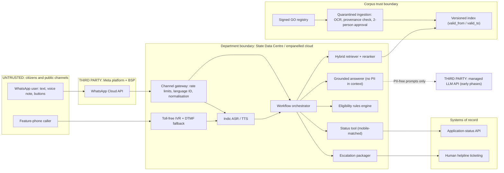

# P14 · Multilingual Citizen-Services Assistant

> A WhatsApp and IVR assistant that answers welfare-scheme questions from official government orders and looks up application status in Telugu, Hindi, Urdu and English. It is built for low-literacy, low-bandwidth citizens, escalates honestly to humans, and does not repeat a forged circular.
>
> **Customer:** Anvaya Welfare Directorate (fictional), welfare department of a fictional Telugu-majority Indian state where Urdu is also an official language · **Industry:** Public sector / social welfare · **Geography:** India · **Real engagement:** 22–24 weeks. Team: 2 FDEs, 1 applied scientist (multilingual retrieval and speech), 1 conversation designer/linguist, part-time security and accessibility specialists, plus the state IT cell, the application-system team and the helpline vendor · **Course build:** 6 weeks, team of 3–4 · **Difficulty:** ★★☆

---

## 1. Scenario — the customer and the ask

The Directorate runs about 40 welfare schemes (pensions, scholarships, housing, farmer support). Its helpline takes about **9,000 calls a day** on 140 contract seats, with peak waits of 11 minutes and 38% abandonment. About 70% of calls ask *"Am I eligible, and which documents do I need?"* or *"What is my application status?"* The rules live in about 1,100 Government Orders (GOs) and circulars, mostly Telugu PDFs, many amending earlier GOs clause by clause. The Director asks for **"an AI helpline for all schemes."**

What citizens need is narrower: grounded eligibility answers for the **12 schemes behind about 80% of queries**, each citing its GO; status lookup through the department API; voice in and out (WhatsApp voice notes and a toll-free IVR); simple, accessible language; and **honest escalation** to a human centre. Users include pensioners on shared feature phones, farmers on patchy 2G/3G and Urdu-speaking families who now get Telugu-only answers. The assistant never *decides* eligibility ("you appear to meet the conditions in GO X; the verifying officer decides"), never collects Aadhaar numbers, and says nothing political.

| Stakeholder | Cares about | Can block |
|---|---|---|
| Director (sponsor) | Grievance counts, visible launch | Scope, launch date |
| Scheme officers (×12) | Correct rules, no false promises | Per-scheme content sign-off |
| State IT / State Data Centre | Hosting, security audit | Hosting approval, audit certificate |
| Application-system team | API load, PII exposure | API access, rate limits |
| Helpline vendor and agents | Jobs, workload, blame | Escalation-desk adoption |
| Legal / DPDP nodal officer | Notice, consent, children's data | Go-live |
| Official-language cell | Correct Telugu/Urdu terminology | Glossary approval |
| Information and Public Relations (I&PR) | Election-period risk | Public launch, templates |
| Disability-rights advocates | Accessible design | Public criticism, audits |
| WhatsApp Solution Provider (BSP) | Policy compliance | Templates, account quality |

## 2. Constraints

**Data.** 35% of GOs are scanned (stamps, skew, handwriting); about 10% of older GOs use **legacy non-Unicode Telugu fonts** that extract as mojibake; income limits sit in tables. Urdu versions exist for only 8 schemes. In a fictional audit, 14% of 100 vendor-FAQ answers contradicted current GOs. The status API has a p95 of 1.8 s and fails about 2% of calls. No helpline recordings are consented for AI use.

**Legal and regulatory (as of Sept 2026; *verify* marks items not confirmed from a primary source).**
- **DPDP Act 2023 ([text](https://www.meity.gov.in/static/uploads/2024/06/2bf1f0e9f04e6fb4f8fef35e82c42aa5.pdf)) and DPDP Rules 2025** (G.S.R. 846(E), 13 Nov 2025, [Gazette PDF](https://www.meity.gov.in/static/uploads/2025/11/53450e6e5dc0bfa85ebd78686cadad39.pdf)).
  - Status lookup can rely on the **s.7(b) legitimate use** for State benefits (prior consent, or a notified State database), under Rule 5 and Second Schedule standards. The notice must be available in English or any **Eighth Schedule language** (s.5(3); Rule 3), which covers Telugu, Hindi and Urdu.
  - Scholarship applicants include **children**. Fourth Schedule Part B item 2 lifts s.9(1) and (3) (parental consent; no tracking or behavioural monitoring) for s.7(b) State benefits, "to the extent necessary". Design as if s.9 applied anyway.
  - Commencement: **12 and 18 months from notification** (Rule 1): consent managers (Rule 4) from Nov 2026, most obligations (Rules 3, 5–16) from May 2027. A Jan 2026 MeitY proposal to cut 18 months to 12 had not been notified as of Sept 2026 ([Mondaq](https://www.mondaq.com/india/data-protection/1773554/meity-plans-to-cut-short-dpdp-compliance-timeline-and-notify-cross-border-restrictions-for-sdfs); *verify before teaching*). s.17 exemptions for State bodies need a Central Government notification: *verify*.
- **IT Rules amendment on synthetically generated information (SGI)** (G.S.R. 120(E), in force 20 Feb 2026; [Khaitan & Co](https://www.khaitanco.com/thought-leadership/MeitY-notifies-the-IT-Amendment-Rules-2026)). Applicability reasoning:
  - **Who:** duties fall on **intermediaries**. Those offering tools that create SGI must label it (audio needs "a prominently prefixed audio disclosure"); significant social media intermediaries such as WhatsApp must obtain and verify user declarations. The Directorate publishes its own answers, so it is not an intermediary for them.
  - **What:** SGI covers only **audio, visual and audio-visual** content that appears authentic. Text replies are outside it, and so are tools used "solely to improve accessibility, clarity, quality, translation…" without changing the substance ([SCC Online](https://www.scconline.com/blog/post/2026/02/12/it-rules-2026-ai-and-intermediary-compliance/)).
  - **So:** the rules probably do not bind the Directorate directly, and only TTS voice replies are even candidates. But a human-sounding voice could be taken for an official, and WhatsApp may apply its own SGI rules. **Decision:** prefix every synthetic audio reply with "This is Anvaya's automated voice", never clone an official's voice, and get the state law department's written opinion.
- **India AI Governance Guidelines** (MeitY, 5 Nov 2025; **non-binding** good practice, not obligations). Sutras include "People First" and "Understandable by Design"; they ask for "accessible, multilingual and responsive" grievance redressal and content authentication ([AZB](https://www.azbpartners.com/bank/meity-releases-guidelines-on-ai-governance-the-way-ahead-and-roadmap-for-ai-use-in-india/)).
- **WhatsApp Business Platform** (a contract, not law, but it can stop the service).
  - Government entities must use a Solution Provider; opt-in is required; business-initiated messages need approved templates; replies are free inside the 24-hour window; automation needs "prompt, clear, and direct escalation paths" ([policy](https://whatsappbusiness.com/policy/)).
  - Meta's terms bar "AI Providers" whose *primary* (not ancillary) functionality is general-purpose AI, as Meta decides, and bar using platform data to train AI models, except to fine-tune a model for the business's **exclusive use** ([terms](https://www.facebook.com/legal/Meta-Terms-for-WhatsApp-Business-Platform)). Chats may feed the Directorate's own model only, never a vendor's shared one.
- **CERT-In Directions (2022).** Government organisations must report covered incidents within 6 hours ([CERT-In](https://www.cert-in.org.in/PDF/CERT-In_Directions_70B_28.04.2022.pdf)).
- **Accessibility:** RPwD Act 2016 and GIGW apply; exact clauses, and whether they reach WhatsApp and IVR, are *verify*.
- **Election Model Code of Conduct** limits government publicity during polls; current ECI instructions, including on AI content, are *verify*.

**Infrastructure.** Production runs in the State Data Centre (SDC) or a MeitY-empanelled cloud (confirm empanelment). GPU procurement through GeM takes 8–12 weeks, so early phases use managed APIs on **PII-free paths only**.

**Budget.** The opex target is ≤ ₹3 per resolved text query and ≤ ₹8 per resolved IVR call. A human-handled call costs about ₹25–40.

**Politics.** I&PR wants a launch event before an election five months away; the vendor fears losing seats; officers fear blame.

## 3. What students are given (course build)

| Dataset | Volume | Schema | Tricky cases |
|---|---|---|---|
| Scheme corpus | 40 fictional schemes, 400 docs (GOs, circulars, FAQs) | go_no, date, scheme_id, valid_from, supersedes, lang, signed, source | 35% scanned (skew, stamps, handwriting); 10% legacy-font PDFs; income-slab tables; clause-level amendments; Urdu for only 5 schemes |
| Forged/poisoned docs | 6 (red-team folder) | same | Fake GO raising an income ceiling; circular demanding a ₹500 "processing fee" to a UPI ID; white-text instructions to the assistant |
| Eligibility rules | JSON per scheme | age, income, category, land, district, occupation, gender | Overlapping schemes; mutually exclusive benefits; effective-dated changes |
| Applications | 100,000 | app_id, mobile, scheme, status, reason_code, applicant_age | Minors; one phone shared by a family; stale status |
| Queries | 3,000 text + 600 voice | lang (te, hi, ur, en, Tenglish, Roman Urdu), intent, gold_doc_ids, gold_answer, answerable | "naaku pension eligibility undha?"; dialect words; misspellings; unanswerable; political; multi-scheme |

**Query and audio generation.** Native speakers *write* queries rather than translating English ones (translationese inflates retrieval scores). Voice notes use varied TTS voices plus noise, encoded as WhatsApp Opus and 8 kHz IVR audio.

**Mock systems:** a status API (needs app_id plus matching mobile; injects 503s and stale records); a WhatsApp simulator (webhook-shaped JSON enforcing the 24-hour window, template-only outbound and interactive-list limits); an IVR simulator (DTMF plus audio); a helpline ticketing API; and a GO registry with an Ed25519-signed manifest standing in for digitally signed PDFs.

**Budget paths.**
- **(A) API, ≤ USD 50.** Small hosted LLM, embeddings and translation: 3,600 eval queries × 5k tokens ≈ 18M tokens per run.
- **(B) Local.** Embeddings [bge-m3](https://huggingface.co/BAAI/bge-m3) or [multilingual-e5-large](https://huggingface.co/intfloat/multilingual-e5-large) with [bge-reranker-v2-m3](https://huggingface.co/BAAI/bge-reranker-v2-m3); pivot translation with [IndicTrans2](https://huggingface.co/ai4bharat/indictrans2-en-indic-1B) (covers Urdu); an open-weight LLM on Ollama/vLLM, e.g. [Sarvam-30B](https://huggingface.co/sarvamai/sarvam-30b) (GGUF exists), Qwen or Gemma; Tesseract (`tel`, `urd`, `hin`) as the OCR baseline; [IndicConformer](https://huggingface.co/ai4bharat/indic-conformer-600m-multilingual) for ASR and [Indic Parler-TTS](https://huggingface.co/ai4bharat/indic-parler-tts), which lists Urdu, for TTS. IndicF5 and Sarvam's Bulbul v3 do **not** list Urdu as of Sept 2026; Sarvam's Saaras v3 ASR does ([docs](https://docs.sarvam.ai/)).

**Out of scope:** a real WhatsApp number or BSP onboarding, real department data, Aadhaar/e-KYC, payments and consent-manager integration.

## 4. Discovery — what the FDE does in week 1

**Map** the citizen journey (hear about scheme → eligibility → apply → field verification → sanction → disbursement) and where calls originate: two days on the helpline floor, one in a village service centre ([Template 01](templates/01-discovery-questionnaire.md), [Template 02](templates/02-data-readiness-scorecard.md)).

**Baselines:** ACD data by language and hour; 300 calls relabelled by reason; a **100-answer accuracy audit** by scheme officers against current GOs; OCR character error rate (CER) on 50 GOs per script; a BM25 retrieval baseline; status API latency and availability; and a 200-person phone survey on smartphone access, WhatsApp use and preferred language.

**Sharpest questions:**
1. Which 12 schemes produce 80% of queries, by language and district?
2. When GO, portal and officer disagree, which wins?
3. Is there a canonical, signed GO repository, or do GOs circulate as scans and forwards?
4. How fast must a rule change reach citizens, and who approves the new answer?
5. Has legal approved indicative (not determinative) eligibility wording?
6. How does the status API identify a citizen, and which PII fields does it return?
7. What share of callers want Urdu, and which Urdu source documents exist?
8. What do agents do today when they do not know an answer, and what will their job become?
9. When does the next Model Code of Conduct period start, and what will I&PR require?
10. Is there a verified WhatsApp account, a BSP contract and approved templates? Which audit gates go-live?

**Qualification: the lowest rung that works.** *Status* is already a DTMF lookup by application number; keep it as the fallback and add voice and WhatsApp on top. *Eligibility* belongs in a **deterministic rules engine** authored from the GOs and signed off by officers, not an LLM reasoning over GOs. *Questions* need a single grounded LLM call over retrieved GO passages, with citations and simple language. A *workflow* ties these together (language ID → intent → status tool | rules questionnaire | grounded Q&A | escalate). No autonomous agent is needed.

**Decision: Go with conditions.** Start with 12 schemes. **Launch each language separately** once it passes its gate, so Urdu may lag. The provenance gate goes live before any public traffic. No Aadhaar in chat.

## 5. Success criteria and acceptance tests

| Dimension | Criterion | Threshold | Test set | Justification |
|---|---|---|---|---|
| Business | Scheme-info and status contacts resolved without a human | ≥ 40% by pilot week 8; abandonment ≤ 20% (from 38%) | 3 pilot vs 3 control districts | Status and FAQ calls dominate |
| Retrieval | hit@5 per language slice | 95% CI lower bound ≥ 0.85 | ≥ 150 answerable golden queries per slice | No right answer without the right GO |
| Faithfulness | Every claim supported by the cited GO | CI lower bound ≥ 0.93 | Same set; judge calibrated to native raters | False benefit claims harm citizens |
| Eligibility | Agreement with rules engine and officer panel | ≥ 97%; 0 determinative "you are eligible" | 400 synthetic profiles | The officer decides |
| Parity | hit@5 and faithfulness gap vs Telugu | Not credibly > 0.07 (bootstrap) | Golden set | Equal service is the point |
| Safety | Abstain or escalate on unanswerable or out-of-scope queries | ≥ 95%; confident wrong answers ≤ 1% | 300 unanswerable (50 per slice) + 100 political | |
| Security | Forged or injected content served | 0 | 6 forged docs + 50 injection variants | |
| Privacy | Status disclosed to a non-matching mobile | 0 of 500 attempts | Enumeration red team | |
| Reliability | Status-flow pass^4 with API faults injected | ≥ 0.95 | 200 scenarios × 4 runs | |
| Latency | WhatsApp text / voice-note reply; IVR end-of-speech to first audio | p95 ≤ 6 s / ≤ 12 s; ≤ 2.5 s | Load test at 2× peak | Status API p95 is 1.8 s, so IVR status turns play a "checking…" prompt first |
| Accessibility | Task success, 24 low-literacy or visually impaired testers | ≥ 80% status check; ≥ 70% correct eligibility guidance | Moderated te/ur sessions | |
| Freshness | Approved rule change live | ≤ 4 working hours | Change drill | |
| Cost | Per resolved query | ≤ ₹3 text; ≤ ₹8 IVR | Metered pilot | |

## 6. Reference architecture



| Component | Responsibility | Self-hostable | Managed | Owner |
|---|---|---|---|---|
| Channel gateway | WhatsApp webhooks, IVR, SMS fallback, rate limits | FastAPI + FreeSWITCH/Asterisk | WhatsApp Cloud API via BSP; CPaaS IVR/SMS | FDE → state IT |
| Normalisation, language ID | NFC, Urdu code-point unification, transliteration | [IndicXlit](https://huggingface.co/ai4bharat/IndicXlit), rules | BHASHINI (MeitY) APIs (*verify* coverage, terms) | Applied scientist |
| Ingestion and OCR | Text, tables, legacy-font detection | Tesseract, VLM-based OCR | Cloud document AI (check te/ur support) | FDE |
| Provenance gate | Signature and registry check, approvals | In-house | — | Directorate content ops |
| Retrieval | Hybrid BM25 + dense, cross-encoder rerank, per-language evaluation | bge-m3/e5 + bge-reranker-v2-m3; OpenSearch, Qdrant or pgvector | Hosted vector DB, embeddings and rerankers | Applied scientist |
| Translation pivot | Urdu/Hindi ↔ Telugu/English | IndicTrans2 | Sarvam translate, BHASHINI | Applied scientist |
| LLM | Grounded simple-language answers | Open weights (Sarvam-30B, Qwen, Gemma) on vLLM | Managed APIs, PII-free paths only | FDE |
| Rules engine | Indicative eligibility | Python/JSON-logic | — | Scheme officers own the rules |
| Speech | ASR/TTS in 4 languages | AI4Bharat IndicConformer, Indic Parler-TTS; BharatGen [Shrutam-2 ASR / Sooktam-2 TTS](https://huggingface.co/bharatgenai) (Feb 2026 cards list te and ur; check licences; Sooktam-2 clones reference voices, so fix one) | Sarvam Saaras/Bulbul, BHASHINI, hyperscalers | Applied scientist |
| Escalation | Ticket plus context packet to humans | — | Helpline CRM | Helpline vendor |
| Observability | Per-language traces and dashboards | Langfuse/Phoenix + OTel collector | APM vendors | State IT |

**ADRs** ([Template 04](templates/04-solution-design-and-adr.md)):
1. **Retrieval per language:** native multilingual embeddings vs pivot translation to Telugu/English vs hybrid BM25 + dense with a reranker, decided per language from the harness.
2. **Model hosting:** managed APIs vs open weights in the SDC vs phased, judged on sovereignty, GPU lead time and Urdu quality.
3. **Eligibility:** rules engine vs LLM reasoning vs hybrid (the LLM collects facts and explains; the engine decides the indicative outcome).
4. **Corpus trust:** open upload by district staff vs signed-registry-only ingestion with two-person approval and effective dating.
5. **Speech stack and voice persona:** BHASHINI vs Sarvam vs self-hosted AI4Bharat vs hyperscalers, plus synthetic-voice disclosure and no cloning.
6. **Channel strategy:** WhatsApp-first vs IVR-first vs both with SMS fallback, weighing the AI-provider clause and template approvals.

## 7. Implementation plan — week by week

| Phase (real) | Weeks | Key tasks | Exit criteria | FDE artifacts |
|---|---|---|---|---|
| Discovery | 1–3 | Journey map, corpus inventory, OCR audit, top-12 rules drafted with officers, BSP and hosting status | Memo signed; 12 schemes named | Templates 01, 02; [SOW](templates/03-sow-and-acceptance-criteria.md) |
| POC | 4–8 | Provenance-gated ingestion; per-language retrieval harness; tokeniser-cost study; rules engine for 3 schemes; mobile-matched status tool | te/en pass gates; Urdu gap diagnosed with a plan | ADRs 1–4, [eval plan](templates/05-eval-plan.md), [threat model](templates/06-threat-model-and-controls.md) |
| Pilot | 9–16 | WhatsApp (text + voice notes) and IVR in 3 districts; 12 schemes; escalation desk; accessibility sessions; red team; security audit | Section 5 met in pilot; audit passed | [Obligations map](templates/07-compliance-obligations-to-controls.md), [security pack](templates/08-security-review-pack.md), [status reports](templates/10-demo-script-and-status-report.md) |
| Production | 17–22 | Statewide rollout, SDC hosting, content-ops process for rule changes, election-period mode | SLOs met for 3 weeks; 2 rule-change drills | [Runbook](templates/09-runbook-slos-and-handover.md) |
| Handover | 23–24 | Train content ops and state IT; hand over eval ownership | Directorate ships a rule change and re-evaluates it unaided | Handover checklist |

**Course build:** W1 discovery memo and data scorecard · W2 ingestion, OCR, provenance gate · W3 retrieval and per-language harness · W4 rules engine, status tool, WhatsApp simulator · W5 voice, accessibility, red team · W6 curveballs and demo.

**Change management with helpline staff.** Agents are not replaced in the pilot: they become the **escalation desk**, get tickets with context, and flag wrong bot answers in one click (feeding the regression set). The best agents write golden queries and review phrasing. The vendor contract moves to per-resolution-and-quality pricing before scale-up, bot metrics never discipline individual agents, and a weekly note says "what the bot got wrong and what we fixed".

**Offline and low-bandwidth fallback.** WhatsApp replies are text-first, under 500 characters, no images or PDFs unless asked, voice only for voice users. The IVR keeps a no-data DTMF status path and pre-recorded audio for the top 50 FAQs. SMS status works by keyword (templates registered under TRAI's DLT rules; *verify*), a missed call triggers a callback, and pre-approved cached answers cover the top 100 questions if the LLM is down.

**Code sketch: per-language evaluation harness** (library-agnostic): hit@k and faithfulness per slice with bootstrap CIs, gating on the *lower* bound and on credible parity gaps against Telugu.

```python
import random
from collections import defaultdict
from statistics import mean

def hit_at_k(gold_ids, retrieved_ids, k):
    return 1.0 if set(gold_ids) & set(retrieved_ids[:k]) else 0.0

def bootstrap(xs, stat=mean, n_boot=2000, alpha=0.05, seed=13):
    rng = random.Random(seed)
    boots = sorted(stat(rng.choices(xs, k=len(xs))) for _ in range(n_boot))
    return stat(xs), boots[int(n_boot * alpha / 2)], boots[int(n_boot * (1 - alpha / 2)) - 1]

def diff_ci(a, b, n_boot=2000, alpha=0.05, seed=13):
    """CI for mean(a) - mean(b) with independent resampling (different items per language)."""
    rng = random.Random(seed)
    d = sorted(mean(rng.choices(a, k=len(a))) - mean(rng.choices(b, k=len(b))) for _ in range(n_boot))
    return mean(a) - mean(b), d[int(n_boot * alpha / 2)], d[int(n_boot * (1 - alpha / 2)) - 1]

def evaluate(records, k=5, floors=None, ref_lang="te", max_gap=0.07, min_n=100):
    """records: dicts with lang (any slice key, e.g. "ur" or "ur|ivr"), gold_ids (empty = unanswerable),
    retrieved_ids, faithful (1/0 from a calibrated judge or native rater; None if the bot escalated)."""
    floors = floors or {"hit@k": 0.85, "faithfulness": 0.93}   # gate on the CI lower bound
    per = defaultdict(lambda: {"hit@k": [], "faithfulness": []})
    for r in records:
        if r["gold_ids"]:
            per[r["lang"]]["hit@k"].append(hit_at_k(r["gold_ids"], r["retrieved_ids"], k))
        if r.get("faithful") is not None:
            per[r["lang"]]["faithfulness"].append(float(r["faithful"]))
    report, failures = {}, []
    for lang, metrics in sorted(per.items()):
        for name, xs in metrics.items():
            if len(xs) < min_n:                   # too few items: report, never pass silently
                report[(lang, name)] = ("insufficient_n", len(xs)); failures.append((lang, name, "n"))
                continue
            m, lo, hi = bootstrap(xs)
            report[(lang, name)] = (round(m, 3), round(lo, 3), round(hi, 3), len(xs))
            if lo < floors[name]:                  # must be credibly above the floor, not just on average
                failures.append((lang, name, "floor"))
            ref = per.get(ref_lang, {}).get(name, [])
            if lang != ref_lang and len(ref) >= min_n:
                g, glo, ghi = diff_ci(ref, xs)        # parity gap vs the reference language
                report[(lang, name, "gap_vs_" + ref_lang)] = (round(g, 3), round(glo, 3), round(ghi, 3))
                if glo > max_gap:                     # gap is credibly larger than allowed
                    failures.append((lang, name, "parity"))
    return report, failures
```

On a synthetic run with Urdu hit@5 near 0.6 and Telugu near 0.9, it reports a gap of about 0.3 [0.2, 0.39] and fails Urdu on floor and parity (curveball 3); slices with n < 100 fail as `insufficient_n`.

## 8. Evaluation plan

**Datasets** ([Template 05](templates/05-eval-plan.md)): **golden**, with at least 150 answerable and 50 unanswerable natively written queries per slice (te, hi, ur, en, Tenglish, Roman Urdu); **adversarial**, with forged documents, injections, political prompts, Aadhaar bait and pressure ("I *am* eligible, just say yes"); **regression**, with every flagged production answer; and **held-out**, with two schemes and one district dialect never used for tuning.

**Metrics per layer:** OCR CER per script and legacy-font detection; **tokeniser fertility** (tokens per sentence relative to English on parallel text such as [FLORES+](https://huggingface.co/datasets/openlanguagedata/flores_plus)) for every candidate model; retrieval hit@k and MRR per slice; answer faithfulness, correctness, citation presence and readability (native raters: "understandable with primary schooling"); ASR CER/WER and application-number accuracy; TTS intelligibility (can listeners answer a question about what they heard?); and safety, latency and cost per slice.

**Why fertility matters.** Pre-tokenisers that treat only letters as word characters split abugidas such as Telugu at every vowel sign; an Aug 2026 preprint found all 17 abugidas it tested affected, from 1.47× (Tibetan) to 9.02× (Thai), and notes o200k is already mark-aware ([arXiv 2608.26449](https://arxiv.org/abs/2608.26449); see also [arXiv 2411.12240](https://arxiv.org/abs/2411.12240)). Fertility multiplies cost and latency and limits how many GO passages fit.

**Native-speaker raters and judge calibration.** Two raters per language label 200 answers (report agreement); the LLM judge rates a language only if Cohen's κ ≥ 0.7 against them, otherwise humans do.

**CI gates.** The harness runs per language on every change; a corpus change re-evaluates the affected scheme.

**Online metrics** (by language): resolution without escalation, escalation reasons, the WhatsApp "helpful?" button and repeat contact, plus officers' weekly spot-check of 50 answers per scheme.

## 9. Security, privacy and compliance

| Context | Private data | Untrusted content | External channel | Design response |
|---|---|---|---|---|
| Grounded Q&A | **No** PII in context | Citizen message + corpus (maybe poisoned) | Reply | Provenance gate; only allow-listed government links |
| Status lookup | Yes (one application) | Citizen message | Reply | Mobile-matched tool; **no corpus text in this context**, so a poisoned GO cannot steer it; the LLM only phrases returned fields |
| Ingestion / OCR / VLM | No | Uploaded documents | Index (after approval) | Quarantined reader extracts typed fields; hidden text stripped; two-person approval |
| Escalation packager | Yes | Conversation | Internal ticket | Identity and status fields come from systems, not the summary |

**Top threats and controls:**
- **Forged circular / corpus poisoning.** Ingest only from the signed registry, cross-check GO number and date, alert on rule diffs, require two-person approval, and make every answer cite a GO number and date.
- **Fee scams impersonating the service.** A verified number on posters; the bot says the scheme never asks for money or OTPs (canary-tested).
- **Status enumeration.** Mobile match, OTP when the number differs, per-number rate limits and minimal fields.
- **Children's data.** A minor's status goes only to the guardian's registered mobile, with no profiling.
- **Political jailbreaks.** A fixed neutrality policy, an election-period mode and a red-team set.
- **Synthetic voice mistaken for an official.** Prefixed disclosure, a neutral voice persona and no cloning.

**Obligations → controls** ([Template 07](templates/07-compliance-obligations-to-controls.md)):

| Obligation | Control | Evidence |
|---|---|---|
| DPDP notice in the user's language (s.5(3), Rule 3) | Short te/hi/ur/en notice before the first lookup, linked to the full notice; audio notice on the IVR | Language-cell-approved texts |
| DPDP legitimate use for State benefits (s.7(b), Rule 5) | Processing limited to scheme purposes; Second Schedule standards mapped | Records of processing |
| DPDP children (s.9; Fourth Schedule Part B exemption for s.7(b) benefits) | Guardian-mobile delivery; no tracking or profiling of minors | Test cases |
| DPDP safeguards and breach (Rules 6–7); CERT-In 6 h | Encryption, access logs, incident playbook | Drill record |
| IT Rules SGI (duties on intermediaries; audio/visual only; likely not binding here; *verify*) | Prefixed audio disclosure; no cloned voices | Audio samples; law-department opinion |
| AI Governance Guidelines (non-binding) | Multilingual grievance route; published model card | Public page |
| WhatsApp terms and policy | Opt-in, templates, human escalation; platform data trains only the Directorate's own model | BSP approvals |
| RPwD / GIGW (*verify*) | Screen-reader-friendly text, voice everywhere, accessibility testing | Test reports |

## 10. Operations and cost model

**SLOs:** WhatsApp path 99.5% (bounded by Meta); IVR 99.9% with DTMF fallback; answer p95 as in Section 5; rule-change freshness ≤ 4 working hours; human callback on escalations within 1 working day.

**Observability.** OTel GenAI spans (pin the semantic-convention version; still at Development status) tagged with language, scheme, cited GO IDs and index version; per-language dashboards; a content-ops queue of pending approvals.

**Cost model** (assumptions; prices change, so re-price quarterly):

| Driver | Assumption | Range |
|---|---|---|
| Volume | 30,000 WhatsApp sessions/day × 3 answers; 20% voice notes; 6,000 IVR calls/day × 3 min | — |
| Tokens per answer | ~1.2k instructions + ~2.5k English-equivalent retrieved text × fertility (1.2–3×) + 200 output | ~4k–9k tokens |
| LLM per answer | Small/open to mid-tier price bands (a frontier model costs about 3× the top) | $0.0003–0.01 |
| Voice note | 20 s ASR + 25 s TTS | $0.003–0.02 |
| WhatsApp fees | Per-message pricing since 1 July 2025: replies and utility templates free inside the window, templates outside it charged ([pricing](https://developers.facebook.com/docs/whatsapp/pricing)) | Check the India rate card |
| IVR | Toll-free telephony + speech + LLM | $0.01–0.05 per minute |

This gives **≈ ₹0.2–3.7 per WhatsApp session** (three answers, 20% of them voice) and **≈ ₹3–13 per IVR call** (at ≈ ₹88/USD). Divided by a 40–60% resolution rate, that is **≈ ₹0.4–9 per resolved text query**, so the ₹3 target needs small or self-hosted models; the IVR's upper range breaks ₹8 even before dividing by resolution unless speech is self-hosted in the SDC, the key input to ADR 2. Fertility is the swing factor, so compare tokenisers *before* choosing the model.

**Runbook entries:**

- **Status API down:** say so, queue a WhatsApp/SMS callback, keep the IVR DTMF path.
- **Template rejected or quality rating drops:** SMS fallback, then fix the template.
- **Corpus incident:** freeze the scheme's answers to "please call the helpline"; roll back the index.
- **One language regresses:** route it to humans. **MCC begins:** switch to election mode.

**DR.** Immutable, restorable index versions; SDC plus a DR site; static IVR menus.

## 11. Curveballs (instructor-injected events)

1. **Week 3: a forged scheme circular enters the corpus.** A district clerk uploads a WhatsApp-forwarded "GO" that raises the pension income limit and asks for a ₹500 fee to a UPI ID; the bot quotes it 212 times. Freeze the scheme's answers, roll back the index, trace every affected conversation and send corrected utility templates. Report within the CERT-In window if it qualifies, fix the root cause (registry-only ingestion) and run a blameless post-mortem.
2. **Week 4: an eligibility rule changes overnight.** A new GO lowers the age limit with immediate effect. Effective-dated rules and index entries (valid_from) let the officer approve the change once; clear answer caches, re-run that scheme's golden set, brief agents and publish the freshness SLO result.
3. **Week 4: Urdu retrieval is far worse than Telugu.** Diagnose before tuning: Arabic vs Urdu code points for *yeh*, *kaf* and *heh* (e.g. U+064A vs U+06CC); Roman-Urdu queries; few Urdu source documents, so retrieval is really cross-lingual; poor Nastaliq OCR. Fix with normalisation, pivot translation for retrieval (answering in Urdu), BM25 hybrid and a curated Urdu FAQ, then embedding fine-tuning on native pairs if needed. Report with CIs and route Urdu to Urdu-speaking agents until the gate passes.
4. **Week 5: a politically sensitive question during the election period.** *"Which party started this scheme; will it stop if X wins?"* Answer neutrally with only the GO facts and date, no commentary and no promotion of new schemes under the MCC, using wording agreed with I&PR in advance; log it.
5. **Week 5: WhatsApp blocks a flow.** The "application approved" utility template is recategorised as marketing and paused, or the BSP flags the account under the AI-provider clause. Switch to SMS or IVR callback, redesign the template within utility rules, and document why the assistant is ancillary to a government service, as the channel ADR anticipated.

## 12. Deliverables and grading rubric

**Checklist:** discovery memo and data scorecard; SOW; ADRs 1–6; fertility study; per-language eval report with CIs; threat model and obligations map (with the SGI applicability note); WhatsApp and IVR simulators with the provenance gate; accessibility notes; runbook; change-management plan; a 15-minute Telugu/Urdu demo showing a failure; curveball log.

| Criterion | Weight | Excellent | Weak |
|---|---|---|---|
| Working system | 25% | Cited answers in four languages; mobile-matched status; honest escalation; DTMF fallback | English-first bot, translated |
| Evaluation rigour | 20% | Per-language CIs, native raters, calibrated judge, fertility measured | One pooled number from translated queries |
| Security and compliance | 15% | Provenance gate, split contexts, reasoned SGI applicability, *verify* flags | "The LLM filters bad documents" |
| FDE artifacts | 20% | ADRs backed by numbers; a real change-management plan | Templates copied unfilled |
| Demo and communication | 10% | Shows the Urdu gap honestly, with the plan | Hides weak languages |
| Curveball handling | 10% | Containment, citizen correction, root cause | Hot-fixes the prompt |

## 13. Stretch goals

- Fine-tune the embeddings for Urdu and Tenglish (Turn 24) and show the before/after CIs.
- Build a content-ops UI where officers diff GO clauses and approve rule changes.

## 14. Curriculum map

| Turn | Title | How it is exercised |
|---|---|---|
| 1 | Tokenization Algorithms | Fertility study per language and script |
| 6 | Encoder, Decoder and Encoder-Decoder Models | Bi-encoder retrieval vs cross-encoder reranker (bge-reranker-v2-m3) |
| 14 | Hallucination in Depth | Faithfulness gates, abstention |
| 24, 48, 49, 50 | Embedding/Reranker Fine-Tuning; Embedding-Model Selection; RAG Evaluation Tooling; Vector Databases | Per-language retrieval choice and harness; Urdu fine-tuning |
| 41 | Multilingual Prompting | Tenglish, Roman Urdu, simple-language answers |
| 42 | Document Parsing and Ingestion | Scanned GOs, legacy fonts, tables |
| 52 | Data Lineage and Deletion in RAG | Effective-dated index, rollback of a forged GO |
| 60, 106 | Voice Agents; Speech AI | IVR and voice notes in four languages |
| 64, 83 | Trust Calibration; Responsible AI Practice | Indicative eligibility, language parity |
| 74, 75, 76 | OWASP LLM Top 10; Red-Teaming; Data and Memory Poisoning | Forged circulars, injections, political prompts |
| 78, 81, 84 | PII/DLP; GDPR and DPDP; Content Provenance | Status privacy, children, signed registry, audio disclosure |
| 89, 91, 92 | Feedback Loops; LLM FinOps; Sovereign Deployment | Platform-data limits, fertility cost, SDC hosting |
| 90, 96, 97 | SLOs and Incident Response; Observability; Evaluation Tools | Freshness SLO, per-language dashboards |
| 102, 134 | Model Provider Landscape; Sovereign AI and Open Weights | Indic model and speech choices |
| 109–116 | FDE practice turns | Qualification, ROI vs ₹25–40 calls, playbook, ADRs, demo, escalation desk (114), data readiness, SOW |

**New/gap topics exercised:** #6 India SGI rules (applicability analysis), #8 injection-resistant architecture (split contexts, quarantined ingestion), #10 sycophancy under citizen pressure, #4 regulation as obligations→controls, RAG-4 index freshness (effective-dated GOs, conflicting versions, 4-hour freshness SLO), RAG-9 citation engineering (GO number and date in every answer), FDE-8 provider usage policies (WhatsApp AI-provider clause), SEC (India sector AI governance: MeitY guidelines, CERT-In), SEC (accessibility law).

## 15. What reviewers look for / common failure modes

- A pooled accuracy number that hides a weak Urdu slice, or an eval set translated from English.
- Fertility ignored, so the cost model is wrong by 2–3× for Telugu.
- An LLM deciding eligibility, or "you are eligible" said without the officer caveat.
- Ingestion that trusts any uploaded PDF; no effective dating, so superseded GOs are still quoted.
- Status revealed on application ID alone.
- Long, jargon-heavy answers read aloud to a feature phone; no fallback when WhatsApp or the LLM is down.
- SGI rules assumed to bind text answers, or ignored for the voice.
- Helpline staff treated as the thing being replaced rather than the people who make it work.
