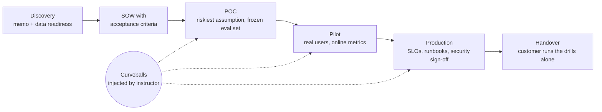

# Real-World FDE Projects

Sixteen engagement briefs that show **how a Forward Deployed Engineer actually delivers AI systems for customers**: who you meet, what you ship each week, which decisions you make and on what evidence, and what goes wrong mid-flight.
Every brief has two versions:
- the **real engagement** (how it runs at a customer, over 8–20 weeks);
- the **course build**, scaled for a team of 2–4 students over 2–4 weeks, with synthetic data and either ≤ USD 50 of API credit or local open-weight models.

## Why projects

The Vol 2 study guide assesses recall only (676 short-answer questions). FDEs are judged on artefacts and judgement: a discovery memo that says "no" when it should, a frozen evaluation set, an SOW with measurable acceptance criteria, a threat model, a running system, and a calm response when the customer's legal team sends a deletion request in week 6. These projects put that into the course.

## The projects

| # | Project | Customer (fictional) · industry · geography | Core skills exercised | Difficulty |
|---|---|---|---|---|
| [P01](P01-permission-aware-knowledge-assistant.md) | Permission-aware knowledge assistant | Law firm · UK/EU + India | ACL-trimmed RAG, ethical walls, citations, verifiable deletion | ★★☆ |
| [P02](P02-text-to-sql-analytics-agent.md) | Text-to-SQL analytics agent over a semantic layer | Retail chain · India | Semantic layer, SQL guard, RLS, execution-accuracy evals, warehouse FinOps | ★★☆ |
| [P03](P03-claims-intake-document-ai.md) | Claims-intake document AI with human review | General insurer · India | Parsing, VLM extraction, constrained outputs, automation bias, fairness | ★★☆ |
| [P04](P04-contact-centre-voice-agent.md) | Contact-centre voice agent | Telecom · India (multilingual) | Real-time voice, handoff, CRM integration, voice-clone fraud, synthetic callers | ★★★ |
| [P05](P05-computer-use-agent-replacing-rpa.md) | Computer-use agent replacing brittle RPA | Freight forwarder · NL + India | Computer use, browser isolation, action gating, durable runs, API-vs-GUI decisions | ★★★ |
| [P06](P06-injection-resistant-inbox-agent.md) | Injection-resistant executive inbox agent | Biotech · US | Lethal trifecta, quarantined reader / CaMeL, context compaction, OBO identity | ★★★ |
| [P07](P07-ai-vulnerability-triage-and-patch-pipeline.md) | Defensive AI vulnerability triage and patch pipeline | Fintech SaaS · EU | AI cyber defence, sandboxed repro, coding-agent patches, EU CRA reporting clock | ★★★ |
| [P08](P08-sovereign-air-gapped-llm-platform.md) | Sovereign, air-gapped LLM platform | Cooperative bank · India | Open-weight selection, serving, capacity maths, signed offline updates, RBI/DPDP | ★★★ |
| [P09](P09-legacy-modernisation-with-coding-agents.md) | Legacy modernisation with coding agents | Life insurer · India | AGENTS.md, skills, spec-driven development, characterisation tests, honest productivity | ★★☆ |
| [P10](P10-ambient-clinical-documentation.md) | Ambient clinical documentation | Community health network · US | Speech + diarisation, omission/hallucination evals, HIPAA, clinician trust | ★★★ |
| [P11](P11-teen-safe-study-companion-compliance.md) | Teen-safe study companion compliance retrofit | Edtech · India → US | Companion/minor laws, crisis protocols, sycophancy evals, age assurance | ★★☆ |
| [P12](P12-enterprise-ai-gateway-finops-platform.md) | Enterprise AI gateway, FinOps and model lifecycle | Conglomerate · global | Gateway, routing, budgets, OTel, deprecations, failover, shadow-AI inventory | ★★★ |
| [P13](P13-agent-ready-commerce-mcp.md) | Agent-ready commerce (TypeScript) | D2C fashion brand · India/US/UK | Remote MCP server + OAuth, assistant distribution, WebMCP, mandates, crawler control | ★★☆ |
| [P14](P14-multilingual-citizen-services-assistant.md) | Multilingual citizen-services assistant | State department · India | Telugu/Hindi/Urdu retrieval, speech, low bandwidth, SGI rules, accessibility | ★★☆ |
| [P15](P15-distilled-domain-small-model-offline.md) | Distilled domain small model for offline technicians | Utility contractor · global | SFT/LoRA, distillation, synthetic data, quantisation, on-device, safety erosion | ★★★ |
| [P16](P16-due-diligence-deep-research-agent.md) | Due-diligence deep-research agent | Private equity · UK + India | Deep research, citation verification, MNPI barriers, content licensing | ★★☆ |

## How every project runs

Each phase ends with graded artefacts built from the shared [templates](templates/):

| Template | Used in phase |
|---|---|
| [01 Discovery questionnaire and qualification](templates/01-discovery-questionnaire.md) | Discovery |
| [02 Data-readiness scorecard](templates/02-data-readiness-scorecard.md) | Discovery |
| [03 SOW and acceptance criteria](templates/03-sow-and-acceptance-criteria.md) | Discovery → POC |
| [04 Solution design and ADRs](templates/04-solution-design-and-adr.md) | POC → Pilot |
| [05 Evaluation plan](templates/05-eval-plan.md) | POC onwards (evaluation is the spine) |
| [06 Threat model and controls](templates/06-threat-model-and-controls.md) | POC → Pilot |
| [07 Compliance obligations → controls](templates/07-compliance-obligations-to-controls.md) | Discovery → Production |
| [08 Security review pack](templates/08-security-review-pack.md) | Discovery → Pilot (it is on the critical path) |
| [09 Runbook, SLOs and handover](templates/09-runbook-slos-and-handover.md) | Production → Handover |
| [10 Demo script and status report](templates/10-demo-script-and-status-report.md) | Every week |

## Curveballs

Every brief lists 4–6 **curveballs**: realistic events that the instructor injects mid-project without warning. Examples: a provider deprecation notice, a prompt-injection incident, a legal deletion request, a cost spike, a UI redesign, a stakeholder reversing a decision, a request that should be refused. Handling them is 10% of the grade. It is also the closest thing to the real job.

## Default grading rubric (briefs may adjust the weights)

| Dimension | Weight | Excellent | Weak |
|---|---|---|---|
| Working system | 25% | Runs end to end on the frozen test set; degrades honestly | Demo-only happy path |
| Evaluation rigour | 20% | Golden, adversarial and held-out sets; calibrated judges; CI gates; confidence intervals | A single score from one run |
| Security and compliance | 15% | Lethal-trifecta check, tested controls, obligations mapped to evidence | A "we added a guardrail" slide |
| FDE artefacts | 20% | Discovery memo, SOW, ADRs, runbook and handover that a customer could sign | Missing, or generic boilerplate |
| Demo and communication | 10% | Honest demo that shows a failure; numbers from the eval set | Cherry-picked outputs |
| Curveball handling | 10% | Fast, calm, evidence-based response; decision recorded in an ADR | Panic patching; no record |

## Suggested sequencing

See [../05-revised-syllabus-and-learning-path.md](../05-revised-syllabus-and-learning-path.md) for where each project sits in the 16-week track. Recommended order:
1. **One ★★☆ build-first project** in weeks 3–6: P01, P02 or P03.
2. **One ★★★ hardening project** in weeks 7–11: P05, P06, P07 or P12.
3. **One capstone chosen by the student's target industry** in weeks 12–16.

## Coverage matrix

<!-- COVERAGE-MATRIX -->
