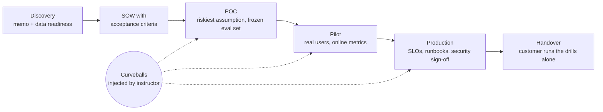

# Real-World FDE Projects

Sixteen engagement briefs that show **how a Forward Deployed Engineer actually delivers AI systems for customers**: who you meet, what you ship each week, which decisions you make and on what evidence, and what goes wrong mid-flight.
Every brief has two versions:
- the **real engagement** (how it runs at a customer, over 12–24 weeks);
- the **course build**, scaled for a team of 2–4 students over 4–6 weeks, with synthetic data and either ≤ USD 50 of API credit or local open-weight models.

## Why projects

The Vol 2 study guide assesses recall only (676 short-answer questions). FDEs are judged on artefacts and judgement: a discovery memo that says "no" when it should, a frozen evaluation set, an SOW with measurable acceptance criteria, a threat model, a running system, and a calm response when the customer's legal team sends a deletion request in week 6. These projects put that into the course.

## The projects

| # | Project | Customer (fictional) · industry · geography | Core skills exercised | Difficulty |
|---|---|---|---|---|
| [P01](P01-permission-aware-knowledge-assistant.md) | Permission-aware knowledge assistant | Law firm · UK/EU + India | ACL-trimmed RAG, ethical walls, citations, verifiable deletion | ★★☆ |
| [P02](P02-text-to-sql-analytics-agent.md) | Text-to-SQL analytics agent over a semantic layer | Retail chain · India | Semantic layer, SQL guard, RLS, execution-accuracy evals, warehouse FinOps | ★★☆ |
| [P03](P03-claims-intake-document-ai.md) | Claims-intake document AI with human review | General insurer · India | Parsing, VLM extraction, constrained outputs, automation bias, fairness | ★★☆ |
| [P04](P04-contact-centre-voice-agent.md) | Contact-centre voice agent | Telecom · India (multilingual) | Real-time voice, handoff, CRM integration, voice-clone fraud, synthetic callers | ★★★ |
| [P05](P05-computer-use-agent-replacing-rpa.md) | Computer-use agent replacing brittle RPA | Freight forwarder · NL + India | Computer use, browser isolation, action gating, durable runs, API-vs-GUI decisions | ★★★ |
| [P06](P06-injection-resistant-inbox-agent.md) | Injection-resistant executive inbox agent | Biotech · US | Lethal trifecta, quarantined reader / CaMeL, context compaction, OBO identity | ★★★ |
| [P07](P07-ai-vulnerability-triage-and-patch-pipeline.md) | Defensive AI vulnerability triage and patch pipeline | Fintech SaaS · EU | AI cyber defence, sandboxed repro, coding-agent patches, EU CRA reporting clock | ★★★ |
| [P08](P08-sovereign-air-gapped-llm-platform.md) | Sovereign, air-gapped LLM platform | Cooperative bank · India | Open-weight selection, serving, capacity maths, signed offline updates, RBI/DPDP | ★★★ |
| [P09](P09-legacy-modernisation-with-coding-agents.md) | Legacy modernisation with coding agents | Life insurer · India | AGENTS.md, skills, spec-driven development, characterisation tests, honest productivity | ★★☆ |
| [P10](P10-ambient-clinical-documentation.md) | Ambient clinical documentation | Community health network · US | Speech + diarisation, omission/hallucination evals, HIPAA, clinician trust | ★★★ |
| [P11](P11-teen-safe-study-companion-compliance.md) | Teen-safe study companion compliance retrofit | Edtech · India → US | Companion/minor laws, crisis protocols, sycophancy evals, age assurance | ★★☆ |
| [P12](P12-enterprise-ai-gateway-finops-platform.md) | Enterprise AI gateway, FinOps and model lifecycle | Conglomerate · global | Gateway, routing, budgets, OTel, deprecations, failover, shadow-AI inventory | ★★★ |
| [P13](P13-agent-ready-commerce-mcp.md) | Agent-ready commerce (TypeScript) | D2C fashion brand · India/US/UK | Remote MCP server + OAuth, assistant distribution, WebMCP, mandates, crawler control | ★★☆ |
| [P14](P14-multilingual-citizen-services-assistant.md) | Multilingual citizen-services assistant | State department · India | Telugu/Hindi/Urdu retrieval, speech, low bandwidth, SGI rules, accessibility | ★★☆ |
| [P15](P15-distilled-domain-small-model-offline.md) | Distilled domain small model for offline technicians | Utility contractor · global | SFT/LoRA, distillation, synthetic data, quantisation, on-device, safety erosion | ★★★ |
| [P16](P16-due-diligence-deep-research-agent.md) | Due-diligence deep-research agent | Private equity · UK + India | Deep research, citation verification, MNPI barriers, content licensing | ★★☆ |

## Starter kits

Every brief has an offline starter kit in [starter-kits/](starter-kits/README.md). No API key, network access or installs are needed; Python 3.11 standard library, except P02 (duckdb and sqlglot) and P13 (Node 22). Each kit has:
- a deterministic generator for the brief's synthetic data, with the tricky cases labelled;
- the brief's §7 control as a tested module;
- a deliberately weak baseline;
- an eval harness that prints `AC-ID | metric | value | threshold | result` against §5.

Every baseline fails several criteria by design, and metrics that need people or production traffic are marked "not computable offline". Teams start week 1 by running their kit, then replace the baseline and track the numbers. A kit is a scaffold, not a solution: the §8 evaluation plan, the calibrated judges and the engagement artefacts are still the team's work.

**For instructors: what a real attempt scores.** P02 has been built end to end with a small local model and scored with its kit and a paraphrased test set. The [P02 validation report](validation/P02-validation-report.md) gives the results, what failed and why, a bug it found in the kit's answer key (fixed), and grading recommendations.

## How every project runs

Each phase ends with graded artefacts built from the shared [templates](templates/):

| Template | Used in phase |
|---|---|
| [01 Discovery questionnaire and qualification](templates/01-discovery-questionnaire.md) | Discovery |
| [02 Data-readiness scorecard](templates/02-data-readiness-scorecard.md) | Discovery |
| [03 SOW and acceptance criteria](templates/03-sow-and-acceptance-criteria.md) | Discovery → POC |
| [04 Solution design and ADRs](templates/04-solution-design-and-adr.md) | POC → Pilot |
| [05 Evaluation plan](templates/05-eval-plan.md) | POC onwards (evaluation is the spine) |
| [06 Threat model and controls](templates/06-threat-model-and-controls.md) | POC → Pilot |
| [07 Compliance obligations → controls](templates/07-compliance-obligations-to-controls.md) | Discovery → Production |
| [08 Security review pack](templates/08-security-review-pack.md) | Discovery → Pilot (it is on the critical path) |
| [09 Runbook, SLOs and handover](templates/09-runbook-slos-and-handover.md) | Production → Handover |
| [10 Demo script and status report](templates/10-demo-script-and-status-report.md) | Every week |

## Curveballs

Every brief lists 4–6 **curveballs**: realistic events that the instructor injects mid-project without warning. Examples: a provider deprecation notice, a prompt-injection incident, a legal deletion request, a cost spike, a UI redesign, a stakeholder reversing a decision, a request that should be refused. Handling them is 10% of the grade. It is also the closest thing to the real job.

## Default grading rubric (briefs may adjust the weights)

| Dimension | Weight | Excellent | Weak |
|---|---|---|---|
| Working system | 25% | Runs end to end on the frozen test set; degrades honestly | Demo-only happy path |
| Evaluation rigour | 20% | Golden, adversarial and held-out sets; calibrated judges; CI gates; confidence intervals | A single score from one run |
| Security and compliance | 15% | Lethal-trifecta check, tested controls, obligations mapped to evidence | A "we added a guardrail" slide |
| FDE artefacts | 20% | Discovery memo, SOW, ADRs, runbook and handover that a customer could sign | Missing, or generic boilerplate |
| Demo and communication | 10% | Honest demo that shows a failure; numbers from the eval set | Cherry-picked outputs |
| Curveball handling | 10% | Fast, calm, evidence-based response; decision recorded in an ADR | Panic patching; no record |

**Two required elements in every project** (graded under "FDE artefacts" and "Demo and communication"):
- **Field-to-product memo** (gap register [FDE-7](../gap-register/E-fde-practice-and-operations.md)). Submit it with the handover pack (Template 09, Part C). One page:
  - what the product or platform should change so the next deployment of this kind is faster;
  - supported with evidence from the engagement.
- **Design defence** (Vol 2 Turn 117). A 20-minute oral review:
  - the student clarifies requirements, draws the flow, then walks through data, models, tools, evaluation, operations, cost and trade-offs, with numbers and honest failure modes;
  - the panel asks at least one "what would make you change this ADR?" question.

## Suggested sequencing

See [../05-revised-syllabus-and-learning-path.md](../05-revised-syllabus-and-learning-path.md) for where each project sits in the 16-week track. Course builds need 4–6 weeks each, so the track runs two full projects and a scoped capstone:
1. **One ★★☆ build-first project** in weeks 2–7, for example P01, P02 or P03.
2. **One ★★★ hardening or operations project** in weeks 8–13, for example P05, P06, P07 or P12.
3. **A three-week capstone sprint** in weeks 14–16. Choose one:
   - **Discovery-to-POC on a new brief** in the student's target industry;
   - **production hardening and handover** of Project 2.

   Either way it ends with a design defence and a field-to-product memo.

## Coverage matrix

How to read this. Each brief's section 14 lists the Vol 2 turns it genuinely exercises. Review agents audited those lists: turns a brief did not really use were removed, and turns it used but did not list were added. The table below is generated from those lists.

**Summary**
- **Vol 2 P1 turns:** 59 of 60 are exercised by at least one project. The 60th, Turn 117, is covered by the design defence in every project.
- **Vol 2 P2 turns:** 38 of 49 are exercised. The rest (for example positional encoding, scaling laws, DPO) are elective reading.

**The 13 new P1 topics from the [gap register](../02-gap-register.md):**

| New P1 topic | Exercised by |
|---|---|
| FDE-1 Security review and data-handling terms | Every project except P14. Each includes a security review pack (Template 08). |
| FDE-2 Systems-of-record integration | P04, P06, P10 |
| FDE-3 Deploying inside the customer's network | P03, P05, P08, P09 |
| FDE-7 FDE operating model and field-to-product loop | Every project, through the required field-to-product memo |
| RAG-1 Context engineering (gap #7) | P01, P02, P04, P05, P06, P15, P16 |
| RAG-3 Permission-aware retrieval | P01, P08 |
| RAG-5 Text-to-SQL and semantic layers (gap #14) | P02 |
| MOD-1 Reasoning controls | P02, P15, P16 |
| AGT-1 Agent harness engineering | P13, P16 |
| SEC-3 Regulatory incident clocks | P01, P02, P03, P04, P07, P08, P09, P12, P14 (breach and incident clocks such as GDPR Art. 33, CRA, CERT-In and RBI) |
| #1 AI-era security of the orchestration layer | P06, P07, P08, P12 |
| #4 Regulation as obligations → controls | P01, P03, P05, P06, P07, P09, P10, P11, P14 (and Template 07 in every project) |
| #8 Prompt-injection-resistant architectures | Every project except P11 |

**Vol 2 turns (P1 and P2) by project**

| Turn | Topic | Vol 2 priority | Exercised by |
|---|---|---|---|
| 1 | Tokenization Algorithms | P1 | [P02](P02-text-to-sql-analytics-agent.md), [P03](P03-claims-intake-document-ai.md), [P08](P08-sovereign-air-gapped-llm-platform.md), [P14](P14-multilingual-citizen-services-assistant.md) |
| 2 | Positional Encoding | P2 | — (elective reading) |
| 3 | Transformer Block Anatomy | P1 | [P08](P08-sovereign-air-gapped-llm-platform.md) |
| 4 | Attention Variants | P2 | [P08](P08-sovereign-air-gapped-llm-platform.md) |
| 6 | Encoder, Decoder and Encoder-Decoder Models | P1 | [P01](P01-permission-aware-knowledge-assistant.md), [P08](P08-sovereign-air-gapped-llm-platform.md), [P10](P10-ambient-clinical-documentation.md), [P13](P13-agent-ready-commerce-mcp.md), [P14](P14-multilingual-citizen-services-assistant.md) |
| 7 | Mixture of Experts (MoE) | P1 | [P08](P08-sovereign-air-gapped-llm-platform.md) |
| 8 | Scaling Laws | P2 | — (elective reading) |
| 9 | Pre-training Data Pipeline | P2 | — (elective reading) |
| 13 | Base-Model Evaluation | P2 | [P08](P08-sovereign-air-gapped-llm-platform.md), [P11](P11-teen-safe-study-companion-compliance.md) |
| 14 | Hallucination in Depth | P1 | [P01](P01-permission-aware-knowledge-assistant.md), [P10](P10-ambient-clinical-documentation.md), [P11](P11-teen-safe-study-companion-compliance.md), [P14](P14-multilingual-citizen-services-assistant.md), [P15](P15-distilled-domain-small-model-offline.md), [P16](P16-due-diligence-deep-research-agent.md) |
| 16 | Instruction Tuning / SFT | P1 | [P15](P15-distilled-domain-small-model-offline.md) |
| 17 | RLHF and Reward Models | P1 | [P11](P11-teen-safe-study-companion-compliance.md) |
| 18 | Preference Optimisation (DPO Family) | P2 | — (elective reading) |
| 19 | Constitutional AI and RLAIF | P2 | — (elective reading) |
| 20 | Reinforcement Learning with Verifiable Rewards (RLVR) | P1 | [P07](P07-ai-vulnerability-triage-and-patch-pipeline.md) |
| 21 | Reasoning Models and Test-Time Compute | P1 | [P02](P02-text-to-sql-analytics-agent.md), [P16](P16-due-diligence-deep-research-agent.md) |
| 22 | Fine-Tuning in Practice | P1 | [P15](P15-distilled-domain-small-model-offline.md) |
| 23 | Distillation and Synthetic Data | P1 | [P03](P03-claims-intake-document-ai.md), [P10](P10-ambient-clinical-documentation.md), [P15](P15-distilled-domain-small-model-offline.md) |
| 24 | Embedding and Reranker Fine-Tuning | P2 | [P14](P14-multilingual-citizen-services-assistant.md), [P15](P15-distilled-domain-small-model-offline.md) |
| 26 | Alignment and Safety Training | P2 | [P11](P11-teen-safe-study-companion-compliance.md), [P15](P15-distilled-domain-small-model-offline.md) |
| 27 | Pipeline and Expert Parallelism for Serving | P2 | [P08](P08-sovereign-air-gapped-llm-platform.md) |
| 28 | Speculative Decoding | P2 | — (elective reading) |
| 29 | PagedAttention and Serving Engines | P1 | [P08](P08-sovereign-air-gapped-llm-platform.md), [P12](P12-enterprise-ai-gateway-finops-platform.md) |
| 30 | Quantisation Formats in Depth | P1 | [P08](P08-sovereign-air-gapped-llm-platform.md), [P15](P15-distilled-domain-small-model-offline.md) |
| 31 | Prefix Caching and Disaggregated Serving | P2 | [P04](P04-contact-centre-voice-agent.md), [P08](P08-sovereign-air-gapped-llm-platform.md), [P12](P12-enterprise-ai-gateway-finops-platform.md) |
| 32 | Long-Context Models in Practice | P2 | [P06](P06-injection-resistant-inbox-agent.md) |
| 33 | Accelerator Landscape and Capacity Planning | P2 | [P08](P08-sovereign-air-gapped-llm-platform.md), [P12](P12-enterprise-ai-gateway-finops-platform.md) |
| 34 | Local and On-Device Inference | P1 | [P09](P09-legacy-modernisation-with-coding-agents.md), [P15](P15-distilled-domain-small-model-offline.md) |
| 35 | Batch and Asynchronous Inference | P2 | [P03](P03-claims-intake-document-ai.md), [P12](P12-enterprise-ai-gateway-finops-platform.md) |
| 36 | Constrained Decoding Engines | P2 | [P02](P02-text-to-sql-analytics-agent.md), [P03](P03-claims-intake-document-ai.md), [P06](P06-injection-resistant-inbox-agent.md), [P07](P07-ai-vulnerability-triage-and-patch-pipeline.md), [P10](P10-ambient-clinical-documentation.md), [P13](P13-agent-ready-commerce-mcp.md), [P15](P15-distilled-domain-small-model-offline.md) |
| 37 | Self-Consistency and Tree/Graph-of-Thought | P2 | [P02](P02-text-to-sql-analytics-agent.md) |
| 38 | Reflection and Evaluator-Optimizer Loops | P1 | [P02](P02-text-to-sql-analytics-agent.md), [P10](P10-ambient-clinical-documentation.md), [P12](P12-enterprise-ai-gateway-finops-platform.md) |
| 39 | Automatic Prompt Optimisation | P2 | — (elective reading) |
| 40 | Meta-Prompting and Agent System-Prompt Design | P2 | [P02](P02-text-to-sql-analytics-agent.md), [P06](P06-injection-resistant-inbox-agent.md), [P11](P11-teen-safe-study-companion-compliance.md) |
| 41 | Multilingual Prompting | P2 | [P02](P02-text-to-sql-analytics-agent.md), [P03](P03-claims-intake-document-ai.md), [P04](P04-contact-centre-voice-agent.md), [P08](P08-sovereign-air-gapped-llm-platform.md), [P10](P10-ambient-clinical-documentation.md), [P11](P11-teen-safe-study-companion-compliance.md), [P13](P13-agent-ready-commerce-mcp.md), [P14](P14-multilingual-citizen-services-assistant.md), [P15](P15-distilled-domain-small-model-offline.md), [P16](P16-due-diligence-deep-research-agent.md) |
| 42 | Document Parsing and Ingestion | P1 | [P01](P01-permission-aware-knowledge-assistant.md), [P03](P03-claims-intake-document-ai.md), [P08](P08-sovereign-air-gapped-llm-platform.md), [P14](P14-multilingual-citizen-services-assistant.md), [P15](P15-distilled-domain-small-model-offline.md), [P16](P16-due-diligence-deep-research-agent.md) |
| 43 | Multimodal RAG | P1 | [P01](P01-permission-aware-knowledge-assistant.md) |
| 45 | Late Chunking and Contextual Retrieval | P2 | [P01](P01-permission-aware-knowledge-assistant.md) |
| 46 | Vector Compression | P2 | — (elective reading) |
| 47 | Long Context vs RAG vs Cache-Augmented Generation | P2 | [P01](P01-permission-aware-knowledge-assistant.md) |
| 48 | Embedding-Model Selection | P1 | [P01](P01-permission-aware-knowledge-assistant.md), [P08](P08-sovereign-air-gapped-llm-platform.md), [P10](P10-ambient-clinical-documentation.md), [P13](P13-agent-ready-commerce-mcp.md), [P14](P14-multilingual-citizen-services-assistant.md), [P15](P15-distilled-domain-small-model-offline.md) |
| 49 | RAG Evaluation Tooling | P1 | [P01](P01-permission-aware-knowledge-assistant.md), [P08](P08-sovereign-air-gapped-llm-platform.md), [P14](P14-multilingual-citizen-services-assistant.md), [P15](P15-distilled-domain-small-model-offline.md), [P16](P16-due-diligence-deep-research-agent.md) |
| 50 | Named Vector Databases and Search Engines | P1 | [P01](P01-permission-aware-knowledge-assistant.md), [P08](P08-sovereign-air-gapped-llm-platform.md), [P13](P13-agent-ready-commerce-mcp.md), [P14](P14-multilingual-citizen-services-assistant.md), [P16](P16-due-diligence-deep-research-agent.md) |
| 51 | Knowledge-Graph Tooling | P2 | — (elective reading) |
| 52 | Data Lineage and Deletion in RAG | P1 | [P01](P01-permission-aware-knowledge-assistant.md), [P08](P08-sovereign-air-gapped-llm-platform.md), [P11](P11-teen-safe-study-companion-compliance.md), [P14](P14-multilingual-citizen-services-assistant.md), [P16](P16-due-diligence-deep-research-agent.md) |
| 53 | Agent Skills (SKILL.md) | P1 | [P09](P09-legacy-modernisation-with-coding-agents.md) |
| 54 | AGENTS.md and Repository Instruction Files | P1 | [P07](P07-ai-vulnerability-triage-and-patch-pipeline.md), [P09](P09-legacy-modernisation-with-coding-agents.md) |
| 55 | Subagents and Context Isolation | P1 | [P06](P06-injection-resistant-inbox-agent.md), [P07](P07-ai-vulnerability-triage-and-patch-pipeline.md), [P09](P09-legacy-modernisation-with-coding-agents.md), [P16](P16-due-diligence-deep-research-agent.md) |
| 56 | Deep-Research Agents | P2 | [P16](P16-due-diligence-deep-research-agent.md) |
| 57 | Background, Scheduled and Always-On Agents | P1 | [P05](P05-computer-use-agent-replacing-rpa.md), [P06](P06-injection-resistant-inbox-agent.md), [P07](P07-ai-vulnerability-triage-and-patch-pipeline.md), [P12](P12-enterprise-ai-gateway-finops-platform.md) |
| 58 | Long-Horizon Task Execution | P1 | [P05](P05-computer-use-agent-replacing-rpa.md), [P06](P06-injection-resistant-inbox-agent.md), [P09](P09-legacy-modernisation-with-coding-agents.md), [P12](P12-enterprise-ai-gateway-finops-platform.md), [P16](P16-due-diligence-deep-research-agent.md) |
| 59 | Agent User Interfaces | P2 | [P03](P03-claims-intake-document-ai.md), [P05](P05-computer-use-agent-replacing-rpa.md), [P06](P06-injection-resistant-inbox-agent.md), [P13](P13-agent-ready-commerce-mcp.md) |
| 60 | Voice Agents | P1 | [P04](P04-contact-centre-voice-agent.md), [P14](P14-multilingual-citizen-services-assistant.md) |
| 61 | Agent-Computer Interface (ACI) Design | P2 | [P02](P02-text-to-sql-analytics-agent.md), [P04](P04-contact-centre-voice-agent.md), [P05](P05-computer-use-agent-replacing-rpa.md), [P06](P06-injection-resistant-inbox-agent.md), [P07](P07-ai-vulnerability-triage-and-patch-pipeline.md), [P13](P13-agent-ready-commerce-mcp.md) |
| 62 | Self-Improving Agents | P2 | — (elective reading) |
| 63 | Simulation and Synthetic Users for Testing | P2 | [P04](P04-contact-centre-voice-agent.md), [P05](P05-computer-use-agent-replacing-rpa.md), [P06](P06-injection-resistant-inbox-agent.md), [P10](P10-ambient-clinical-documentation.md), [P11](P11-teen-safe-study-companion-compliance.md), [P13](P13-agent-ready-commerce-mcp.md) |
| 64 | Trust Calibration and Automation Bias | P2 | [P01](P01-permission-aware-knowledge-assistant.md), [P02](P02-text-to-sql-analytics-agent.md), [P03](P03-claims-intake-document-ai.md), [P05](P05-computer-use-agent-replacing-rpa.md), [P06](P06-injection-resistant-inbox-agent.md), [P07](P07-ai-vulnerability-triage-and-patch-pipeline.md), [P09](P09-legacy-modernisation-with-coding-agents.md), [P10](P10-ambient-clinical-documentation.md), [P14](P14-multilingual-citizen-services-assistant.md), [P15](P15-distilled-domain-small-model-offline.md), [P16](P16-due-diligence-deep-research-agent.md) |
| 65 | The MCP Specification 2026-07-28 | P1 | [P05](P05-computer-use-agent-replacing-rpa.md), [P06](P06-injection-resistant-inbox-agent.md), [P12](P12-enterprise-ai-gateway-finops-platform.md), [P13](P13-agent-ready-commerce-mcp.md) |
| 66 | MCP Authorization in Depth | P1 | [P06](P06-injection-resistant-inbox-agent.md), [P12](P12-enterprise-ai-gateway-finops-platform.md), [P13](P13-agent-ready-commerce-mcp.md) |
| 67 | A2A v1.0 | P1 | [P13](P13-agent-ready-commerce-mcp.md) |
| 68 | The Agentic AI Foundation (AAIF) | P2 | [P12](P12-enterprise-ai-gateway-finops-platform.md) |
| 69 | WebMCP | P1 | [P05](P05-computer-use-agent-replacing-rpa.md), [P13](P13-agent-ready-commerce-mcp.md) |
| 70 | Agentic Commerce and Payment Protocols | P2 | [P13](P13-agent-ready-commerce-mcp.md) |
| 71 | Agent Identity Platforms | P1 | [P01](P01-permission-aware-knowledge-assistant.md), [P02](P02-text-to-sql-analytics-agent.md), [P05](P05-computer-use-agent-replacing-rpa.md), [P06](P06-injection-resistant-inbox-agent.md), [P10](P10-ambient-clinical-documentation.md), [P12](P12-enterprise-ai-gateway-finops-platform.md), [P13](P13-agent-ready-commerce-mcp.md) |
| 72 | Hosted Agent Platforms | P1 | [P04](P04-contact-centre-voice-agent.md), [P06](P06-injection-resistant-inbox-agent.md) |
| 73 | OWASP Top 10 for Agentic Applications (2026) | P1 | [P04](P04-contact-centre-voice-agent.md), [P05](P05-computer-use-agent-replacing-rpa.md), [P06](P06-injection-resistant-inbox-agent.md), [P07](P07-ai-vulnerability-triage-and-patch-pipeline.md), [P09](P09-legacy-modernisation-with-coding-agents.md), [P12](P12-enterprise-ai-gateway-finops-platform.md), [P13](P13-agent-ready-commerce-mcp.md), [P16](P16-due-diligence-deep-research-agent.md) |
| 74 | OWASP Top 10 for LLM Applications | P1 | [P01](P01-permission-aware-knowledge-assistant.md), [P02](P02-text-to-sql-analytics-agent.md), [P03](P03-claims-intake-document-ai.md), [P04](P04-contact-centre-voice-agent.md), [P05](P05-computer-use-agent-replacing-rpa.md), [P06](P06-injection-resistant-inbox-agent.md), [P07](P07-ai-vulnerability-triage-and-patch-pipeline.md), [P08](P08-sovereign-air-gapped-llm-platform.md), [P10](P10-ambient-clinical-documentation.md), [P11](P11-teen-safe-study-companion-compliance.md), [P12](P12-enterprise-ai-gateway-finops-platform.md), [P13](P13-agent-ready-commerce-mcp.md), [P14](P14-multilingual-citizen-services-assistant.md), [P16](P16-due-diligence-deep-research-agent.md) |
| 75 | Jailbreaks and Red-Teaming Practice | P1 | [P01](P01-permission-aware-knowledge-assistant.md), [P02](P02-text-to-sql-analytics-agent.md), [P04](P04-contact-centre-voice-agent.md), [P05](P05-computer-use-agent-replacing-rpa.md), [P06](P06-injection-resistant-inbox-agent.md), [P07](P07-ai-vulnerability-triage-and-patch-pipeline.md), [P08](P08-sovereign-air-gapped-llm-platform.md), [P09](P09-legacy-modernisation-with-coding-agents.md), [P10](P10-ambient-clinical-documentation.md), [P11](P11-teen-safe-study-companion-compliance.md), [P13](P13-agent-ready-commerce-mcp.md), [P14](P14-multilingual-citizen-services-assistant.md), [P15](P15-distilled-domain-small-model-offline.md), [P16](P16-due-diligence-deep-research-agent.md) |
| 76 | Data and Memory Poisoning | P1 | [P01](P01-permission-aware-knowledge-assistant.md), [P02](P02-text-to-sql-analytics-agent.md), [P06](P06-injection-resistant-inbox-agent.md), [P11](P11-teen-safe-study-companion-compliance.md), [P13](P13-agent-ready-commerce-mcp.md), [P14](P14-multilingual-citizen-services-assistant.md), [P15](P15-distilled-domain-small-model-offline.md), [P16](P16-due-diligence-deep-research-agent.md) |
| 77 | Model Supply Chain | P2 | [P07](P07-ai-vulnerability-triage-and-patch-pipeline.md), [P08](P08-sovereign-air-gapped-llm-platform.md), [P09](P09-legacy-modernisation-with-coding-agents.md), [P12](P12-enterprise-ai-gateway-finops-platform.md), [P13](P13-agent-ready-commerce-mcp.md), [P15](P15-distilled-domain-small-model-offline.md) |
| 78 | PII Detection and Data-Loss Prevention | P1 | [P01](P01-permission-aware-knowledge-assistant.md), [P02](P02-text-to-sql-analytics-agent.md), [P03](P03-claims-intake-document-ai.md), [P04](P04-contact-centre-voice-agent.md), [P05](P05-computer-use-agent-replacing-rpa.md), [P06](P06-injection-resistant-inbox-agent.md), [P07](P07-ai-vulnerability-triage-and-patch-pipeline.md), [P08](P08-sovereign-air-gapped-llm-platform.md), [P09](P09-legacy-modernisation-with-coding-agents.md), [P10](P10-ambient-clinical-documentation.md), [P11](P11-teen-safe-study-companion-compliance.md), [P12](P12-enterprise-ai-gateway-finops-platform.md), [P13](P13-agent-ready-commerce-mcp.md), [P14](P14-multilingual-citizen-services-assistant.md), [P15](P15-distilled-domain-small-model-offline.md), [P16](P16-due-diligence-deep-research-agent.md) |
| 79 | The EU AI Act | P1 | [P01](P01-permission-aware-knowledge-assistant.md), [P05](P05-computer-use-agent-replacing-rpa.md), [P07](P07-ai-vulnerability-triage-and-patch-pipeline.md), [P12](P12-enterprise-ai-gateway-finops-platform.md) |
| 80 | NIST AI RMF and ISO/IEC 42001 | P2 | [P12](P12-enterprise-ai-gateway-finops-platform.md) |
| 81 | Privacy Law for AI: GDPR and India's DPDP | P1 | [P01](P01-permission-aware-knowledge-assistant.md), [P02](P02-text-to-sql-analytics-agent.md), [P03](P03-claims-intake-document-ai.md), [P04](P04-contact-centre-voice-agent.md), [P05](P05-computer-use-agent-replacing-rpa.md), [P07](P07-ai-vulnerability-triage-and-patch-pipeline.md), [P08](P08-sovereign-air-gapped-llm-platform.md), [P09](P09-legacy-modernisation-with-coding-agents.md), [P11](P11-teen-safe-study-companion-compliance.md), [P12](P12-enterprise-ai-gateway-finops-platform.md), [P13](P13-agent-ready-commerce-mcp.md), [P14](P14-multilingual-citizen-services-assistant.md), [P16](P16-due-diligence-deep-research-agent.md) |
| 82 | Sector Compliance | P2 | [P01](P01-permission-aware-knowledge-assistant.md), [P03](P03-claims-intake-document-ai.md), [P04](P04-contact-centre-voice-agent.md), [P06](P06-injection-resistant-inbox-agent.md), [P07](P07-ai-vulnerability-triage-and-patch-pipeline.md), [P08](P08-sovereign-air-gapped-llm-platform.md), [P09](P09-legacy-modernisation-with-coding-agents.md), [P10](P10-ambient-clinical-documentation.md), [P13](P13-agent-ready-commerce-mcp.md), [P16](P16-due-diligence-deep-research-agent.md) |
| 83 | Responsible AI Practice: Fairness, Explainability and Oversight | P2 | [P03](P03-claims-intake-document-ai.md), [P10](P10-ambient-clinical-documentation.md), [P11](P11-teen-safe-study-companion-compliance.md), [P14](P14-multilingual-citizen-services-assistant.md) |
| 84 | Content Provenance and Watermarking | P2 | [P14](P14-multilingual-citizen-services-assistant.md) |
| 85 | Copyright and IP for AI | P2 | [P09](P09-legacy-modernisation-with-coding-agents.md), [P13](P13-agent-ready-commerce-mcp.md), [P15](P15-distilled-domain-small-model-offline.md), [P16](P16-due-diligence-deep-research-agent.md) |
| 86 | Code-Execution Sandboxes | P2 | [P05](P05-computer-use-agent-replacing-rpa.md), [P07](P07-ai-vulnerability-triage-and-patch-pipeline.md), [P09](P09-legacy-modernisation-with-coding-agents.md) |
| 87 | Model Upgrades and Deprecation Management | P1 | [P01](P01-permission-aware-knowledge-assistant.md), [P02](P02-text-to-sql-analytics-agent.md), [P03](P03-claims-intake-document-ai.md), [P04](P04-contact-centre-voice-agent.md), [P05](P05-computer-use-agent-replacing-rpa.md), [P07](P07-ai-vulnerability-triage-and-patch-pipeline.md), [P08](P08-sovereign-air-gapped-llm-platform.md), [P09](P09-legacy-modernisation-with-coding-agents.md), [P10](P10-ambient-clinical-documentation.md), [P11](P11-teen-safe-study-companion-compliance.md), [P12](P12-enterprise-ai-gateway-finops-platform.md), [P13](P13-agent-ready-commerce-mcp.md), [P15](P15-distilled-domain-small-model-offline.md), [P16](P16-due-diligence-deep-research-agent.md) |
| 88 | Online A/B Testing and Canary Releases | P1 | [P03](P03-claims-intake-document-ai.md), [P04](P04-contact-centre-voice-agent.md), [P06](P06-injection-resistant-inbox-agent.md), [P08](P08-sovereign-air-gapped-llm-platform.md), [P09](P09-legacy-modernisation-with-coding-agents.md), [P10](P10-ambient-clinical-documentation.md), [P11](P11-teen-safe-study-companion-compliance.md), [P12](P12-enterprise-ai-gateway-finops-platform.md), [P15](P15-distilled-domain-small-model-offline.md) |
| 89 | Feedback Loops and the Data Flywheel | P1 | [P01](P01-permission-aware-knowledge-assistant.md), [P02](P02-text-to-sql-analytics-agent.md), [P03](P03-claims-intake-document-ai.md), [P06](P06-injection-resistant-inbox-agent.md), [P10](P10-ambient-clinical-documentation.md), [P11](P11-teen-safe-study-companion-compliance.md), [P14](P14-multilingual-citizen-services-assistant.md), [P15](P15-distilled-domain-small-model-offline.md) |
| 90 | SLOs, Incident Response and On-Call for AI | P2 | [P01](P01-permission-aware-knowledge-assistant.md), [P02](P02-text-to-sql-analytics-agent.md), [P03](P03-claims-intake-document-ai.md), [P04](P04-contact-centre-voice-agent.md), [P05](P05-computer-use-agent-replacing-rpa.md), [P06](P06-injection-resistant-inbox-agent.md), [P07](P07-ai-vulnerability-triage-and-patch-pipeline.md), [P08](P08-sovereign-air-gapped-llm-platform.md), [P09](P09-legacy-modernisation-with-coding-agents.md), [P10](P10-ambient-clinical-documentation.md), [P11](P11-teen-safe-study-companion-compliance.md), [P12](P12-enterprise-ai-gateway-finops-platform.md), [P13](P13-agent-ready-commerce-mcp.md), [P14](P14-multilingual-citizen-services-assistant.md), [P15](P15-distilled-domain-small-model-offline.md) |
| 91 | LLM FinOps | P1 | [P01](P01-permission-aware-knowledge-assistant.md), [P02](P02-text-to-sql-analytics-agent.md), [P03](P03-claims-intake-document-ai.md), [P04](P04-contact-centre-voice-agent.md), [P05](P05-computer-use-agent-replacing-rpa.md), [P06](P06-injection-resistant-inbox-agent.md), [P07](P07-ai-vulnerability-triage-and-patch-pipeline.md), [P08](P08-sovereign-air-gapped-llm-platform.md), [P09](P09-legacy-modernisation-with-coding-agents.md), [P10](P10-ambient-clinical-documentation.md), [P11](P11-teen-safe-study-companion-compliance.md), [P12](P12-enterprise-ai-gateway-finops-platform.md), [P13](P13-agent-ready-commerce-mcp.md), [P14](P14-multilingual-citizen-services-assistant.md), [P16](P16-due-diligence-deep-research-agent.md) |
| 92 | On-Prem, Air-Gapped and Sovereign Deployment | P1 | [P01](P01-permission-aware-knowledge-assistant.md), [P03](P03-claims-intake-document-ai.md), [P08](P08-sovereign-air-gapped-llm-platform.md), [P09](P09-legacy-modernisation-with-coding-agents.md), [P12](P12-enterprise-ai-gateway-finops-platform.md), [P14](P14-multilingual-citizen-services-assistant.md), [P15](P15-distilled-domain-small-model-offline.md) |
| 93 | Infrastructure as Code for AI Stacks | P2 | [P08](P08-sovereign-air-gapped-llm-platform.md), [P12](P12-enterprise-ai-gateway-finops-platform.md) |
| 94 | Provider Failover and Disaster Recovery | P2 | [P01](P01-permission-aware-knowledge-assistant.md), [P02](P02-text-to-sql-analytics-agent.md), [P03](P03-claims-intake-document-ai.md), [P04](P04-contact-centre-voice-agent.md), [P05](P05-computer-use-agent-replacing-rpa.md), [P08](P08-sovereign-air-gapped-llm-platform.md), [P10](P10-ambient-clinical-documentation.md), [P11](P11-teen-safe-study-companion-compliance.md), [P12](P12-enterprise-ai-gateway-finops-platform.md) |
| 95 | Agent Frameworks, Hands-On | P1 | [P04](P04-contact-centre-voice-agent.md), [P07](P07-ai-vulnerability-triage-and-patch-pipeline.md), [P13](P13-agent-ready-commerce-mcp.md), [P16](P16-due-diligence-deep-research-agent.md) |
| 96 | Observability Tools | P1 | [P01](P01-permission-aware-knowledge-assistant.md), [P02](P02-text-to-sql-analytics-agent.md), [P03](P03-claims-intake-document-ai.md), [P04](P04-contact-centre-voice-agent.md), [P05](P05-computer-use-agent-replacing-rpa.md), [P06](P06-injection-resistant-inbox-agent.md), [P07](P07-ai-vulnerability-triage-and-patch-pipeline.md), [P08](P08-sovereign-air-gapped-llm-platform.md), [P09](P09-legacy-modernisation-with-coding-agents.md), [P10](P10-ambient-clinical-documentation.md), [P11](P11-teen-safe-study-companion-compliance.md), [P12](P12-enterprise-ai-gateway-finops-platform.md), [P13](P13-agent-ready-commerce-mcp.md), [P14](P14-multilingual-citizen-services-assistant.md), [P16](P16-due-diligence-deep-research-agent.md) |
| 97 | Evaluation Tools | P1 | [P01](P01-permission-aware-knowledge-assistant.md), [P02](P02-text-to-sql-analytics-agent.md), [P03](P03-claims-intake-document-ai.md), [P04](P04-contact-centre-voice-agent.md), [P05](P05-computer-use-agent-replacing-rpa.md), [P06](P06-injection-resistant-inbox-agent.md), [P07](P07-ai-vulnerability-triage-and-patch-pipeline.md), [P08](P08-sovereign-air-gapped-llm-platform.md), [P10](P10-ambient-clinical-documentation.md), [P11](P11-teen-safe-study-companion-compliance.md), [P12](P12-enterprise-ai-gateway-finops-platform.md), [P14](P14-multilingual-citizen-services-assistant.md), [P16](P16-due-diligence-deep-research-agent.md) |
| 98 | Guardrail Tools | P2 | [P06](P06-injection-resistant-inbox-agent.md), [P11](P11-teen-safe-study-companion-compliance.md), [P12](P12-enterprise-ai-gateway-finops-platform.md) |
| 99 | Durable Workflow Platforms | P2 | [P03](P03-claims-intake-document-ai.md), [P05](P05-computer-use-agent-replacing-rpa.md), [P07](P07-ai-vulnerability-triage-and-patch-pipeline.md), [P10](P10-ambient-clinical-documentation.md), [P16](P16-due-diligence-deep-research-agent.md) |
| 100 | AI Gateways | P1 | [P01](P01-permission-aware-knowledge-assistant.md), [P02](P02-text-to-sql-analytics-agent.md), [P04](P04-contact-centre-voice-agent.md), [P08](P08-sovereign-air-gapped-llm-platform.md), [P09](P09-legacy-modernisation-with-coding-agents.md), [P12](P12-enterprise-ai-gateway-finops-platform.md), [P13](P13-agent-ready-commerce-mcp.md), [P16](P16-due-diligence-deep-research-agent.md) |
| 101 | Coding Agents as Daily Tools | P1 | [P07](P07-ai-vulnerability-triage-and-patch-pipeline.md), [P09](P09-legacy-modernisation-with-coding-agents.md) |
| 102 | Model Provider Landscape | P1 | [P01](P01-permission-aware-knowledge-assistant.md), [P02](P02-text-to-sql-analytics-agent.md), [P04](P04-contact-centre-voice-agent.md), [P08](P08-sovereign-air-gapped-llm-platform.md), [P09](P09-legacy-modernisation-with-coding-agents.md), [P10](P10-ambient-clinical-documentation.md), [P12](P12-enterprise-ai-gateway-finops-platform.md), [P14](P14-multilingual-citizen-services-assistant.md) |
| 103 | Python Engineering for AI Apps | P1 | [P02](P02-text-to-sql-analytics-agent.md), [P09](P09-legacy-modernisation-with-coding-agents.md) |
| 104 | Testing AI Code | P2 | [P02](P02-text-to-sql-analytics-agent.md), [P07](P07-ai-vulnerability-triage-and-patch-pipeline.md), [P09](P09-legacy-modernisation-with-coding-agents.md), [P13](P13-agent-ready-commerce-mcp.md), [P15](P15-distilled-domain-small-model-offline.md) |
| 105 | Vision-Language Models | P1 | [P01](P01-permission-aware-knowledge-assistant.md), [P03](P03-claims-intake-document-ai.md), [P05](P05-computer-use-agent-replacing-rpa.md) |
| 106 | Speech AI | P1 | [P04](P04-contact-centre-voice-agent.md), [P10](P10-ambient-clinical-documentation.md), [P14](P14-multilingual-citizen-services-assistant.md) |
| 108 | Multimodal Embeddings | P2 | — (elective reading) |
| 109 | Use-Case Discovery and Qualification | P1 | [P01](P01-permission-aware-knowledge-assistant.md), [P02](P02-text-to-sql-analytics-agent.md), [P03](P03-claims-intake-document-ai.md), [P04](P04-contact-centre-voice-agent.md), [P05](P05-computer-use-agent-replacing-rpa.md), [P06](P06-injection-resistant-inbox-agent.md), [P07](P07-ai-vulnerability-triage-and-patch-pipeline.md), [P08](P08-sovereign-air-gapped-llm-platform.md), [P09](P09-legacy-modernisation-with-coding-agents.md), [P10](P10-ambient-clinical-documentation.md), [P11](P11-teen-safe-study-companion-compliance.md), [P12](P12-enterprise-ai-gateway-finops-platform.md), [P13](P13-agent-ready-commerce-mcp.md), [P14](P14-multilingual-citizen-services-assistant.md), [P15](P15-distilled-domain-small-model-offline.md), [P16](P16-due-diligence-deep-research-agent.md) |
| 110 | Business Case and ROI | P1 | [P01](P01-permission-aware-knowledge-assistant.md), [P02](P02-text-to-sql-analytics-agent.md), [P03](P03-claims-intake-document-ai.md), [P04](P04-contact-centre-voice-agent.md), [P05](P05-computer-use-agent-replacing-rpa.md), [P06](P06-injection-resistant-inbox-agent.md), [P07](P07-ai-vulnerability-triage-and-patch-pipeline.md), [P08](P08-sovereign-air-gapped-llm-platform.md), [P09](P09-legacy-modernisation-with-coding-agents.md), [P10](P10-ambient-clinical-documentation.md), [P11](P11-teen-safe-study-companion-compliance.md), [P12](P12-enterprise-ai-gateway-finops-platform.md), [P13](P13-agent-ready-commerce-mcp.md), [P14](P14-multilingual-citizen-services-assistant.md), [P15](P15-distilled-domain-small-model-offline.md), [P16](P16-due-diligence-deep-research-agent.md) |
| 111 | POC → Pilot → Production Playbook | P1 | [P01](P01-permission-aware-knowledge-assistant.md), [P02](P02-text-to-sql-analytics-agent.md), [P03](P03-claims-intake-document-ai.md), [P04](P04-contact-centre-voice-agent.md), [P05](P05-computer-use-agent-replacing-rpa.md), [P06](P06-injection-resistant-inbox-agent.md), [P07](P07-ai-vulnerability-triage-and-patch-pipeline.md), [P08](P08-sovereign-air-gapped-llm-platform.md), [P09](P09-legacy-modernisation-with-coding-agents.md), [P10](P10-ambient-clinical-documentation.md), [P11](P11-teen-safe-study-companion-compliance.md), [P12](P12-enterprise-ai-gateway-finops-platform.md), [P13](P13-agent-ready-commerce-mcp.md), [P14](P14-multilingual-citizen-services-assistant.md), [P15](P15-distilled-domain-small-model-offline.md), [P16](P16-due-diligence-deep-research-agent.md) |
| 112 | Architecture Documents and ADRs | P1 | [P01](P01-permission-aware-knowledge-assistant.md), [P02](P02-text-to-sql-analytics-agent.md), [P03](P03-claims-intake-document-ai.md), [P04](P04-contact-centre-voice-agent.md), [P05](P05-computer-use-agent-replacing-rpa.md), [P06](P06-injection-resistant-inbox-agent.md), [P07](P07-ai-vulnerability-triage-and-patch-pipeline.md), [P08](P08-sovereign-air-gapped-llm-platform.md), [P09](P09-legacy-modernisation-with-coding-agents.md), [P10](P10-ambient-clinical-documentation.md), [P11](P11-teen-safe-study-companion-compliance.md), [P12](P12-enterprise-ai-gateway-finops-platform.md), [P13](P13-agent-ready-commerce-mcp.md), [P14](P14-multilingual-citizen-services-assistant.md), [P15](P15-distilled-domain-small-model-offline.md), [P16](P16-due-diligence-deep-research-agent.md) |
| 113 | Stakeholder Communication and Demos | P1 | [P01](P01-permission-aware-knowledge-assistant.md), [P02](P02-text-to-sql-analytics-agent.md), [P03](P03-claims-intake-document-ai.md), [P04](P04-contact-centre-voice-agent.md), [P05](P05-computer-use-agent-replacing-rpa.md), [P06](P06-injection-resistant-inbox-agent.md), [P07](P07-ai-vulnerability-triage-and-patch-pipeline.md), [P08](P08-sovereign-air-gapped-llm-platform.md), [P09](P09-legacy-modernisation-with-coding-agents.md), [P10](P10-ambient-clinical-documentation.md), [P11](P11-teen-safe-study-companion-compliance.md), [P12](P12-enterprise-ai-gateway-finops-platform.md), [P13](P13-agent-ready-commerce-mcp.md), [P14](P14-multilingual-citizen-services-assistant.md), [P15](P15-distilled-domain-small-model-offline.md), [P16](P16-due-diligence-deep-research-agent.md) |
| 114 | Change Management and Adoption | P2 | [P01](P01-permission-aware-knowledge-assistant.md), [P02](P02-text-to-sql-analytics-agent.md), [P03](P03-claims-intake-document-ai.md), [P04](P04-contact-centre-voice-agent.md), [P05](P05-computer-use-agent-replacing-rpa.md), [P06](P06-injection-resistant-inbox-agent.md), [P08](P08-sovereign-air-gapped-llm-platform.md), [P09](P09-legacy-modernisation-with-coding-agents.md), [P10](P10-ambient-clinical-documentation.md), [P11](P11-teen-safe-study-companion-compliance.md), [P12](P12-enterprise-ai-gateway-finops-platform.md), [P13](P13-agent-ready-commerce-mcp.md), [P14](P14-multilingual-citizen-services-assistant.md), [P15](P15-distilled-domain-small-model-offline.md) |
| 115 | Data-Readiness Assessment | P2 | [P01](P01-permission-aware-knowledge-assistant.md), [P02](P02-text-to-sql-analytics-agent.md), [P03](P03-claims-intake-document-ai.md), [P04](P04-contact-centre-voice-agent.md), [P05](P05-computer-use-agent-replacing-rpa.md), [P07](P07-ai-vulnerability-triage-and-patch-pipeline.md), [P08](P08-sovereign-air-gapped-llm-platform.md), [P09](P09-legacy-modernisation-with-coding-agents.md), [P10](P10-ambient-clinical-documentation.md), [P11](P11-teen-safe-study-companion-compliance.md), [P12](P12-enterprise-ai-gateway-finops-platform.md), [P13](P13-agent-ready-commerce-mcp.md), [P14](P14-multilingual-citizen-services-assistant.md), [P15](P15-distilled-domain-small-model-offline.md) |
| 116 | Scoping, Estimation and SOWs | P2 | [P01](P01-permission-aware-knowledge-assistant.md), [P02](P02-text-to-sql-analytics-agent.md), [P03](P03-claims-intake-document-ai.md), [P04](P04-contact-centre-voice-agent.md), [P05](P05-computer-use-agent-replacing-rpa.md), [P06](P06-injection-resistant-inbox-agent.md), [P07](P07-ai-vulnerability-triage-and-patch-pipeline.md), [P08](P08-sovereign-air-gapped-llm-platform.md), [P09](P09-legacy-modernisation-with-coding-agents.md), [P10](P10-ambient-clinical-documentation.md), [P11](P11-teen-safe-study-companion-compliance.md), [P12](P12-enterprise-ai-gateway-finops-platform.md), [P13](P13-agent-ready-commerce-mcp.md), [P14](P14-multilingual-citizen-services-assistant.md), [P15](P15-distilled-domain-small-model-offline.md) |
| 117 | Technical Interview and System-Design Readiness | P1 | design defence in every project |

